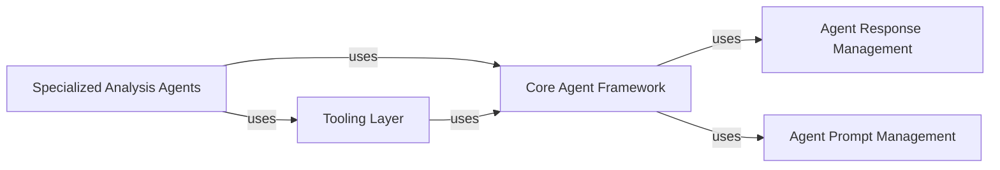

## Details

The `AI Agent Core` component is fundamental because it establishes the base `CodeBoardingAgent` class, which is the foundation for all specialized agents within the system. This promotes consistency, reusability, and extensibility, aligning with the project's architectural bias towards modularity and clear separation of concerns. These components are fundamental because they represent a clear separation of concerns within an agent-based system. The `Core Agent Framework` provides the essential blueprint, `Agent Response Management` and `Agent Prompt Management` handle crucial communication aspects, `Specialized Analysis Agents` embody the system's intelligence, and the `Tooling Layer` provides the necessary interaction capabilities with the external environment. This modularity enhances maintainability, scalability, and testability, which are key architectural goals for an AI-powered software engineering tool.

### Core Agent Framework
Provides the foundational structure and common functionalities for all AI agents within the system. It defines the base class, `CodeBoardingAgent`, which establishes a consistent interface and shared capabilities for agent development. These capabilities include mechanisms for parsing agent invocations, handling responses, integrating with various tools, and managing the agent's lifecycle. It ensures consistency, reusability, and extensibility across all specialized agents by providing a common blueprint.

**Related Classes/Methods**:

- `CodeBoardingAgent`

### Agent Response Management
This component is responsible for standardizing and managing the responses generated by various AI agents. It defines the structure and methods for agents to communicate their outputs, ensuring that responses are consistently formatted and easily parsable by other components or the user interface. This includes handling different types of responses, such as code snippets, textual explanations, or structured data.

**Related Classes/Methods**:

- ``

### Agent Prompt Management
This component focuses on the creation, management, and optimization of prompts used to interact with Large Language Models (LLMs) within the agent system. It provides utilities for constructing prompts that guide the LLMs to perform specific tasks, extract relevant information, or generate desired outputs. This includes handling prompt templates, injecting context, and ensuring prompt effectiveness for various agent functionalities.

**Related Classes/Methods**:

- ``

### Specialized Analysis Agents
This component encompasses a suite of specialized AI agents, each designed to perform specific code analysis or software engineering tasks. These agents inherit from the `Core Agent Framework` and leverage various tools to achieve their objectives. Examples include agents for abstraction, detail extraction, diff analysis, and validation.

**Related Classes/Methods**:

- ``
- ``
- ``
- ``
- ``
- ``

### Tooling Layer
This component provides a collection of tools that AI agents can utilize to interact with the project environment, retrieve information, or perform specific operations. These tools abstract away the complexities of underlying systems (e.g., file system, Git, static analysis engines) and expose a simplified interface for agents. Examples include tools for reading source code, file structures, package dependencies, and Git diffs.

**Related Classes/Methods**:

- ``
- ``
- ``
- ``
- ``
- ``
- ``
- ``
- ``
- ``
- `ReadDiffTool`

### [FAQ](https://github.com/CodeBoarding/GeneratedOnBoardings/tree/main?tab=readme-ov-file#faq)
