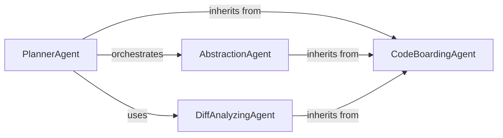

## Details

One paragraph explaining the functionality which is represented by this graph. What the main flow is and what is its purpose.

### CodeBoardingAgent
Acts as the abstract base class for all specialized agents. It implements the Template Method pattern by providing a standardized framework that encapsulates common concerns like AI model interaction, environment variable setup, and access to shared tools. This ensures consistency and reusability across the agent system.

**Related Classes/Methods**:

- `agents/agent.py`

### PlannerAgent
Serves as the primary entry point and controller for an analysis task. It receives a high-level goal, breaks it down into a concrete, multi-step execution plan, and orchestrates the workflow by delegating specific tasks to the appropriate worker agents (like the AbstractionAgent).

**Related Classes/Methods**:

- `agents/planner_agent.py`

### AbstractionAgent
The main worker agent responsible for executing the core architectural analysis. Following the plan from the PlannerAgent, it interacts directly with source code and Control Flow Graph (CFG) data to identify patterns, define component responsibilities, and generate the raw insights for the codebase model.

**Related Classes/Methods**:

- `agents/abstraction_agent.py`

### DiffAnalyzingAgent
A specialized agent that enables efficient incremental updates. It analyzes Git diffs to identify the precise scope of code changes, allowing the system to perform targeted re-analysis instead of processing the entire codebase again. This implements a form of Change Data Capture (CDC).

**Related Classes/Methods**:

- `agents/diff_analyzer.py`

### [FAQ](https://github.com/CodeBoarding/GeneratedOnBoardings/tree/main?tab=readme-ov-file#faq)