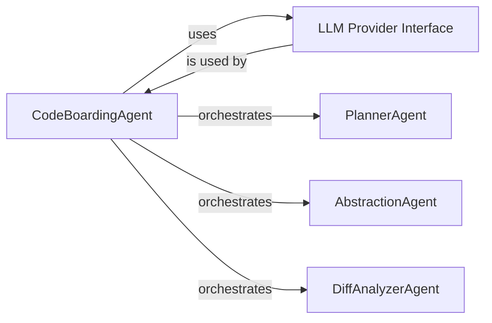

## Details

The AI Analysis Engine subsystem is the cognitive core of the system, responsible for interpreting static analysis data through a multi-agent framework. It leverages specialized agents to identify architectural patterns, understand component roles, and build a comprehensive codebase model.

### CodeBoardingAgent
The central orchestrator of the AI analysis workflow. It manages analysis requests, initializes LLMs, invokes them with prompts, and processes their responses. It acts as the primary coordinator for all specialized agents within the engine.

**Related Classes/Methods**:

- `agents.agent`

### LLM Provider Interface
Provides an abstraction layer for interacting with various Large Language Model providers (e.g., OpenAI, Anthropic, Google Gemini, AWS Bedrock). It handles API calls, model selection, and standardizes response retrieval, decoupling the core logic from specific LLM vendor implementations.

**Related Classes/Methods**:

- `llm_providers.interface` (1:1)

### PlannerAgent
A specialized AI agent focused on strategic planning within the analysis workflow. It determines the sequence of steps and sub-tasks required to achieve a given analysis objective, guiding the overall process.

**Related Classes/Methods**:

- `agents.planner_agent`

### AbstractionAgent
A specialized AI agent responsible for identifying and generating higher-level abstractions from raw code data. This includes summarizing code sections, identifying design patterns, and distilling complex details into more manageable concepts.

**Related Classes/Methods**:

- `agents.abstraction_agent`

### DiffAnalyzerAgent
A specialized AI agent dedicated to analyzing differences between code versions or states. It identifies changes, assesses their impact, and provides insights into how modifications affect architectural patterns or component roles.

**Related Classes/Methods**:

- `agents.diff_analyzer`

### [FAQ](https://github.com/CodeBoarding/GeneratedOnBoardings/tree/main?tab=readme-ov-file#faq)
