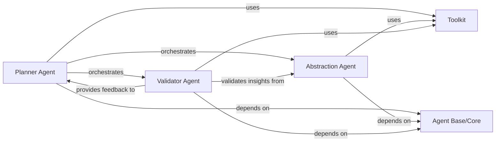

## Details

The system operates with a clear division of labor among its core AI agents. The `Planner Agent` initiates the process, strategically determining the necessary steps and information required for architectural interpretation. It orchestrates the activities of the `Abstraction Agent`, which is responsible for transforming raw code data into high-level architectural insights, and the `Validator Agent`, which ensures the accuracy and consistency of these insights. All agents leverage the `Agent Base/Core` component for fundamental functionalities and shared utilities, promoting a cohesive and extensible design. The `Toolkit` serves as the agents' primary interface to the codebase, providing a comprehensive set of specialized tools for data retrieval, including source code, file structures, and control flow graphs, enabling informed decision-making and analysis throughout the architectural interpretation workflow.

### Planner Agent
This component acts as the strategic orchestrator of the entire architectural interpretation process. It determines the sequence of operations, decides which information to gather using the Toolkit, and coordinates the activities of the Abstraction and Validator Agents. Its centrality lies in guiding the overall strategy for generating architectural insights, making it the control hub of the AI interpretation workflow.

**Related Classes/Methods**:

- <a href="https://github.com/CodeBoarding/CodeBoarding/blob/main/diagram_analysis/diagram_generator.py" target="_blank" rel="noopener noreferrer">`planner_agent`</a>

### Abstraction Agent
The Abstraction Agent is responsible for synthesizing raw static analysis data and other code artifacts into high-level architectural abstractions, patterns, and insights. This component is crucial for transforming granular code details into meaningful architectural representations, embodying the core "interpretation" aspect of the engine. Its importance stems from its role in generating the primary architectural output.

**Related Classes/Methods**:

- <a href="https://github.com/CodeBoarding/CodeBoarding/blob/main/diagram_analysis/diagram_generator.py" target="_blank" rel="noopener noreferrer">`abstraction_agent`</a>

### Validator Agent
This component ensures the quality, accuracy, and consistency of the architectural insights produced by the Abstraction Agent. It performs checks and validations against the original code context and established architectural principles to refine and confirm the generated output. The Validator Agent is central for maintaining the integrity and reliability of the system's output, crucial for a developer tool where accuracy is paramount.

**Related Classes/Methods**:

- <a href="https://github.com/CodeBoarding/CodeBoarding/blob/main/diagram_analysis/diagram_generator.py" target="_blank" rel="noopener noreferrer">`validator_agent`</a>

### Agent Base/Core
The Agent Base/Core provides foundational functionalities, common interfaces, and shared utilities that are leveraged by all specialized agents (Planner, Abstraction, Validator). This component promotes code reusability, consistency, and simplifies the development of new agents. It is central as it establishes the common architectural pattern and infrastructure for all AI agents within the subsystem, ensuring a cohesive and extensible design.

**Related Classes/Methods**:

- <a href="https://github.com/CodeBoarding/CodeBoarding/blob/main/agents/diff_analyzer.py#L20-L136" target="_blank" rel="noopener noreferrer">`agent`:20-136</a>

### Toolkit
The Toolkit is a comprehensive suite of specialized tools that enable the AI agents to interact with the codebase and retrieve specific types of information. This includes reading source code, file structures, external dependencies, package relationships, Control Flow Graphs (CFG), method invocations, Git diffs, raw file content, code structure (class hierarchies), and documentation. The Toolkit is central because it acts as the agents' "eyes and ears" into the project, providing all the necessary data access for informed decision-making and analysis.

**Related Classes/Methods**:

- <a href="https://github.com/CodeBoarding/CodeBoarding/blob/main/agents/diff_analyzer.py#L21-L32" target="_blank" rel="noopener noreferrer">`__init__`:21-32</a>
- <a href="https://github.com/CodeBoarding/CodeBoarding/blob/main/agents/tools/read_source.py#L23-L97" target="_blank" rel="noopener noreferrer">`code_reference_reader`:23-97</a>
- <a href="https://github.com/CodeBoarding/CodeBoarding/blob/main/agents/tools/read_file_structure.py#L22-L175" target="_blank" rel="noopener noreferrer">`file_structure_tool`:22-175</a>
- <a href="https://github.com/CodeBoarding/CodeBoarding/blob/main/agents/agent.py" target="_blank" rel="noopener noreferrer">`external_deps_tool`</a>
- <a href="https://github.com/CodeBoarding/CodeBoarding/blob/main/agents/tools/read_packages.py#L29-L65" target="_blank" rel="noopener noreferrer">`package_relations_tool`:29-65</a>
- <a href="https://github.com/CodeBoarding/CodeBoarding/blob/main/agents/tools/read_cfg.py#L12-L67" target="_blank" rel="noopener noreferrer">`get_cfg_tool`:12-67</a>
- <a href="https://github.com/CodeBoarding/CodeBoarding/blob/main/agents/agent.py" target="_blank" rel="noopener noreferrer">`method_invocations_tool`</a>
- <a href="https://github.com/CodeBoarding/CodeBoarding/blob/main/agents/diff_analyzer.py" target="_blank" rel="noopener noreferrer">`read_diff_tool`</a>
- <a href="https://github.com/CodeBoarding/CodeBoarding/blob/main/agents/agent.py" target="_blank" rel="noopener noreferrer">`read_file_tool`</a>
- <a href="https://github.com/CodeBoarding/CodeBoarding/blob/main/agents/tools/read_structure.py#L19-L54" target="_blank" rel="noopener noreferrer">`code_structure_tool`:19-54</a>
- <a href="https://github.com/CodeBoarding/CodeBoarding/blob/main/agents/tools/read_docs.py#L19-L145" target="_blank" rel="noopener noreferrer">`read_docs_tool`:19-145</a>

### [FAQ](https://github.com/CodeBoarding/GeneratedOnBoardings/tree/main?tab=readme-ov-file#faq)
