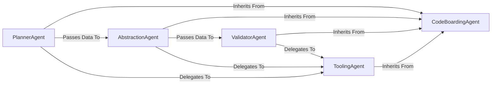

## Details

One paragraph explaining the functionality which is represented by this graph. What the main flow is and what is its purpose.

### CodeBoardingAgent
An abstract base class that provides a foundational agentic framework. It standardizes LLM interactions, state management, and initialization for all specialized agents, ensuring consistent behavior and integration.

**Related Classes/Methods**:

- `agents.agent`

### PlannerAgent
The initial stage of the pipeline. It examines the project's overall structure to create a high-level analysis plan, guiding the subsequent abstraction phase. It inherits its core capabilities from the CodeBoardingAgent.

**Related Classes/Methods**:

- `agents.planner_agent`

### AbstractionAgent
The central processing unit of the engine. It executes the plan from the PlannerAgent, synthesizing architectural components and relationships from the codebase by delegating to various ToolingAgents.

**Related Classes/Methods**:

- `agents.abstraction_agent`

### ValidatorAgent
The final quality assurance stage. It systematically reviews the output from the AbstractionAgent, verifying the correctness of identified components and their relationships, often by delegating checks to ToolingAgents.

**Related Classes/Methods**:

- `agents.validator_agent`

### ToolingAgent
A collection of specialized agents that perform fine-grained analysis tasks (e.g., reading files, parsing class structures, analyzing dependencies). They inherit from CodeBoardingAgent and are invoked by other agents to provide specific data points about the codebase.

**Related Classes/Methods**:

- `agents.tools.*`

### [FAQ](https://github.com/CodeBoarding/GeneratedOnBoardings/tree/main?tab=readme-ov-file#faq)
