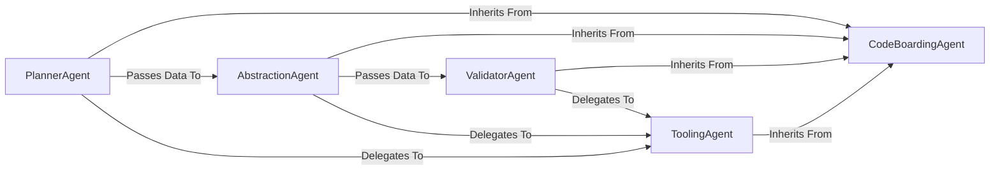

## Details

The CodeBoarding system operates as a multi-stage agentic pipeline designed to analyze project codebases. The process begins with the `PlannerAgent`, which establishes an initial analysis plan. This plan is then executed by the `AbstractionAgent`, responsible for synthesizing architectural components and their relationships. The `ValidatorAgent` subsequently ensures the correctness and integrity of the generated architectural insights. Throughout these stages, various `ToolingAgent` instances are leveraged to perform granular analysis tasks, providing essential data. The entire agentic framework is built upon the `CodeBoardingAgent`, an abstract base class that provides core functionalities and a standardized approach for LLM interactions, state management, and initialization. Recent significant updates to `CodeBoardingAgent` indicate an evolution of this foundational framework, impacting the interfaces and expected behaviors of all specialized agents.

### CodeBoardingAgent
An abstract base class that provides a foundational agentic framework. It standardizes LLM interactions, state management, and initialization for all specialized agents, ensuring consistent behavior and integration. Recent significant updates to this class suggest an evolution of its core functionalities, potentially altering the contract and common behavior expected from all agents in the system.

**Related Classes/Methods**:

- `agents.agent`

### PlannerAgent
The initial stage of the pipeline. It examines the project's overall structure to create a high-level analysis plan, guiding the subsequent abstraction phase. It inherits its core capabilities from the `CodeBoardingAgent`, and its implementation may have been updated to align with recent changes in the foundational agent framework.

**Related Classes/Methods**:

- `agents.planner_agent`

### AbstractionAgent
The central processing unit of the engine. It executes the plan from the `PlannerAgent`, synthesizing architectural components and relationships from the codebase by delegating to various `ToolingAgents`. Its behavior and interactions with the base class may have been modified due to recent updates in the `CodeBoardingAgent`.

**Related Classes/Methods**:

- `agents.abstraction_agent`

### ValidatorAgent
The final quality assurance stage. It systematically reviews the output from the `AbstractionAgent`, verifying the correctness of identified components and their relationships, often by delegating checks to `ToolingAgents`. Its responsibilities and internal logic may have been adjusted in response to the evolving `CodeBoardingAgent` framework.

**Related Classes/Methods**:

- `agents.validator_agent`

### ToolingAgent
A collection of specialized agents that perform fine-grained analysis tasks (e.g., reading files, parsing class structures, analyzing dependencies). They inherit from `CodeBoardingAgent` and are invoked by other agents to provide specific data points about the codebase. Their functionalities may have been refined to integrate with the updated foundational agent framework.

**Related Classes/Methods**:

- <a href="https://github.com/CodeBoarding/CodeBoarding/blob/main/" target="_blank" rel="noopener noreferrer">`agents.tools.*`</a>

### [FAQ](https://github.com/CodeBoarding/GeneratedOnBoardings/tree/main?tab=readme-ov-file#faq)
