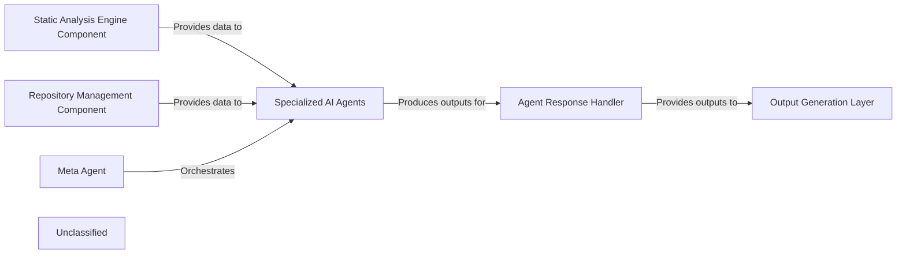

## Details

The system's architecture is centered around an AI Interpretation Layer orchestrated by the Meta Agent. This layer processes raw code data and repository information, provided by the Static Analysis Engine Component and Repository Management Component, respectively. A suite of Specialized AI Agents (including Abstraction, Details, Planner, Validator, and Diff Analyzer agents) performs targeted analysis under the Meta Agent's guidance. Their diverse outputs are then collected and standardized by the Agent Response Handler, which acts as a crucial intermediary before insights are passed to the Output Generation Layer for producing architectural diagrams and comprehensive documentation. This design ensures a clear separation of concerns, from data acquisition and intelligent analysis to structured output generation.

### Static Analysis Engine Component
This component is responsible for performing static analysis on the codebase, extracting structural information, control flow graphs (CFG), class hierarchies, and raw source code. It acts as a primary data source for the AI interpretation layer.

**Related Classes/Methods**: _None_

### Repository Management Component
Manages access to the code repository, providing functionalities like retrieving different versions of the codebase and generating code differences (diffs) between them. It's a crucial data source for analyzing changes.

**Related Classes/Methods**: _None_

### Meta Agent
The central orchestrator of the AI Interpretation Layer. It determines the overall analysis strategy, sequences the execution of specialized agents, and synthesizes their individual outputs to achieve the analysis goals.

**Related Classes/Methods**: _None_

### Specialized AI Agents
This component represents a collection of distinct AI agents, each with a specialized function: `Abstraction Agent` for high-level architectural views, `Details Agent` for fine-grained implementation insights, `Planner Agent` for formulating analysis strategies, `Validator Agent` for ensuring accuracy and consistency, and `Diff Analyzer Agent` for identifying architectural changes from code differences. They process data from the input components under the Meta Agent's guidance.

**Related Classes/Methods**:

- <a href="https://github.com/CodeBoarding/CodeBoarding/blob/main/agents/diff_analyzer.py#L20-L136" target="_blank" rel="noopener noreferrer">`agent`:20-136</a>

### Agent Response Handler
Responsible for collecting, standardizing, and managing the structured outputs generated by all specialized AI agents. It ensures that the insights are in a consistent and consumable format for downstream components.

**Related Classes/Methods**: _None_

### Output Generation Layer
This layer consumes the standardized outputs from the `Agent Response Handler`. It includes components like the `Diagram Analysis Component` for generating visual architectural diagrams and the `Output Generation Engine Component` for producing various forms of documentation and reports.

**Related Classes/Methods**: _None_

### Unclassified
Component for all unclassified files and utility functions (Utility functions/External Libraries/Dependencies)

**Related Classes/Methods**: _None_

### [FAQ](https://github.com/CodeBoarding/GeneratedOnBoardings/tree/main?tab=readme-ov-file#faq)
