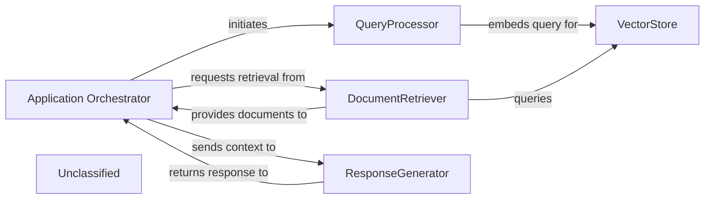

## Details

The recent architectural changes primarily involve a significant refactoring of core agent logic and an enhancement of static analysis capabilities. The refactoring in `agents/agent.py` suggests a simplification or re-organization of how agents are defined and interact, directly impacting the `Application Orchestrator`'s role in coordinating agents and the `QueryProcessor`'s utilization of agent logic. Concurrently, the `static_analyzer/reference_resolve_mixin.py` has been substantially expanded, bolstering the system's static analysis features within the `Unclassified` component. While this enhancement offers new potential, its direct integration into the primary data flow of `QueryProcessor` or `ResponseGenerator` is currently a potential rather than a confirmed critical interaction. The system's architecture is centered around an `Application Orchestrator` that manages the overall flow from user query to generated response. The `QueryProcessor` handles initial query processing and embedding, preparing data for the `VectorStore`, which serves as the central repository for document embeddings. The `DocumentRetriever` interfaces with the `VectorStore` to fetch relevant information, which is then passed to the `ResponseGenerator` for natural language output. Recent refactoring in core agent logic has streamlined how the `Application Orchestrator` coordinates agents and how the `QueryProcessor` utilizes agent-related functionalities. Additionally, the `Unclassified` component now encompasses significantly enhanced static analysis capabilities, offering potential for future integration into core processing pathways.

### Application Orchestrator
Manages the overall application flow, coordinating interactions between `QueryProcessor`, `DocumentRetriever`, and `ResponseGenerator`. It receives user queries and delivers final responses, adapting its agent coordination mechanisms due to recent core agent logic refactoring.

**Related Classes/Methods**:

- <a href="https://github.com/CodeBoarding/CodeBoarding/blob/mainagents/agent.py" target="_blank" rel="noopener noreferrer">`agents.agent`</a>

### QueryProcessor
Handles incoming user queries, embeds them, and prepares them for similarity search, now utilizing a potentially streamlined agent logic due to recent refactoring.

**Related Classes/Methods**:

### VectorStore
Stores and retrieves document embeddings based on similarity search.

**Related Classes/Methods**:

- `langchain_community.vectorstores.chroma.Chroma:similarity_search`

### DocumentRetriever
Retrieves relevant documents from the vector store.

**Related Classes/Methods**:

### ResponseGenerator
Generates a natural language response using a large language model based on the query and retrieved documents.

**Related Classes/Methods**:

### Unclassified
Component for unclassified files, external libraries, and utility functions, including significantly enhanced static analysis capabilities for reference resolution.

**Related Classes/Methods**:

- `static_analyzer.reference_resolve_mixin`

### Unclassified
Component for all unclassified files and utility functions (Utility functions/External Libraries/Dependencies)

**Related Classes/Methods**: _None_

### [FAQ](https://github.com/CodeBoarding/GeneratedOnBoardings/tree/main?tab=readme-ov-file#faq)
