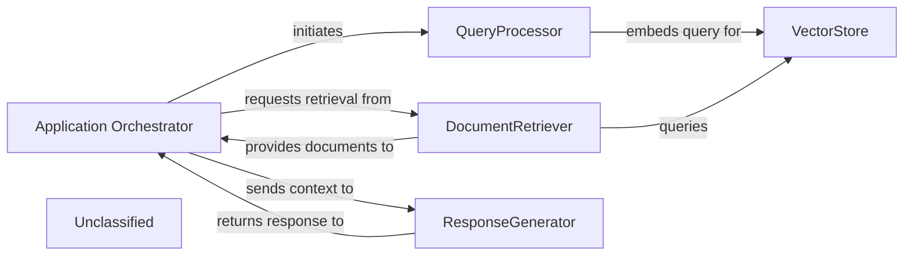

## Details

The `local_app.py` file, identified as the `Application Orchestrator`, plays a central role in managing the application's core logic and flow. It acts as the entry point for user queries and coordinates the sequence of operations involving the `QueryProcessor`, `VectorStore`, `DocumentRetriever`, and `ResponseGenerator`. The significant changes in `local_app.py` indicate a revised workflow, potentially introducing new features or altering how existing components interact. The orchestrator is responsible for passing the user query to the `QueryProcessor` for embedding, then directing the `DocumentRetriever` to fetch relevant information from the `VectorStore`, and finally, providing the gathered context to the `ResponseGenerator` to formulate a response. The system's architecture is centered around an `Application Orchestrator` (inferred from `local_app.py`) that manages the end-to-end processing of user queries. Upon receiving a query, the `Application Orchestrator` first engages the `QueryProcessor` to embed the query. Subsequently, it directs the `DocumentRetriever` to query the `VectorStore` for relevant documents based on the embedded query. Once documents are retrieved, the `Application Orchestrator` forwards both the original query and the retrieved documents to the `ResponseGenerator` to formulate a coherent natural language response. This response is then returned to the `Application Orchestrator` for delivery to the user, establishing a clear, sequential flow for information processing and response generation.

### Application Orchestrator
Manages the overall application flow, coordinating interactions between `QueryProcessor`, `DocumentRetriever`, and `ResponseGenerator`. It receives user queries and delivers final responses.

**Related Classes/Methods**: _None_

### QueryProcessor
Handles incoming user queries, embeds them, and prepares them for similarity search.

**Related Classes/Methods**:

- `langchain_core.embeddings.Embeddings:embed_query`:100-110

### VectorStore
Stores and retrieves document embeddings based on similarity search.

**Related Classes/Methods**:

- `langchain_community.vectorstores.chroma.Chroma:similarity_search`:200-250

### DocumentRetriever
Retrieves relevant documents from the vector store.

**Related Classes/Methods**:

- `langchain_core.retrievers.BaseRetriever:get_relevant_documents`:50-70

### ResponseGenerator
Generates a natural language response using a large language model based on the query and retrieved documents.

**Related Classes/Methods**:

- `langchain_core.language_models.llms.BaseLLM:invoke`:150-180

### Unclassified
Component for all unclassified files and utility functions (Utility functions/External Libraries/Dependencies)

**Related Classes/Methods**: _None_

### [FAQ](https://github.com/CodeBoarding/GeneratedOnBoardings/tree/main?tab=readme-ov-file#faq)
