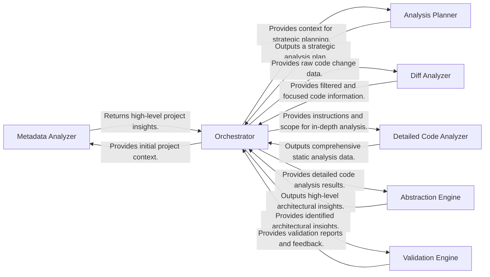

## Details

The CodeBoarding project employs a multi-agent architecture orchestrated by the Orchestrator component (agents.agent.CodeBoardingAgent). This central component manages the entire analysis workflow, from initial project context establishment to the final validation of architectural insights. The process begins with the Orchestrator providing initial project context to the Metadata Analyzer, which then returns high-level project insights. Based on these insights, the Orchestrator directs the Analysis Planner to formulate a strategic analysis plan. For code changes, the Diff Analyzer processes raw diff data, providing focused information back to the Orchestrator. The Detailed Code Analyzer performs in-depth static analysis under the Orchestrator's guidance, generating comprehensive data. This detailed analysis is then fed to the Abstraction Engine, which synthesizes high-level architectural insights. Finally, the Validation Engine verifies these insights, reporting back to the Orchestrator to ensure the integrity and accuracy of the generated architecture.

### Metadata Analyzer
Analyzes high-level project metadata to establish the initial context for subsequent analysis. It provides foundational information about the codebase.

**Related Classes/Methods**:

- `agents.meta_agent`

### Analysis Planner
Formulates a strategic plan for the code analysis, identifying key areas or components for deeper inspection based on initial context.

**Related Classes/Methods**:

- `agents.planner_agent`

### Diff Analyzer
Identifies and processes code changes (diffs) to focus the analysis on modified or new code, optimizing the analysis scope and efficiency.

**Related Classes/Methods**:

- `agents.diff_analyzer`

### Detailed Code Analyzer
Performs in-depth static analysis, including generating control flow graphs (CFG) and enhancing the structural understanding of the code. This agent delves into the granular details.

**Related Classes/Methods**:

- `agents.details_agent`

### Abstraction Engine
Transforms detailed code analysis results into high-level architectural insights, identifying components, their responsibilities, and interactions. It's responsible for synthesizing complex data into abstract representations.

**Related Classes/Methods**:

- `agents.abstraction_agent`

### Validation Engine
Verifies the accuracy, consistency, and completeness of the identified architectural components, their relationships, and code references against the source code. Ensures the integrity of the generated insights.

**Related Classes/Methods**:

- `agents.validator_agent`

### Orchestrator
Central coordinator, managing the flow of data and control between AI agents.

**Related Classes/Methods**:

- <a href="https://github.com/CodeBoarding/CodeBoarding/blob/main/agents/agent.py#L27-L207" target="_blank" rel="noopener noreferrer">`agents.agent.CodeBoardingAgent`:27-207</a>

### [FAQ](https://github.com/CodeBoarding/GeneratedOnBoardings/tree/main?tab=readme-ov-file#faq)
