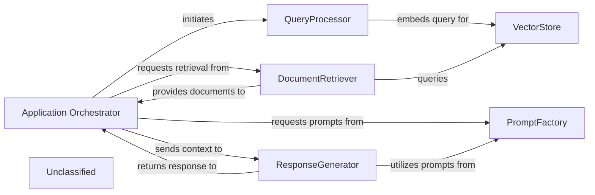

## Details

The system operates with an Application Orchestrator at its core, managing the overall flow from user query to final response. It initiates the QueryProcessor to handle and embed incoming queries, which are then used by the DocumentRetriever to query the VectorStore for relevant documents. A key enhancement is the PromptFactory, which now employs an abstract factory pattern to centralize and standardize prompt generation for various agents and language models, including specialized prompts for Gemini Flash. The Application Orchestrator and ResponseGenerator both interact with the PromptFactory to obtain optimized prompts, enabling the ResponseGenerator to craft accurate and contextually rich natural language responses based on the retrieved documents and the user's query. This modular design ensures extensibility and consistent interaction with large language models.

### Application Orchestrator
Manages the overall application flow, coordinating interactions between QueryProcessor, DocumentRetriever, ResponseGenerator, and now leveraging the PromptFactory for agent prompt generation. It receives user queries and delivers final responses, adapting its agent coordination mechanisms due to recent core agent logic refactoring and the new prompt management system.

**Related Classes/Methods**:

- <a href="https://github.com/CodeBoarding/CodeBoarding/blob/mainagents/agent.py" target="_blank" rel="noopener noreferrer">`agents.agent`</a>

### QueryProcessor
Handles incoming user queries, embeds them, and prepares them for similarity search, potentially utilizing refined prompts from the PromptFactory for enhanced query understanding.

**Related Classes/Methods**:

- <a href="https://github.com/CodeBoarding/CodeBoarding/blob/main." target="_blank" rel="noopener noreferrer">`langchain_core.embeddings.Embeddings:embed_query`</a>

### VectorStore
Stores and retrieves document embeddings based on similarity search.

**Related Classes/Methods**:

- `langchain_community.vectorstores.chroma.Chroma:similarity_search`

### DocumentRetriever
Retrieves relevant documents from the vector store.

**Related Classes/Methods**:

- <a href="https://github.com/CodeBoarding/CodeBoarding/blob/main." target="_blank" rel="noopener noreferrer">`langchain_core.retrievers.BaseRetriever:get_relevant_documents`</a>

### ResponseGenerator
Generates a natural language response using a large language model based on the query and retrieved documents, now significantly enhanced by leveraging structured prompts from the PromptFactory, including specialized prompts for models like Gemini Flash.

**Related Classes/Methods**:

- <a href="https://github.com/CodeBoarding/CodeBoarding/blob/main." target="_blank" rel="noopener noreferrer">`langchain_core.language_models.llms.BaseLLM:invoke`</a>

### PromptFactory
Centralizes the creation and management of prompts for various agents and language models through an abstract factory pattern. It provides a structured and standardized approach to prompt generation, leveraging an AbstractPromptFactory interface and specialized implementations like GeminiFlashPromptsBidirectional and GeminiFlashPromptsUnidirectional. This ensures consistent and optimized interactions with LLMs, notably for Gemini Flash, by managing an expanded library of prompts.

**Related Classes/Methods**:

- <a href="https://github.com/CodeBoarding/CodeBoarding/blob/mainagents/prompts/prompt_factory.py#L29-L90" target="_blank" rel="noopener noreferrer">`prompt_factory.PromptFactory`:29-90</a>

### Unclassified
Component for all unclassified files and utility functions (Utility functions/External Libraries/Dependencies)

**Related Classes/Methods**: _None_

### [FAQ](https://github.com/CodeBoarding/GeneratedOnBoardings/tree/main?tab=readme-ov-file#faq)
