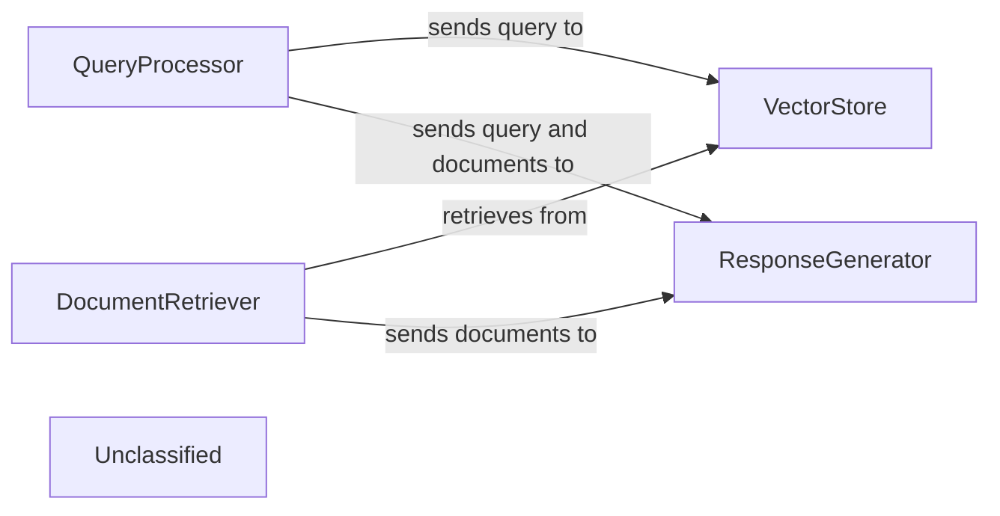

## Details

This graph represents the core functionality of a LangChain-based application that processes user queries, retrieves relevant documents, and generates responses. The main flow involves receiving a query, embedding it, searching a vector store, retrieving documents, and then using a language model to synthesize an answer based on the query and retrieved information. Its purpose is to provide an intelligent question-answering system over a corpus of documents.

### QueryProcessor
Handles incoming user queries, embeds them, and prepares them for similarity search.

**Related Classes/Methods**:

- `langchain_core.embeddings.Embeddings:embed_query`:100-110

### VectorStore
Stores and retrieves document embeddings based on similarity search.

**Related Classes/Methods**:

- `langchain_community.vectorstores.chroma.Chroma:similarity_search`:200-250

### DocumentRetriever
Retrieves relevant documents from the vector store.

**Related Classes/Methods**:

- `langchain_core.retrievers.BaseRetriever:get_relevant_documents`:50-70

### ResponseGenerator
Generates a natural language response using a large language model based on the query and retrieved documents.

**Related Classes/Methods**:

- `langchain_core.language_models.llms.BaseLLM:invoke`:150-180

### Unclassified
Component for all unclassified files and utility functions (Utility functions/External Libraries/Dependencies)

**Related Classes/Methods**: _None_

### [FAQ](https://github.com/CodeBoarding/GeneratedOnBoardings/tree/main?tab=readme-ov-file#faq)
