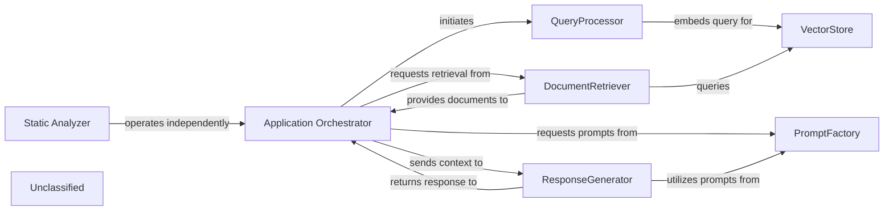

## Details

The system is structured around a Retrieval Augmented Generation (RAG) pipeline, with the Application Orchestrator serving as the central coordinator. It manages the flow from user query to response generation, leveraging the QueryProcessor for query embedding, the DocumentRetriever and VectorStore for document retrieval, and the ResponseGenerator for crafting natural language responses. The PromptFactory provides a standardized mechanism for generating and managing prompts, optimizing interactions with various language models. Operating in parallel and independently, the Static Analyzer component offers advanced static analysis capabilities, particularly for TypeScript configurations, incorporating graph-based analysis and a sophisticated Language Server Protocol (LSP) client to provide deep insights without directly influencing the RAG workflow.

### Application Orchestrator
Manages the overall application flow, coordinating interactions between QueryProcessor, DocumentRetriever, ResponseGenerator, and leveraging the PromptFactory for agent prompt generation. It receives user queries and delivers final responses, adapting its agent coordination mechanisms due to recent core agent logic refactoring and the new prompt management system.

**Related Classes/Methods**:

- <a href="https://github.com/CodeBoarding/CodeBoarding/blob/mainagents/agent.py" target="_blank" rel="noopener noreferrer">`agents.agent`</a>

### QueryProcessor
Handles incoming user queries, embeds them, and prepares them for similarity search, potentially utilizing refined prompts from the PromptFactory for enhanced query understanding.

**Related Classes/Methods**:

- <a href="https://github.com/CodeBoarding/CodeBoarding/blob/main." target="_blank" rel="noopener noreferrer">`langchain_core.embeddings.Embeddings:embed_query`</a>

### VectorStore
Stores and retrieves document embeddings based on similarity search.

**Related Classes/Methods**:

- `langchain_community.vectorstores.chroma.Chroma:similarity_search`

### DocumentRetriever
Retrieves relevant documents from the vector store.

**Related Classes/Methods**:

- <a href="https://github.com/CodeBoarding/CodeBoarding/blob/main." target="_blank" rel="noopener noreferrer">`langchain_core.retrievers.BaseRetriever:get_relevant_documents`</a>

### ResponseGenerator
Generates a natural language response using a large language model based on the query and retrieved documents, now significantly enhanced by leveraging structured prompts from the PromptFactory, including specialized prompts for models like Gemini Flash and Claude.

**Related Classes/Methods**:

- <a href="https://github.com/CodeBoarding/CodeBoarding/blob/main." target="_blank" rel="noopener noreferrer">`langchain_core.language_models.llms.BaseLLM:invoke`</a>

### PromptFactory
Centralizes the creation and management of prompts for various agents and language models through an abstract factory pattern. It provides a structured and standardized approach to prompt generation, leveraging an AbstractPromptFactory interface and specialized implementations like GeminiFlashPromptsBidirectional, GeminiFlashPromptsUnidirectional, ClaudePromptsBidirectional, and ClaudePromptsUnidirectional. This ensures consistent and optimized interactions with LLMs, notably for Gemini Flash and Claude models, by managing an expanded library of prompts.

**Related Classes/Methods**:

- <a href="https://github.com/CodeBoarding/CodeBoarding/blob/mainagents/prompts/prompt_factory.py#L29-L98" target="_blank" rel="noopener noreferrer">`prompt_factory.PromptFactory`:29-98</a>

### Static Analyzer
An independent functional area responsible for performing static analysis, primarily focusing on TypeScript configurations. This component has been significantly enhanced with the integration of a dedicated Language Server Protocol (LSP) client for TypeScript, enabling more sophisticated and in-depth analysis by leveraging the full capabilities of a TypeScript Language Server. It now also incorporates graph-based analysis capabilities to provide deeper insights. It operates in parallel to the core RAG system, providing distinct capabilities without directly altering the RAG data flow.

**Related Classes/Methods**:

- <a href="https://github.com/CodeBoarding/CodeBoarding/blob/mainstatic_analyzer/typescript_config_scanner.py" target="_blank" rel="noopener noreferrer">`static_analyzer.typescript_config_scanner`</a>
- <a href="https://github.com/CodeBoarding/CodeBoarding/blob/mainstatic_analyzer/lsp_client/typescript_client.py" target="_blank" rel="noopener noreferrer">`static_analyzer.lsp_client.typescript_client`</a>
- <a href="https://github.com/CodeBoarding/CodeBoarding/blob/mainstatic_analyzer/graph.py" target="_blank" rel="noopener noreferrer">`static_analyzer.graph`</a>

### Unclassified
Component for all unclassified files and utility functions (Utility functions/External Libraries/Dependencies)

**Related Classes/Methods**: _None_

### [FAQ](https://github.com/CodeBoarding/GeneratedOnBoardings/tree/main?tab=readme-ov-file#faq)
