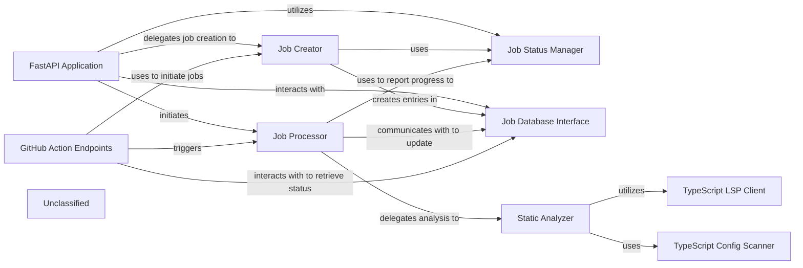

## Details

The system is centered around a FastAPI Application that serves as the primary entry point for all client interactions, managing API endpoints for job initiation and status retrieval. It delegates job creation to the Job Creator and interacts with the Job Database Interface for persistent storage, while the Job Status Manager oversees job lifecycle states. The Job Processor is an asynchronous component orchestrating the documentation generation pipeline, which now explicitly delegates code analysis to the Static Analyzer. The Static Analyzer is a critical subsystem, especially for TypeScript projects, leveraging a TypeScript LSP Client for deep language server interactions and a TypeScript Config Scanner for understanding project build contexts. Specialized GitHub Action Endpoints facilitate automated job initiation and status monitoring for GitHub workflows, interacting with the Job Creator, Job Processor, and Job Database Interface. This architecture highlights a clear separation of concerns, with the Static Analyzer providing enhanced language-specific analysis capabilities to the core Job Processor.

### FastAPI Application
The core web server, responsible for defining and managing API endpoints, handling incoming HTTP requests, and routing them to appropriate handlers for job initiation, status retrieval, and external integrations. It serves as the primary entry point for all client interactions.

**Related Classes/Methods**:

- <a href="https://github.com/CodeBoarding/CodeBoarding/blob/mainlocal_app.py" target="_blank" rel="noopener noreferrer">`local_app.app`</a>

### Job Creator
Responsible for initializing new documentation generation job records. It assigns unique identifiers and sets the initial status (e.g., PENDING) for each new job, preparing it for processing.

**Related Classes/Methods**:

- <a href="https://github.com/CodeBoarding/CodeBoarding/blob/mainlocal_app.py" target="_blank" rel="noopener noreferrer">`local_app.make_job`</a>

### Job Status Manager
Defines and manages the lifecycle states of documentation generation jobs (e.g., PENDING, RUNNING, COMPLETED, FAILED). It provides a consistent mechanism for updating and retrieving the current status of any job within the system.

**Related Classes/Methods**:

- <a href="https://github.com/CodeBoarding/CodeBoarding/blob/mainlocal_app.py" target="_blank" rel="noopener noreferrer">`local_app.JobStatus`</a>
- <a href="https://github.com/CodeBoarding/CodeBoarding/blob/mainduckdb_crud.py" target="_blank" rel="noopener noreferrer">`duckdb_crud.update_job`</a>
- <a href="https://github.com/CodeBoarding/CodeBoarding/blob/mainduckdb_crud.py" target="_blank" rel="noopener noreferrer">`duckdb_crud.fetch_job`</a>

### Job Database Interface
Provides an abstraction layer for persistent storage and retrieval of job-related data. It encapsulates CRUD (Create, Read, Update, Delete) operations for job records, ensuring data integrity and accessibility across the API service.

**Related Classes/Methods**:

- <a href="https://github.com/CodeBoarding/CodeBoarding/blob/mainduckdb_crud.py" target="_blank" rel="noopener noreferrer">`duckdb_crud.init_db`</a>
- <a href="https://github.com/CodeBoarding/CodeBoarding/blob/mainduckdb_crud.py" target="_blank" rel="noopener noreferrer">`duckdb_crud.insert_job`</a>
- <a href="https://github.com/CodeBoarding/CodeBoarding/blob/mainduckdb_crud.py" target="_blank" rel="noopener noreferrer">`duckdb_crud.fetch_job`</a>
- <a href="https://github.com/CodeBoarding/CodeBoarding/blob/mainduckdb_crud.py" target="_blank" rel="noopener noreferrer">`duckdb_crud.update_job`</a>
- <a href="https://github.com/CodeBoarding/CodeBoarding/blob/mainduckdb_crud.py" target="_blank" rel="noopener noreferrer">`duckdb_crud.fetch_all_jobs`</a>

### Job Processor
An asynchronous component that orchestrates the end-to-end documentation generation pipeline for a single job. It handles repository cloning, invokes the core analysis and generation logic (delegating to the Static Analyzer), and manages the processing results, updating job status throughout its execution.

**Related Classes/Methods**:

- <a href="https://github.com/CodeBoarding/CodeBoarding/blob/mainlocal_app.py" target="_blank" rel="noopener noreferrer">`local_app.generate_onboarding`</a>

### Static Analyzer
Responsible for performing in-depth code analysis, particularly for TypeScript projects. It leverages an LSP client for language server interactions and a configuration scanner to understand project build settings, providing structured insights to the Job Processor.

**Related Classes/Methods**:

- <a href="https://github.com/CodeBoarding/CodeBoarding/blob/mainstatic_analyzer/scanner.py" target="_blank" rel="noopener noreferrer">`static_analyzer/scanner.py`</a>
- <a href="https://github.com/CodeBoarding/CodeBoarding/blob/mainstatic_analyzer/lsp_client/client.py" target="_blank" rel="noopener noreferrer">`static_analyzer/lsp_client/client.py`</a>

### TypeScript LSP Client
A specialized client within the Static Analyzer that interacts with the TypeScript Language Server Protocol. It enables sophisticated code understanding, symbol resolution, and semantic analysis for TypeScript projects.

**Related Classes/Methods**:

- <a href="https://github.com/CodeBoarding/CodeBoarding/blob/mainstatic_analyzer/lsp_client/typescript_client.py" target="_blank" rel="noopener noreferrer">`static_analyzer/lsp_client/typescript_client.py`</a>

### TypeScript Config Scanner
A component within the Static Analyzer responsible for parsing and interpreting TypeScript configuration files (e.g., `tsconfig.json`). It extracts crucial project settings, build contexts, and file inclusions necessary for accurate static analysis.

**Related Classes/Methods**:

- <a href="https://github.com/CodeBoarding/CodeBoarding/blob/mainstatic_analyzer/typescript_config_scanner.py" target="_blank" rel="noopener noreferrer">`static_analyzer/typescript_config_scanner.py`</a>

### GitHub Action Endpoints
A specialized set of API endpoints within the FastAPI Application designed for seamless integration with GitHub Actions workflows. These endpoints facilitate automated job initiation and status monitoring specifically for GitHub-driven documentation generation requests.

**Related Classes/Methods**:

- <a href="https://github.com/CodeBoarding/CodeBoarding/blob/mainlocal_app.py" target="_blank" rel="noopener noreferrer">`local_app.start_docs_generation_job`</a>
- <a href="https://github.com/CodeBoarding/CodeBoarding/blob/mainlocal_app.py" target="_blank" rel="noopener noreferrer">`local_app.get_github_action_job_status`</a>

### Unclassified
Component for all unclassified files and utility functions (Utility functions/External Libraries/Dependencies)

**Related Classes/Methods**: _None_

### [FAQ](https://github.com/CodeBoarding/GeneratedOnBoardings/tree/main?tab=readme-ov-file#faq)
