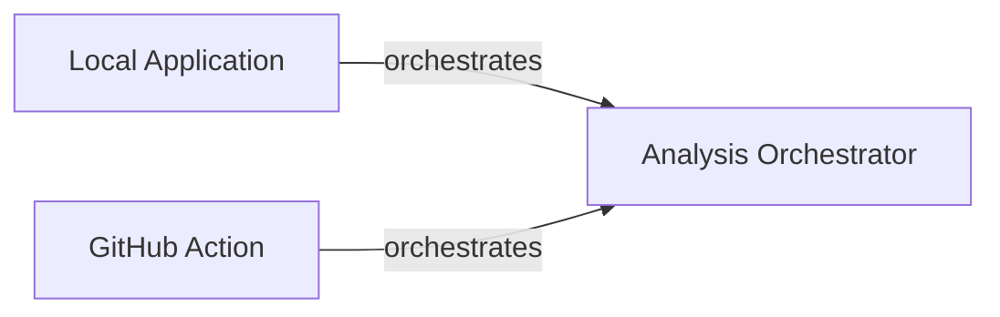

## Details

Initial analysis of the project components and their relations, with a focus on identifying the 'Analysis Orchestrator' and its interactions. Further refinement is needed to include specific code references for the 'Analysis Orchestrator' by examining 'github_action.py' and 'local_app.py'.

### Analysis Orchestrator
Orchestrates the analysis process, coordinating between different components.

**Related Classes/Methods**: _None_

### Local Application
Manages local application interactions.

**Related Classes/Methods**: _None_

### GitHub Action
Handles GitHub Actions workflows.

**Related Classes/Methods**: _None_

### [FAQ](https://github.com/CodeBoarding/GeneratedOnBoardings/tree/main?tab=readme-ov-file#faq)
