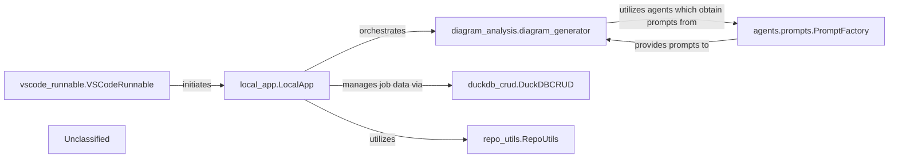

## Details

CodeBoarding's local application (`local_app.LocalApp`) serves as the central entry point, handling requests from external clients like the VS Code extension (`vscode_runnable.VSCodeRunnable`). It orchestrates the core functionality of the platform, primarily delegating to the `diagram_analysis.diagram_generator` for comprehensive code analysis and diagram creation. The `local_app.LocalApp` also relies on `duckdb_crud.DuckDBCRUD` for persistent storage of job metadata and `repo_utils.RepoUtils` for repository operations. A critical subsystem for LLM interaction is managed by `agents.prompts.PromptFactory`, which, through an Abstract Factory pattern, dynamically provides prompts to the agents utilized by the `diagram_analysis.diagram_generator`, ensuring modularity and extensibility in integrating diverse LLMs and prompt strategies.

### local_app.LocalApp
Serves as the primary local interface for CodeBoarding, enabling local users and the VS Code extension to initiate, manage, and retrieve the status of analysis jobs, and to trigger documentation generation. It acts as a local API endpoint, orchestrating interactions with core analysis and data management components.

**Related Classes/Methods**:

- <a href="https://github.com/CodeBoarding/CodeBoarding/blob/mainlocal_app.py" target="_blank" rel="noopener noreferrer">`local_app.LocalApp`</a>

### diagram_analysis.diagram_generator
Orchestrates the comprehensive code analysis and diagram generation workflow, initiated by the `local_app.LocalApp`. It's responsible for the core value proposition of the platform, leveraging various agents and LLMs for analysis.

**Related Classes/Methods**:

- <a href="https://github.com/CodeBoarding/CodeBoarding/blob/maindiagram_analysis/diagram_generator.py" target="_blank" rel="noopener noreferrer">`diagram_analysis.diagram_generator`</a>

### agents.prompts.PromptFactory
Manages the dynamic selection and retrieval of prompts used by various agents for interacting with Large Language Models (LLMs). It has been refactored to leverage an Abstract Factory pattern, centralizing prompt definitions and enhancing modularity, configurability, and maintainability of LLM interactions. This pattern allows for easy integration of new LLMs and prompt strategies through concrete factory implementations (e.g., `gemini_flash_prompts_bidirectional.py`, `gemini_flash_prompts_unidirectional.py`) based on an abstract interface (`abstract_prompt_factory.py`).

**Related Classes/Methods**:

- <a href="https://github.com/CodeBoarding/CodeBoarding/blob/mainagents/prompts/prompt_factory.py#L29-L90" target="_blank" rel="noopener noreferrer">`agents.prompts.prompt_factory.PromptFactory`:29-90</a>

### duckdb_crud.DuckDBCRUD
Manages persistent storage and retrieval of analysis job metadata and status, crucial for `local_app.LocalApp` to track and report on job progress.

**Related Classes/Methods**:

- <a href="https://github.com/CodeBoarding/CodeBoarding/blob/mainduckdb_crud.py" target="_blank" rel="noopener noreferrer">`duckdb_crud.DuckDBCRUD`</a>

### repo_utils.RepoUtils
Provides repository-related operations such as cloning or fetching diffs, potentially utilized by `local_app.LocalApp` to prepare repositories for analysis.

**Related Classes/Methods**:

- <a href="https://github.com/CodeBoarding/CodeBoarding/blob/mainrepo_utils/__init__.py" target="_blank" rel="noopener noreferrer">`repo_utils.RepoUtils`</a>

### vscode_runnable.VSCodeRunnable
An external client that consumes services provided by the `local_app.LocalApp` for VS Code extension functionalities, representing a key external integration point.

**Related Classes/Methods**:

- <a href="https://github.com/CodeBoarding/CodeBoarding/blob/mainvscode_runnable.py" target="_blank" rel="noopener noreferrer">`vscode_runnable.VSCodeRunnable`</a>

### Unclassified
Component for all unclassified files and utility functions (Utility functions/External Libraries/Dependencies)

**Related Classes/Methods**:

- `unclassified.UnclassifiedComponent`:1-10

### Unclassified
Component for all unclassified files and utility functions (Utility functions/External Libraries/Dependencies)

**Related Classes/Methods**: _None_

### [FAQ](https://github.com/CodeBoarding/GeneratedOnBoardings/tree/main?tab=readme-ov-file#faq)
