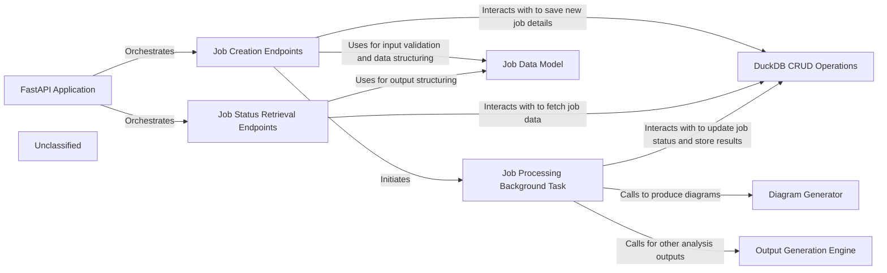

## Details

The system is built around a FastAPI Application that serves as the central entry point for all client interactions. It exposes Job Creation Endpoints for initiating new code analysis and documentation generation tasks, and Job Status Retrieval Endpoints for monitoring their progress and fetching results. All job-related data is managed persistently through DuckDB CRUD Operations. When a job is created, the Job Creation Endpoints initiate a Job Processing Background Task to handle the heavy computational work asynchronously. This background task interacts with the DuckDB CRUD Operations to update job statuses and store results. Depending on the job type, it may also invoke the Diagram Generator for visual documentation or the Output Generation Engine for other analysis outputs. The Job Data Model ensures consistent data structures and validation across the entire system.

### FastAPI Application
The core web server instance, responsible for defining and managing all API routes, middleware, and overall request/response handling. It serves as the central orchestrator for all incoming API calls.

**Related Classes/Methods**:

- <a href="https://github.com/CodeBoarding/CodeBoarding/blob/main/local_app.py" target="_blank" rel="noopener noreferrer">`local_app.py:app`</a>

### Job Creation Endpoints
Provides the API endpoints for users to submit new code analysis and documentation generation requests, validating input and initiating the job lifecycle.

**Related Classes/Methods**:

- <a href="https://github.com/CodeBoarding/CodeBoarding/blob/main/local_app.py" target="_blank" rel="noopener noreferrer">`local_app.py:start_generation_job`</a>
- <a href="https://github.com/CodeBoarding/CodeBoarding/blob/main/local_app.py" target="_blank" rel="noopener noreferrer">`local_app.py:start_docs_generation_job`</a>

### Job Status Retrieval Endpoints
Offers API endpoints for clients to query the current status, progress, and results of previously submitted jobs.

**Related Classes/Methods**:

- <a href="https://github.com/CodeBoarding/CodeBoarding/blob/main/local_app.py" target="_blank" rel="noopener noreferrer">`local_app.py:get_job`</a>
- <a href="https://github.com/CodeBoarding/CodeBoarding/blob/main/local_app.py" target="_blank" rel="noopener noreferrer">`local_app.py:get_github_action_status`</a>
- <a href="https://github.com/CodeBoarding/CodeBoarding/blob/main/local_app.py" target="_blank" rel="noopener noreferrer">`local_app.py:list_jobs`</a>

### Job Processing Background Task
Asynchronously executes the core job logic, offloading heavy computation from the main API thread to ensure responsiveness. It coordinates the actual analysis and generation steps.

**Related Classes/Methods**:

- <a href="https://github.com/CodeBoarding/CodeBoarding/blob/main/local_app.py" target="_blank" rel="noopener noreferrer">`local_app.py:generate_onboarding`</a>
- <a href="https://github.com/CodeBoarding/CodeBoarding/blob/main/local_app.py" target="_blank" rel="noopener noreferrer">`local_app.py:process_docs_generation_job`</a>

### Job Data Model
Defines the data structures (e.g., Pydantic models) for jobs and incoming documentation generation requests, ensuring data consistency and validation across the API.

**Related Classes/Methods**:

- <a href="https://github.com/CodeBoarding/CodeBoarding/blob/main/local_app.py" target="_blank" rel="noopener noreferrer">`local_app.py:JobStatus`</a>
- <a href="https://github.com/CodeBoarding/CodeBoarding/blob/main/local_app.py" target="_blank" rel="noopener noreferrer">`local_app.py:DocsGenerationRequest`</a>
- <a href="https://github.com/CodeBoarding/CodeBoarding/blob/main/local_app.py" target="_blank" rel="noopener noreferrer">`local_app.py:make_job`</a>

### DuckDB CRUD Operations
Handles persistent job management by interacting with the DuckDB database for storing, retrieving, and updating job records.

**Related Classes/Methods**: _None_

### Diagram Generator
A specialized component responsible for generating architectural diagrams and other visual documentation based on the analysis results.

**Related Classes/Methods**:

- <a href="https://github.com/CodeBoarding/CodeBoarding/blob/main/demo.py" target="_blank" rel="noopener noreferrer">`demo.py:generate_docs_remote`</a>

### Output Generation Engine [[Expand]](./Output_Generation_Engine.md)
A component responsible for generating various analysis outputs, potentially triggered by external events like GitHub Actions, beyond just diagrams.

**Related Classes/Methods**:

- <a href="https://github.com/CodeBoarding/CodeBoarding/blob/main/github_action.py" target="_blank" rel="noopener noreferrer">`github_action.py:generate_analysis`</a>

### Unclassified
Component for all unclassified files and utility functions (Utility functions/External Libraries/Dependencies)

**Related Classes/Methods**: _None_

### [FAQ](https://github.com/CodeBoarding/GeneratedOnBoardings/tree/main?tab=readme-ov-file#faq)
