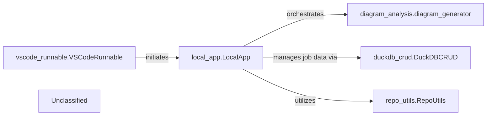

## Details

The CodeBoarding system's local architecture is centered around the `local_app.LocalApp`, which acts as the primary interface for users and the VS Code extension. The `vscode_runnable.VSCodeRunnable` component represents the external VS Code extension, initiating analysis jobs through `local_app.LocalApp`. Upon receiving a request, `local_app.LocalApp` orchestrates the `diagram_analysis.diagram_generator` to perform the core code analysis and diagram generation. Throughout this process, `local_app.LocalApp` interacts with `duckdb_crud.DuckDBCRUD` for managing and persisting analysis job metadata and status. Additionally, `repo_utils.RepoUtils` provides essential repository-related functionalities, such as code fetching, which `local_app.LocalApp` utilizes to prepare the codebase for analysis. This structure ensures a clear separation of concerns, with `local_app.LocalApp` coordinating the workflow, `diagram_analysis.diagram_generator` handling the core logic, `duckdb_crud.DuckDBCRUD` managing data persistence, and `repo_utils.RepoUtils` providing foundational repository operations.

### local_app.LocalApp
Serves as the primary local interface for CodeBoarding, enabling local users and the VS Code extension to initiate, manage, and retrieve the status of analysis jobs, and to trigger documentation generation. It acts as a local API endpoint, orchestrating interactions with core analysis and data management components.

**Related Classes/Methods**:

- `local_app.LocalApp`

### diagram_analysis.diagram_generator
Orchestrates the comprehensive code analysis and diagram generation workflow, initiated by the `local_app.LocalApp`. It's responsible for the core value proposition of the platform.

**Related Classes/Methods**:

- `diagram_analysis.diagram_generator`

### duckdb_crud.DuckDBCRUD
Manages persistent storage and retrieval of analysis job metadata and status, crucial for `local_app.LocalApp` to track and report on job progress.

**Related Classes/Methods**:

- `duckdb_crud.DuckDBCRUD`

### repo_utils.RepoUtils
Provides repository-related operations such as cloning or fetching diffs, potentially utilized by `local_app.LocalApp` to prepare repositories for analysis.

**Related Classes/Methods**:

- `repo_utils.RepoUtils`

### vscode_runnable.VSCodeRunnable
An external client that consumes services provided by the `local_app.LocalApp` for VS Code extension functionalities, representing a key external integration point.

**Related Classes/Methods**:

- `vscode_runnable.VSCodeRunnable`

### Unclassified
Component for all unclassified files and utility functions (Utility functions/External Libraries/Dependencies)

**Related Classes/Methods**: _None_

### [FAQ](https://github.com/CodeBoarding/GeneratedOnBoardings/tree/main?tab=readme-ov-file#faq)
