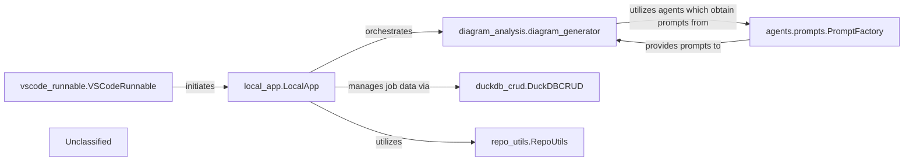

## Details

The CodeBoarding platform is orchestrated by `local_app.LocalApp`, which serves as the primary interface for users and the VS Code extension (`vscode_runnable.VSCodeRunnable`). `local_app.LocalApp` initiates and manages analysis jobs, leveraging `duckdb_crud.DuckDBCRUD` for persistent storage of job metadata and `repo_utils.RepoUtils` for repository operations. The core analysis and diagram generation workflow is handled by `diagram_analysis.diagram_generator`. A significant internal enhancement is the `agents.prompts.PromptFactory`, which centralizes and dynamically manages prompts for the various agents utilized by `diagram_analysis.diagram_generator` when interacting with LLMs, ensuring modularity and configurability in prompt management. This structured approach to prompt handling is crucial for the system's interaction with LLMs, which underpins the `diagram_analysis.diagram_generator`'s function.

### local_app.LocalApp
Serves as the primary local interface for CodeBoarding, enabling local users and the VS Code extension to initiate, manage, and retrieve the status of analysis jobs, and to trigger documentation generation. It acts as a local API endpoint, orchestrating interactions with core analysis and data management components.

**Related Classes/Methods**:

- <a href="https://github.com/CodeBoarding/CodeBoarding/blob/mainlocal_app.py" target="_blank" rel="noopener noreferrer">`local_app.LocalApp`</a>

### diagram_analysis.diagram_generator
Orchestrates the comprehensive code analysis and diagram generation workflow, initiated by the `local_app.LocalApp`. It's responsible for the core value proposition of the platform, leveraging various agents and LLMs for analysis.

**Related Classes/Methods**:

- <a href="https://github.com/CodeBoarding/CodeBoarding/blob/maindiagram_analysis/diagram_generator.py" target="_blank" rel="noopener noreferrer">`diagram_analysis.diagram_generator`</a>

### agents.prompts.PromptFactory
Manages the dynamic selection and retrieval of prompts used by various agents for interacting with Large Language Models (LLMs). It centralizes prompt definitions, enhancing modularity, configurability, and maintainability of LLM interactions.

**Related Classes/Methods**:

- <a href="https://github.com/CodeBoarding/CodeBoarding/blob/mainagents/prompts/prompt_factory.py#L27-L77" target="_blank" rel="noopener noreferrer">`agents.prompts.prompt_factory.PromptFactory`:27-77</a>

### duckdb_crud.DuckDBCRUD
Manages persistent storage and retrieval of analysis job metadata and status, crucial for `local_app.LocalApp` to track and report on job progress.

**Related Classes/Methods**:

- <a href="https://github.com/CodeBoarding/CodeBoarding/blob/mainduckdb_crud.py" target="_blank" rel="noopener noreferrer">`duckdb_crud.DuckDBCRUD`</a>

### repo_utils.RepoUtils
Provides repository-related operations such as cloning or fetching diffs, potentially utilized by `local_app.LocalApp` to prepare repositories for analysis.

**Related Classes/Methods**:

- <a href="https://github.com/CodeBoarding/CodeBoarding/blob/mainrepo_utils/__init__.py" target="_blank" rel="noopener noreferrer">`repo_utils.RepoUtils`</a>

### vscode_runnable.VSCodeRunnable
An external client that consumes services provided by the `local_app.LocalApp` for VS Code extension functionalities, representing a key external integration point.

**Related Classes/Methods**:

- <a href="https://github.com/CodeBoarding/CodeBoarding/blob/mainvscode_runnable.py" target="_blank" rel="noopener noreferrer">`vscode_runnable.VSCodeRunnable`</a>

### Unclassified
Component for all unclassified files and utility functions (Utility functions/External Libraries/Dependencies)

**Related Classes/Methods**: _None_

### [FAQ](https://github.com/CodeBoarding/GeneratedOnBoardings/tree/main?tab=readme-ov-file#faq)
