```mermaid
graph LR
    API_Service["API Service"]
    Orchestration_Engine["Orchestration Engine"]
    Repository_Manager["Repository Manager"]
    Static_Analysis_Engine["Static Analysis Engine"]
    AI_Interpretation_Layer["AI Interpretation Layer"]
    Output_Generation_Engine["Output Generation Engine"]
    Unclassified["Unclassified"]
    API_Service -- "submits jobs to" --> Orchestration_Engine
    Orchestration_Engine -- "sends status to" --> API_Service
    Output_Generation_Engine -- "provides artifacts to" --> API_Service
    Orchestration_Engine -- "invokes" --> Repository_Manager
    Repository_Manager -- "provides code to" --> Static_Analysis_Engine
    Static_Analysis_Engine -- "sends analysis results to" --> AI_Interpretation_Layer
    AI_Interpretation_Layer -- "sends interpreted insights to" --> Output_Generation_Engine
    click API_Service href "https://github.com/CodeBoarding/CodeBoarding/blob/main/.codeboarding/API_Service.md" "Details"
    click Orchestration_Engine href "https://github.com/CodeBoarding/CodeBoarding/blob/main/.codeboarding/Orchestration_Engine.md" "Details"
    click Repository_Manager href "https://github.com/CodeBoarding/CodeBoarding/blob/main/.codeboarding/Repository_Manager.md" "Details"
    click Static_Analysis_Engine href "https://github.com/CodeBoarding/CodeBoarding/blob/main/.codeboarding/Static_Analysis_Engine.md" "Details"
    click AI_Interpretation_Layer href "https://github.com/CodeBoarding/CodeBoarding/blob/main/.codeboarding/AI_Interpretation_Layer.md" "Details"
    click Output_Generation_Engine href "https://github.com/CodeBoarding/CodeBoarding/blob/main/.codeboarding/Output_Generation_Engine.md" "Details"
```

## Details

The CodeBoarding system is structured around a pipeline that processes code analysis requests and generates architectural insights. The API Service serves as the external entry point, receiving user requests and initiating analysis jobs. These jobs are then managed by the Orchestration Engine, which coordinates the entire analysis workflow. The Orchestration Engine interacts with the Repository Manager to fetch and prepare codebases for analysis. The prepared code is then fed into the Static Analysis Engine, which extracts structural and behavioral information. The raw analysis results are subsequently passed to the AI Interpretation Layer, where Large Language Models interpret the data to identify architectural patterns and generate high-level insights. Finally, the Output Generation Engine takes these interpreted insights to produce various artifacts, including architectural diagrams and documentation, which are then made available through the API Service. This architecture ensures a clear separation of concerns, allowing for modular development and efficient processing of code analysis tasks.

### API Service [[Expand]](./API_Service.md)
The primary external interface for CodeBoarding, handling user requests, initiating code analysis jobs, retrieving job status and results, and integrating with external systems like GitHub Actions for automated documentation generation.

**Related Classes/Methods**:

- <a href="https://github.com/CodeBoarding/CodeBoarding/blob/mainlocal_app.py" target="_blank" rel="noopener noreferrer">`local_app`</a>

### Orchestration Engine [[Expand]](./Orchestration_Engine.md)
Manages the lifecycle of code analysis jobs, including scheduling, execution, and status tracking. It acts as an orchestrator for the analysis pipeline, invoking other components as needed.

**Related Classes/Methods**:

- <a href="https://github.com/CodeBoarding/CodeBoarding/blob/main.codeboarding/Orchestration_Engine.json" target="_blank" rel="noopener noreferrer">`Orchestration_Engine`</a>

### Repository Manager [[Expand]](./Repository_Manager.md)
Handles interactions with code repositories (e.g., GitHub), including cloning, fetching, and managing codebases for analysis.

**Related Classes/Methods**:

- <a href="https://github.com/CodeBoarding/CodeBoarding/blob/main.codeboarding/Repository_Manager.json" target="_blank" rel="noopener noreferrer">`Repository_Manager`</a>

### Static Analysis Engine [[Expand]](./Static_Analysis_Engine.md)
Performs static code analysis on various programming languages (Python, Go, TypeScript) to extract structural and behavioral information from the codebase.

**Related Classes/Methods**:

- <a href="https://github.com/CodeBoarding/CodeBoarding/blob/main.codeboarding/Static_Analysis_Engine.json" target="_blank" rel="noopener noreferrer">`Static_Analysis_Engine`</a>

### AI Interpretation Layer [[Expand]](./AI_Interpretation_Layer.md)
Utilizes Large Language Models (LLMs) from various providers (OpenAI, Anthropic, Google Gemini, AWS Bedrock, Ollama) to interpret static analysis results, identify architectural patterns, and generate high-level insights.

**Related Classes/Methods**:

- <a href="https://github.com/CodeBoarding/CodeBoarding/blob/main.codeboarding/AI_Interpretation_Layer.json" target="_blank" rel="noopener noreferrer">`AI_Interpretation_Layer`</a>

### Output Generation Engine [[Expand]](./Output_Generation_Engine.md)
Responsible for generating various outputs, including architectural diagrams (Mermaid.js), reports, and documentation, based on the interpreted analysis results.

**Related Classes/Methods**:

- <a href="https://github.com/CodeBoarding/CodeBoarding/blob/main.codeboarding/Output_Generation_Engine.json" target="_blank" rel="noopener noreferrer">`Output_Generation_Engine`</a>

### Unclassified
Component for all unclassified files and utility functions (Utility functions/External Libraries/Dependencies)

**Related Classes/Methods**: _None_

### [FAQ](https://github.com/CodeBoarding/GeneratedOnBoardings/tree/main?tab=readme-ov-file#faq)
