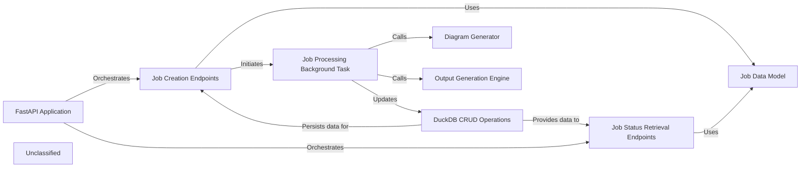

## Details

The CodeBoarding application is structured around a FastAPI Application that serves as the central orchestrator for all API interactions. This core component routes incoming requests to Job Creation Endpoints for initiating new code analysis and documentation generation tasks, and to Job Status Retrieval Endpoints for clients to monitor the progress and retrieve results of their submitted jobs. All data related to jobs, requests, and responses is consistently defined and validated by the Job Data Model. Persistent storage and retrieval of job records are handled by DuckDB CRUD Operations. Intensive computational work, such as code analysis and documentation generation, is asynchronously managed by the Job Processing Background Task. This background task coordinates the execution of these operations, updating job statuses, and leveraging specialized components like the Diagram Generator for visual outputs and the Output Generation Engine for other forms of analysis results. Recent significant updates to the core application logic in local_app.py have expanded the capabilities and refined the interactions within these central components, introducing new flows and enhancing existing functionalities.

### FastAPI Application
The core web server instance, responsible for defining and managing all API routes, middleware, and overall request/response handling. It serves as the central orchestrator for all incoming API calls.

**Related Classes/Methods**:

- <a href="https://github.com/CodeBoarding/CodeBoarding/blob/main/local_app.py" target="_blank" rel="noopener noreferrer">`local_app.py:app`</a>

### Job Creation Endpoints
Provides the API endpoints for users to submit new code analysis and documentation generation requests, validating input and initiating the job lifecycle. Recent changes in `local_app.py` suggest an expansion of its capabilities, potentially introducing new job types or more complex submission logic.

**Related Classes/Methods**:

- <a href="https://github.com/CodeBoarding/CodeBoarding/blob/main/local_app.py" target="_blank" rel="noopener noreferrer">`local_app.py:start_generation_job`</a>
- <a href="https://github.com/CodeBoarding/CodeBoarding/blob/main/local_app.py" target="_blank" rel="noopener noreferrer">`local_app.py:start_docs_generation_job`</a>

### Job Status Retrieval Endpoints
Offers API endpoints for clients to query the current status, progress, and results of previously submitted jobs. This component likely provides more detailed status information or filtering capabilities due to recent updates.

**Related Classes/Methods**:

- <a href="https://github.com/CodeBoarding/CodeBoarding/blob/main/local_app.py" target="_blank" rel="noopener noreferrer">`local_app.py:get_job`</a>
- <a href="https://github.com/CodeBoarding/CodeBoarding/blob/main/local_app.py" target="_blank" rel="noopener noreferrer">`local_app.py:get_github_action_status`</a>
- <a href="https://github.com/CodeBoarding/CodeBoarding/blob/main/local_app.py" target="_blank" rel="noopener noreferrer">`local_app.py:list_jobs`</a>

### Job Processing Background Task
Asynchronously executes the core job logic, offloading heavy computation from the main API thread to ensure responsiveness. It coordinates the actual analysis and generation steps, and its internal logic or the types of tasks it handles have become more complex due to recent changes.

**Related Classes/Methods**:

- <a href="https://github.com/CodeBoarding/CodeBoarding/blob/main/local_app.py" target="_blank" rel="noopener noreferrer">`local_app.py:generate_onboarding`</a>
- <a href="https://github.com/CodeBoarding/CodeBoarding/blob/main/local_app.py" target="_blank" rel="noopener noreferrer">`local_app.py:process_docs_generation_job`</a>

### Job Data Model
Defines the data structures (e.g., Pydantic models) for jobs, incoming requests, and API responses, ensuring data consistency and validation across the application. Updates to `local_app.py` likely involved modifications or additions to these models to support new features.

**Related Classes/Methods**:

- <a href="https://github.com/CodeBoarding/CodeBoarding/blob/main/local_app.py" target="_blank" rel="noopener noreferrer">`local_app.py:JobStatus`</a>
- <a href="https://github.com/CodeBoarding/CodeBoarding/blob/main/local_app.py" target="_blank" rel="noopener noreferrer">`local_app.py:DocsGenerationRequest`</a>
- <a href="https://github.com/CodeBoarding/CodeBoarding/blob/main/local_app.py" target="_blank" rel="noopener noreferrer">`local_app.py:make_job`</a>

### DuckDB CRUD Operations
Handles persistent job management by interacting with the DuckDB database for storing, retrieving, and updating job records, ensuring data integrity throughout the job lifecycle.

**Related Classes/Methods**: _None_

### Diagram Generator
A specialized component responsible for generating architectural diagrams and other visual documentation based on the analysis results.

**Related Classes/Methods**:

- <a href="https://github.com/CodeBoarding/CodeBoarding/blob/main/demo.py" target="_blank" rel="noopener noreferrer">`demo.py:generate_docs_remote`</a>

### Output Generation Engine [[Expand]](./Output_Generation_Engine.md)
A broader component responsible for generating various analysis outputs, potentially triggered by external events like GitHub Actions, beyond just diagrams.

**Related Classes/Methods**:

- <a href="https://github.com/CodeBoarding/CodeBoarding/blob/main/github_action.py" target="_blank" rel="noopener noreferrer">`github_action.py:generate_analysis`</a>

### Unclassified
Component for all unclassified files and utility functions (Utility functions/External Libraries/Dependencies)

**Related Classes/Methods**: _None_

### [FAQ](https://github.com/CodeBoarding/GeneratedOnBoardings/tree/main?tab=readme-ov-file#faq)
