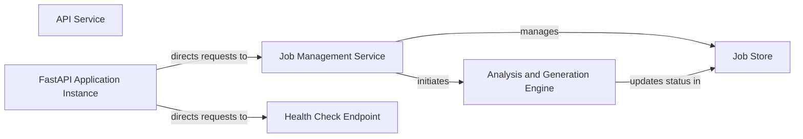

## Details

The CodeBoarding API Service is built around a FastAPI application instance that serves as the central dispatcher for all incoming requests. This instance routes requests to the Job Management Service, which orchestrates the lifecycle of code analysis and documentation generation jobs. The Job Management Service interacts with a Job Store for persistent storage of job data and delegates the intensive processing tasks to the Analysis and Generation Engine. This engine is responsible for performing the actual code analysis and generating the required outputs. A dedicated Health Check Endpoint is also exposed to monitor the API Service's operational status. This architecture ensures a clear separation of concerns, allowing for scalable job processing and robust API management.

### API Service [[Expand]](./API_Service.md)
The overarching component responsible for exposing CodeBoarding's functionality to external clients. It handles all incoming HTTP requests and routes them to the appropriate internal handlers.

**Related Classes/Methods**:

- <a href="https://github.com/CodeBoarding/CodeBoarding/blob/main/local_app.py" target="_blank" rel="noopener noreferrer">`local_app`</a>

### FastAPI Application Instance
The core of the API Service, this instance (`app` in `local_app.py`) manages the routing of incoming requests to specific endpoint functions and handles HTTP protocol details. It is the central dispatcher for all API calls.

**Related Classes/Methods**:

- <a href="https://github.com/CodeBoarding/CodeBoarding/blob/main/local_app.py" target="_blank" rel="noopener noreferrer">`local_app.app`</a>

### Job Management Service
Manages the lifecycle of all analysis and documentation generation jobs, including creation, status tracking, and retrieval. It interacts with the Job Store for persistence and delegates the actual processing to the Analysis and Generation Engine.

**Related Classes/Methods**:

- <a href="https://github.com/CodeBoarding/CodeBoarding/blob/main/local_app.py#L133-L150" target="_blank" rel="noopener noreferrer">`local_app.start_generation_job`:133-150</a>
- <a href="https://github.com/CodeBoarding/CodeBoarding/blob/main/local_app.py#L181-L231" target="_blank" rel="noopener noreferrer">`local_app.start_docs_generation_job`:181-231</a>
- <a href="https://github.com/CodeBoarding/CodeBoarding/blob/main/local_app.py#L161-L170" target="_blank" rel="noopener noreferrer">`local_app.get_job`:161-170</a>
- <a href="https://github.com/CodeBoarding/CodeBoarding/blob/main/local_app.py#L282-L311" target="_blank" rel="noopener noreferrer">`local_app.list_jobs`:282-311</a>
- <a href="https://github.com/CodeBoarding/CodeBoarding/blob/main/local_app.py#L234-L279" target="_blank" rel="noopener noreferrer">`local_app.get_github_action_status`:234-279</a>
- <a href="https://github.com/CodeBoarding/CodeBoarding/blob/main/local_app.py#L77-L89" target="_blank" rel="noopener noreferrer">`local_app.make_job`:77-89</a>
- <a href="https://github.com/CodeBoarding/CodeBoarding/blob/main/local_app.py#L92-L129" target="_blank" rel="noopener noreferrer">`local_app.generate_onboarding`:92-129</a>
- <a href="https://github.com/CodeBoarding/CodeBoarding/blob/main/local_app.py#L314-L378" target="_blank" rel="noopener noreferrer">`local_app.process_docs_generation_job`:314-378</a>

### Job Store
Provides persistent storage and retrieval mechanisms for job-related data, including job status, results, and metadata. It abstracts the underlying database operations.

**Related Classes/Methods**:

- <a href="https://github.com/CodeBoarding/CodeBoarding/blob/main/duckdb_crud.py#L73-L93" target="_blank" rel="noopener noreferrer">`duckdb_crud.fetch_job`:73-93</a>
- <a href="https://github.com/CodeBoarding/CodeBoarding/blob/main/duckdb_crud.py#L15-L44" target="_blank" rel="noopener noreferrer">`duckdb_crud.init_db`:15-44</a>
- <a href="https://github.com/CodeBoarding/CodeBoarding/blob/main/duckdb_crud.py#L48-L58" target="_blank" rel="noopener noreferrer">`duckdb_crud.insert_job`:48-58</a>
- <a href="https://github.com/CodeBoarding/CodeBoarding/blob/main/duckdb_crud.py#L61-L70" target="_blank" rel="noopener noreferrer">`duckdb_crud.update_job`:61-70</a>
- <a href="https://github.com/CodeBoarding/CodeBoarding/blob/main/duckdb_crud.py#L96-L117" target="_blank" rel="noopener noreferrer">`duckdb_crud.fetch_all_jobs`:96-117</a>

### Analysis and Generation Engine
Executes the actual code analysis, diagram generation, and documentation creation processes. It interacts with external repositories and internal static analysis tools to produce the final output.

**Related Classes/Methods**:

- <a href="https://github.com/CodeBoarding/CodeBoarding/blob/main/demo.py#L86-L101" target="_blank" rel="noopener noreferrer">`demo.generate_docs_remote`:86-101</a>
- <a href="https://github.com/CodeBoarding/CodeBoarding/blob/main/github_action.py#L70-L100" target="_blank" rel="noopener noreferrer">`github_action.generate_analysis`:70-100</a>

### Health Check Endpoint
A health check endpoint used to verify the availability and responsiveness of the API Service. It provides a simple status response to indicate the service is operational.

**Related Classes/Methods**:

- <a href="https://github.com/CodeBoarding/CodeBoarding/blob/main/local_app.py#L153-L159" target="_blank" rel="noopener noreferrer">`local_app.get_heart_beat`:153-159</a>

### [FAQ](https://github.com/CodeBoarding/GeneratedOnBoardings/tree/main?tab=readme-ov-file#faq)
