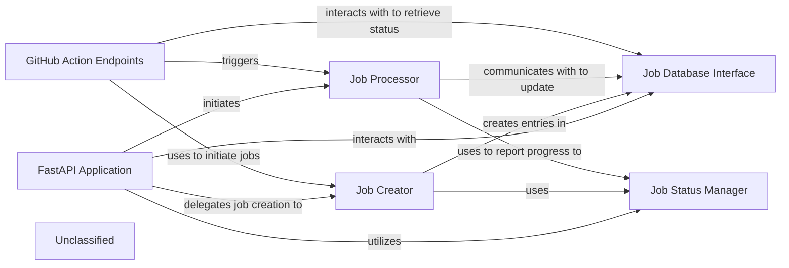

## Details

The system is built around a `FastAPI Application` that serves as the central entry point for all client interactions. It exposes various API endpoints, including those for general job management and specialized `GitHub Action Endpoints`. The `FastAPI Application` delegates the creation of new documentation generation jobs to the `Job Creator`, which initializes job records and interacts with the `Job Database Interface` for persistent storage. The `Job Status Manager` is crucial for tracking the lifecycle of each job, with updates and retrievals facilitated through the `Job Database Interface`. The core logic for processing documentation generation is encapsulated within the `Job Processor`, an asynchronous component that orchestrates the entire pipeline, from repository cloning to content generation, and reports its progress and results back via the `Job Status Manager` and `Job Database Interface`. The `GitHub Action Endpoints` specifically leverage the `Job Creator` and `Job Processor` to automate documentation generation within GitHub workflows and retrieve job statuses from the `Job Database Interface`.

### FastAPI Application
The core web server, responsible for defining and managing API endpoints, handling incoming HTTP requests, and routing them to appropriate handlers for job initiation, status retrieval, and external integrations. It serves as the primary entry point for all client interactions.

**Related Classes/Methods**:

- <a href="https://github.com/CodeBoarding/CodeBoarding/blob/mainlocal_app.py" target="_blank" rel="noopener noreferrer">`local_app.app`</a>

### Job Creator
Responsible for initializing new documentation generation job records. It assigns unique identifiers and sets the initial status (e.g., PENDING) for each new job, preparing it for processing.

**Related Classes/Methods**:

- <a href="https://github.com/CodeBoarding/CodeBoarding/blob/mainlocal_app.py" target="_blank" rel="noopener noreferrer">`local_app.make_job`</a>

### Job Status Manager
Defines and manages the lifecycle states of documentation generation jobs (e.g., PENDING, RUNNING, COMPLETED, FAILED). It provides a consistent mechanism for updating and retrieving the current status of any job within the system.

**Related Classes/Methods**:

- <a href="https://github.com/CodeBoarding/CodeBoarding/blob/mainlocal_app.py" target="_blank" rel="noopener noreferrer">`local_app.JobStatus`</a>
- <a href="https://github.com/CodeBoarding/CodeBoarding/blob/mainduckdb_crud.py" target="_blank" rel="noopener noreferrer">`duckdb_crud.update_job`</a>
- <a href="https://github.com/CodeBoarding/CodeBoarding/blob/mainduckdb_crud.py" target="_blank" rel="noopener noreferrer">`duckdb_crud.fetch_job`</a>

### Job Database Interface
Provides an abstraction layer for persistent storage and retrieval of job-related data. It encapsulates CRUD (Create, Read, Update, Delete) operations for job records, ensuring data integrity and accessibility across the API service.

**Related Classes/Methods**:

- <a href="https://github.com/CodeBoarding/CodeBoarding/blob/mainduckdb_crud.py" target="_blank" rel="noopener noreferrer">`duckdb_crud.init_db`</a>
- <a href="https://github.com/CodeBoarding/CodeBoarding/blob/mainduckdb_crud.py" target="_blank" rel="noopener noreferrer">`duckdb_crud.insert_job`</a>
- <a href="https://github.com/CodeBoarding/CodeBoarding/blob/mainduckdb_crud.py" target="_blank" rel="noopener noreferrer">`duckdb_crud.fetch_job`</a>
- <a href="https://github.com/CodeBoarding/CodeBoarding/blob/mainduckdb_crud.py" target="_blank" rel="noopener noreferrer">`duckdb_crud.update_job`</a>
- <a href="https://github.com/CodeBoarding/CodeBoarding/blob/mainduckdb_crud.py" target="_blank" rel="noopener noreferrer">`duckdb_crud.fetch_all_jobs`</a>

### Job Processor
An asynchronous component that orchestrates the end-to-end documentation generation pipeline for a single job. It handles repository cloning, invokes the core analysis and generation logic, and manages the processing results, updating job status throughout its execution.

**Related Classes/Methods**:

- <a href="https://github.com/CodeBoarding/CodeBoarding/blob/mainlocal_app.py" target="_blank" rel="noopener noreferrer">`local_app.generate_onboarding`</a>

### GitHub Action Endpoints
A specialized set of API endpoints within the FastAPI Application designed for seamless integration with GitHub Actions workflows. These endpoints facilitate automated job initiation and status monitoring specifically for GitHub-driven documentation generation requests.

**Related Classes/Methods**:

- <a href="https://github.com/CodeBoarding/CodeBoarding/blob/mainlocal_app.py" target="_blank" rel="noopener noreferrer">`local_app.start_docs_generation_job`</a>
- <a href="https://github.com/CodeBoarding/CodeBoarding/blob/mainlocal_app.py" target="_blank" rel="noopener noreferrer">`local_app.get_github_action_job_status`</a>

### Unclassified
Component for all unclassified files and utility functions (Utility functions/External Libraries/Dependencies)

**Related Classes/Methods**: _None_

### [FAQ](https://github.com/CodeBoarding/GeneratedOnBoardings/tree/main?tab=readme-ov-file#faq)
