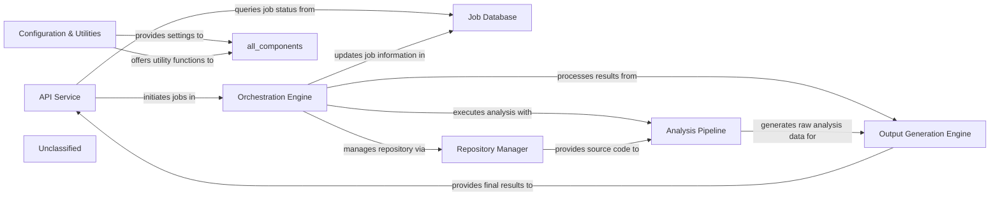

## Details

The CodeBoarding system operates with an `API Service` as its entry point, handling user requests and initiating code analysis jobs. These jobs are managed by an `Orchestration Engine` which coordinates the entire workflow, from fetching code via the `Repository Manager` to executing the `Analysis Pipeline` (encompassing static analysis and AI interpretation). The `Job Database` maintains the state and metadata of all ongoing and completed jobs. Once the analysis is complete, the `Output Generation Engine` formats the results into user-consumable documentation and visualizations, which are then retrieved by the `API Service`. A `Configuration & Utilities` component provides essential services and settings across the entire system, ensuring consistent operation and reusability. This architecture supports an asynchronous, pipeline-driven approach to code documentation and analysis.

### API Service [[Expand]](./API_Service.md)
The API Service acts as the primary external interface for CodeBoarding, responsible for receiving and processing user requests related to code analysis and visualization. It handles the initiation of new analysis jobs, provides mechanisms for users to retrieve the status of ongoing jobs, and serves the final analysis results, including generated documentation and visualizations. Furthermore, it integrates with external systems like GitHub Actions to trigger automated documentation generation workflows. This component is crucial for orchestrating the interaction between users and the backend analysis pipeline, aligning with the project's pipeline/event-driven and producer-consumer architectural patterns.

**Related Classes/Methods**:

- <a href="https://github.com/CodeBoarding/CodeBoarding/blob/mainlocal_app.py" target="_blank" rel="noopener noreferrer">`local_app.app`</a>

### Job Database
Manages the state and metadata of all analysis jobs, including their status, progress, and associated results. It acts as a central ledger for asynchronous operations, ensuring persistence and traceability of analysis tasks.

**Related Classes/Methods**:

- <a href="https://github.com/CodeBoarding/CodeBoarding/blob/mainduckdb_crud.py" target="_blank" rel="noopener noreferrer">`duckdb_crud`</a>

### Orchestration Engine [[Expand]](./Orchestration_Engine.md)
Coordinates the execution of analysis tasks, managing the flow of data and control between different engines. It's responsible for task scheduling, dependency management, and overall workflow execution, embodying the pipeline/event-driven architecture.

**Related Classes/Methods**:

- <a href="https://github.com/CodeBoarding/CodeBoarding/blob/mainlocal_app.py" target="_blank" rel="noopener noreferrer">`local_app.generate_onboarding`</a>

### Repository Manager [[Expand]](./Repository_Manager.md)
Handles interactions with code repositories (e.g., GitHub), including cloning, fetching, and managing local copies of the source code to be analyzed. It ensures the analysis engines have access to the correct code versions.

**Related Classes/Methods**:

- <a href="https://github.com/CodeBoarding/CodeBoarding/blob/mainrepo_utils" target="_blank" rel="noopener noreferrer">`repo_utils`</a>

### Analysis Pipeline
This component encapsulates the core logic for static analysis and AI-driven interpretation of the codebase. It takes the raw source code, extracts structural information, and then uses AI models to generate insights, summaries, and initial documentation drafts.

**Related Classes/Methods**:

- <a href="https://github.com/CodeBoarding/CodeBoarding/blob/maindemo.py" target="_blank" rel="noopener noreferrer">`demo.generate_docs_remote`</a>

### Output Generation Engine [[Expand]](./Output_Generation_Engine.md)
Responsible for formatting and generating the final outputs, such as documentation (e.g., Markdown, HTML), visualizations (e.g., Mermaid.js diagrams), and structured data. It transforms processed information into user-consumable formats.

**Related Classes/Methods**:

- <a href="https://github.com/CodeBoarding/CodeBoarding/blob/mainlocal_app.py" target="_blank" rel="noopener noreferrer">`local_app.generate_onboarding`</a>

### Configuration & Utilities
Provides common utilities, configuration management, and helper functions used across various components. This component ensures consistency and reusability of common functionalities.

**Related Classes/Methods**:

- <a href="https://github.com/CodeBoarding/CodeBoarding/blob/mainutils.py" target="_blank" rel="noopener noreferrer">`utils`</a>

### Unclassified
Component for all unclassified files and utility functions (Utility functions/External Libraries/Dependencies)

**Related Classes/Methods**: _None_

### [FAQ](https://github.com/CodeBoarding/GeneratedOnBoardings/tree/main?tab=readme-ov-file#faq)
