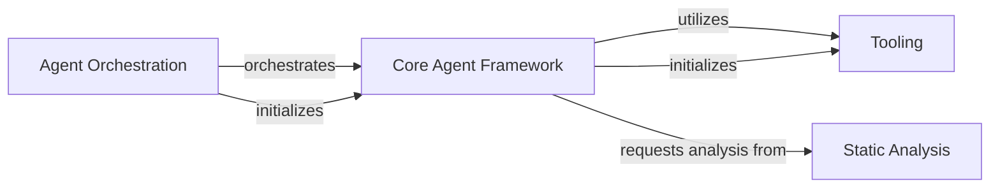

## Component Details

The Agent Orchestration subsystem serves as the central control unit for the CodeBoarding system, managing the lifecycle and interactions of various specialized agents. It orchestrates agent workflows, handles core functionalities such as parsing responses and resolving code references, and leverages a foundational Core Agent Framework, a suite of Tooling for code interaction, and a Static Analysis component for precise code reference mapping.

### Agent Orchestration
The central control unit responsible for initializing the system, managing agent workflows, and handling core functionalities like parsing responses and resolving code references.

**Related Classes/Methods**:

- <a href="https://github.com/CodeBoarding/CodeBoarding/blob/master/agents/agent.py#L19-L89" target="_blank" rel="noopener noreferrer">`agents.agent.CodeBoardingAgent` (19:89)</a>
- <a href="https://github.com/CodeBoarding/CodeBoarding/blob/master/agents/agent.py#L20-L33" target="_blank" rel="noopener noreferrer">`agents.agent.CodeBoardingAgent:__init__` (20:33)</a>
- <a href="https://github.com/CodeBoarding/CodeBoarding/blob/master/agents/agent.py#L41-L57" target="_blank" rel="noopener noreferrer">`agents.agent.CodeBoardingAgent:_invoke` (41:57)</a>
- <a href="https://github.com/CodeBoarding/CodeBoarding/blob/master/agents/agent.py#L59-L66" target="_blank" rel="noopener noreferrer">`agents.agent.CodeBoardingAgent:_parse_invoke` (59:66)</a>
- <a href="https://github.com/CodeBoarding/CodeBoarding/blob/master/agents/agent.py#L68-L89" target="_blank" rel="noopener noreferrer">`agents.agent.CodeBoardingAgent:fix_source_code_reference_lines` (68:89)</a>
- <a href="https://github.com/CodeBoarding/CodeBoarding/blob/master/static_analyzer/reference_lines.py#L4-L52" target="_blank" rel="noopener noreferrer">`static_analyzer.reference_lines:find_fqn_location` (4:52)</a>

### Core Agent Framework
Provides the foundational structure and core functionalities for all agents in the CodeBoarding system. It defines common behaviors such as parsing invocations, setting up environment variables, interacting with tools, and handling source code reference resolution.

**Related Classes/Methods**:

- <a href="https://github.com/CodeBoarding/CodeBoarding/blob/master/agents/agent.py#L19-L89" target="_blank" rel="noopener noreferrer">`agents.agent.CodeBoardingAgent` (19:89)</a>
- <a href="https://github.com/CodeBoarding/CodeBoarding/blob/master/agents/agent.py#L20-L33" target="_blank" rel="noopener noreferrer">`agents.agent.CodeBoardingAgent:__init__` (20:33)</a>
- <a href="https://github.com/CodeBoarding/CodeBoarding/blob/master/agents/agent.py#L59-L66" target="_blank" rel="noopener noreferrer">`agents.agent.CodeBoardingAgent:_parse_invoke` (59:66)</a>
- <a href="https://github.com/CodeBoarding/CodeBoarding/blob/master/agents/agent.py#L68-L89" target="_blank" rel="noopener noreferrer">`agents.agent.CodeBoardingAgent.fix_source_code_reference_lines` (68:89)</a>
- <a href="https://github.com/CodeBoarding/CodeBoarding/blob/master/agents/agent.py#L35-L39" target="_blank" rel="noopener noreferrer">`agents.agent.CodeBoardingAgent._setup_env_vars` (35:39)</a>
- <a href="https://github.com/CodeBoarding/CodeBoarding/blob/master/agents/agent.py#L41-L57" target="_blank" rel="noopener noreferrer">`agents.agent.CodeBoardingAgent._invoke` (41:57)</a>

### Tooling
A collection of utility tools that enable agents to interact with the codebase. These tools provide functionalities like reading source code, understanding package relationships, and analyzing code structure, which are crucial for agents to gather information for their analysis tasks.

**Related Classes/Methods**:

- <a href="https://github.com/CodeBoarding/CodeBoarding/blob/master/agents/tools/read_source.py#L19-L137" target="_blank" rel="noopener noreferrer">`agents.tools.read_source.CodeExplorerTool` (19:137)</a>
- <a href="https://github.com/CodeBoarding/CodeBoarding/blob/master/agents/tools/read_source.py#L49-L114" target="_blank" rel="noopener noreferrer">`agents.tools.read_source.CodeExplorerTool.read_file` (49:114)</a>
- <a href="https://github.com/CodeBoarding/CodeBoarding/blob/master/agents/tools/read_packages.py#L25-L74" target="_blank" rel="noopener noreferrer">`agents.tools.read_packages.PackageRelationsTool` (25:74)</a>
- <a href="https://github.com/CodeBoarding/CodeBoarding/blob/master/agents/tools/read_structure.py#L12-L58" target="_blank" rel="noopener noreferrer">`agents.tools.read_structure.CodeStructureTool` (12:58)</a>
- `agents.tools` (full file reference)

### Static Analysis
Responsible for performing static code analysis, primarily focused on identifying and locating fully qualified names (FQNs) within the source code. This component assists in precisely mapping code references to their exact positions in files.

**Related Classes/Methods**:

- <a href="https://github.com/CodeBoarding/CodeBoarding/blob/master/static_analyzer/reference_lines.py#L4-L52" target="_blank" rel="noopener noreferrer">`static_analyzer.reference_lines.find_fqn_location` (4:52)</a>
- <a href="https://github.com/CodeBoarding/CodeBoarding/blob/master/static_analyzer/reference_lines.py#L21-L30" target="_blank" rel="noopener noreferrer">`static_analyzer.reference_lines.find_fqn_location.find_node` (21:30)</a>
- `static_analyzer.reference_lines.find_fqn_location.LineCounter` (full file reference)
- `static_analyzer.reference_lines.find_fqn_location.LineCounter.visit` (full file reference)
- `static_analyzer.reference_lines` (full file reference)

### [FAQ](https://github.com/CodeBoarding/GeneratedOnBoardings/tree/main?tab=readme-ov-file#faq)
