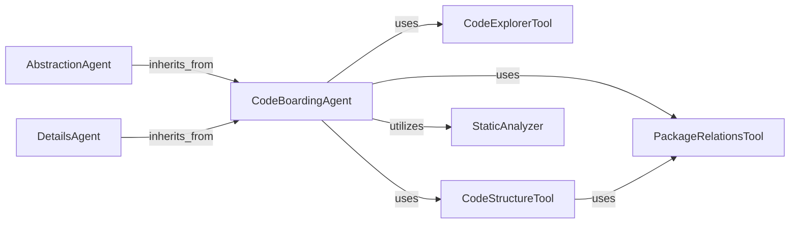

## Component Details

The Agent System is the core intelligent system responsible for analyzing code, stepping through CFGs and source, and generating detailed or abstract insights. It provides the foundational structure for all agents and their specialized functionalities, orchestrating various tools to perform comprehensive code analysis.

### CodeBoardingAgent
The central orchestrator of the CodeBoarding subsystem, responsible for initializing various tools and managing the parsing and invocation of analysis steps. It acts as a core agent that delegates tasks to specialized tools and handles the overall flow of code analysis.

**Related Classes/Methods**:

- <a href="https://github.com/CodeBoarding/CodeBoarding/blob/master/agents/agent.py#L20-L33" target="_blank" rel="noopener noreferrer">`agents.agent.CodeBoardingAgent:__init__` (20:33)</a>
- <a href="https://github.com/CodeBoarding/CodeBoarding/blob/master/agents/agent.py#L59-L66" target="_blank" rel="noopener noreferrer">`agents.agent.CodeBoardingAgent:_parse_invoke` (59:66)</a>
- <a href="https://github.com/CodeBoarding/CodeBoarding/blob/master/agents/agent.py#L68-L89" target="_blank" rel="noopener noreferrer">`agents.agent.CodeBoardingAgent:fix_source_code_reference_lines` (68:89)</a>
- <a href="https://github.com/CodeBoarding/CodeBoarding/blob/master/agents/agent.py#L35-L39" target="_blank" rel="noopener noreferrer">`agents.agent.CodeBoardingAgent._setup_env_vars` (35:39)</a>
- <a href="https://github.com/CodeBoarding/CodeBoarding/blob/master/agents/agent.py#L41-L57" target="_blank" rel="noopener noreferrer">`agents.agent.CodeBoardingAgent._invoke` (41:57)</a>

### AbstractionAgent
A specialized agent within the CodeBoarding subsystem focused on generating abstract analysis. It interacts with the core CodeBoardingAgent to perform its steps related to CFG and source code analysis, ultimately contributing to the overall analysis generation.

**Related Classes/Methods**:

- <a href="https://github.com/CodeBoarding/CodeBoarding/blob/master/agents/abstraction_agent.py#L12-L38" target="_blank" rel="noopener noreferrer">`agents.abstraction_agent.AbstractionAgent:__init__` (12:38)</a>
- <a href="https://github.com/CodeBoarding/CodeBoarding/blob/master/agents/abstraction_agent.py#L40-L45" target="_blank" rel="noopener noreferrer">`agents.abstraction_agent.AbstractionAgent:step_cfg` (40:45)</a>
- <a href="https://github.com/CodeBoarding/CodeBoarding/blob/master/agents/abstraction_agent.py#L47-L62" target="_blank" rel="noopener noreferrer">`agents.abstraction_agent.AbstractionAgent:step_source` (47:62)</a>
- <a href="https://github.com/CodeBoarding/CodeBoarding/blob/master/agents/abstraction_agent.py#L64-L72" target="_blank" rel="noopener noreferrer">`agents.abstraction_agent.AbstractionAgent:generate_analysis` (64:72)</a>

### DetailsAgent
An agent dedicated to providing detailed analysis within the CodeBoarding subsystem. It performs steps for sub-CFG, CFG, enhanced structure, and general analysis by interacting with the core CodeBoardingAgent to execute its specific analytical tasks.

**Related Classes/Methods**:

- <a href="https://github.com/CodeBoarding/CodeBoarding/blob/master/agents/details_agent.py#L13-L40" target="_blank" rel="noopener noreferrer">`agents.details_agent.DetailsAgent:__init__` (13:40)</a>
- <a href="https://github.com/CodeBoarding/CodeBoarding/blob/master/agents/details_agent.py#L42-L47" target="_blank" rel="noopener noreferrer">`agents.details_agent.DetailsAgent:step_subcfg` (42:47)</a>
- <a href="https://github.com/CodeBoarding/CodeBoarding/blob/master/agents/details_agent.py#L49-L56" target="_blank" rel="noopener noreferrer">`agents.details_agent.DetailsAgent:step_cfg` (49:56)</a>
- <a href="https://github.com/CodeBoarding/CodeBoarding/blob/master/agents/details_agent.py#L58-L67" target="_blank" rel="noopener noreferrer">`agents.details_agent.DetailsAgent:step_enhance_structure` (58:67)</a>
- <a href="https://github.com/CodeBoarding/CodeBoarding/blob/master/agents/details_agent.py#L69-L76" target="_blank" rel="noopener noreferrer">`agents.details_agent.DetailsAgent:step_analysis` (69:76)</a>

### CodeExplorerTool
A utility tool within the CodeBoarding subsystem designed for reading and exploring source code files. It provides functionalities to read file content and identify subsequences, supporting the agents in accessing and processing code information.

**Related Classes/Methods**:

- <a href="https://github.com/CodeBoarding/CodeBoarding/blob/master/agents/tools/read_source.py#L29-L32" target="_blank" rel="noopener noreferrer">`agents.tools.read_source.CodeExplorerTool:__init__` (29:32)</a>
- <a href="https://github.com/CodeBoarding/CodeBoarding/blob/master/agents/tools/read_source.py#L41-L47" target="_blank" rel="noopener noreferrer">`agents.tools.read_source.CodeExplorerTool:_run` (41:47)</a>
- <a href="https://github.com/CodeBoarding/CodeBoarding/blob/master/agents/tools/read_source.py#L49-L114" target="_blank" rel="noopener noreferrer">`agents.tools.read_source.CodeExplorerTool:read_file` (49:114)</a>
- <a href="https://github.com/CodeBoarding/CodeBoarding/blob/master/agents/tools/read_source.py#L131-L137" target="_blank" rel="noopener noreferrer">`agents.tools.read_source.CodeExplorerTool.is_subsequence` (131:137)</a>
- <a href="https://github.com/CodeBoarding/CodeBoarding/blob/master/agents/tools/read_source.py#L117-L129" target="_blank" rel="noopener noreferrer">`agents.tools.read_source.CodeExplorerTool.read_content` (117:129)</a>
- <a href="https://github.com/CodeBoarding/CodeBoarding/blob/master/agents/tools/read_source.py#L144-L147" target="_blank" rel="noopener noreferrer">`agents.tools.read_source.transform_path` (144:147)</a>

### PackageRelationsTool
A tool used by the CodeBoarding subsystem to analyze and provide information about package relationships. It reads package data, potentially from dot files, to establish the hierarchy and connections between different code packages.

**Related Classes/Methods**:

- <a href="https://github.com/CodeBoarding/CodeBoarding/blob/master/agents/tools/read_packages.py#L34-L37" target="_blank" rel="noopener noreferrer">`agents.tools.read_packages.PackageRelationsTool:__init__` (34:37)</a>
- <a href="https://github.com/CodeBoarding/CodeBoarding/blob/master/agents/tools/read_packages.py#L47-L58" target="_blank" rel="noopener noreferrer">`agents.tools.read_packages.PackageRelationsTool:_run` (47:58)</a>
- <a href="https://github.com/CodeBoarding/CodeBoarding/blob/master/agents/tools/read_packages.py#L60-L74" target="_blank" rel="noopener noreferrer">`agents.tools.read_packages.PackageRelationsTool:read_file` (60:74)</a>
- <a href="https://github.com/CodeBoarding/CodeBoarding/blob/master/agents/tools/utils.py#L6-L19" target="_blank" rel="noopener noreferrer">`agents.tools.utils.read_dot_file` (6:19)</a>
- <a href="https://github.com/CodeBoarding/CodeBoarding/blob/master/agents/tools/read_packages.py#L17-L22" target="_blank" rel="noopener noreferrer">`agents.tools.read_packages.NoRootPackageFoundError` (17:22)</a>

### CodeStructureTool
A tool within the CodeBoarding subsystem dedicated to reading and analyzing the structural aspects of code. It helps in understanding the organization and layout of the codebase, which is crucial for comprehensive analysis.

**Related Classes/Methods**:

- <a href="https://github.com/CodeBoarding/CodeBoarding/blob/master/agents/tools/read_structure.py#L19-L22" target="_blank" rel="noopener noreferrer">`agents.tools.read_structure.CodeStructureTool:__init__` (19:22)</a>
- <a href="https://github.com/CodeBoarding/CodeBoarding/blob/master/agents/tools/read_structure.py#L32-L42" target="_blank" rel="noopener noreferrer">`agents.tools.read_structure.CodeStructureTool:_run` (32:42)</a>
- <a href="https://github.com/CodeBoarding/CodeBoarding/blob/master/agents/tools/read_structure.py#L44-L58" target="_blank" rel="noopener noreferrer">`agents.tools.read_structure.CodeStructureTool:read_file` (44:58)</a>

### StaticAnalyzer
A component responsible for performing static analysis tasks, specifically focusing on finding fully qualified name (FQN) locations within the source code. It includes functionalities to traverse code structures and count lines to pinpoint exact references.

**Related Classes/Methods**:

- <a href="https://github.com/CodeBoarding/CodeBoarding/blob/master/static_analyzer/reference_lines.py#L4-L52" target="_blank" rel="noopener noreferrer">`static_analyzer.reference_lines:find_fqn_location` (4:52)</a>
- <a href="https://github.com/CodeBoarding/CodeBoarding/blob/master/static_analyzer/reference_lines.py#L21-L30" target="_blank" rel="noopener noreferrer">`static_analyzer.reference_lines.find_fqn_location.find_node` (21:30)</a>
- `static_analyzer.reference_lines.find_fqn_location.LineCounter` (full file reference)
- `static_analyzer.reference_lines.find_fqn_location.LineCounter.visit` (full file reference)

### [FAQ](https://github.com/CodeBoarding/GeneratedOnBoardings/tree/main?tab=readme-ov-file#faq)
