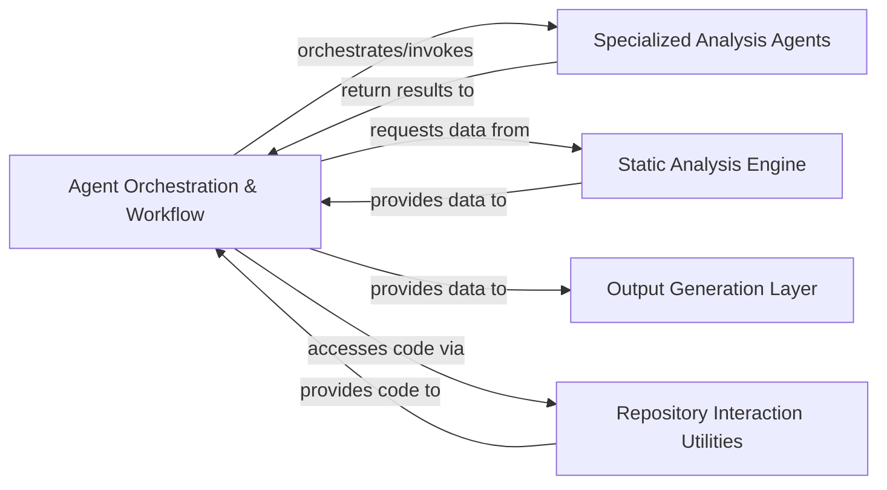

## Details

The `Agent Orchestration & Workflow` component serves as the central nervous system of the AI-powered software engineering tool. It is responsible for initiating, managing, and coordinating the entire code analysis and documentation generation pipeline. This component embodies the "Agent Orchestration Unit" and "Pipeline/Workflow Pattern" by defining the overall flow, from static analysis and initial project abstraction to detailed component analysis and iterative refinement.

### Agent Orchestration & Workflow [[Expand]](./Agent_Orchestration_Workflow.md)
This is the central control unit responsible for initiating, managing, and coordinating the entire analysis workflow. It orchestrates the execution of various AI agents, processes their outputs, and directs the generation of final documentation. It defines the overall pipeline for code analysis and documentation, including static analysis generation, initial project abstraction, detailed component analysis, and iterative refinement based on validation and diff analysis.

**Related Classes/Methods**:

- <a href="https://github.com/CodeBoarding/CodeBoarding/blob/main/diagram_analysis/diagram_generator.py#L22-L210" target="_blank" rel="noopener noreferrer">`diagram_analysis.diagram_generator.DiagramGenerator` (22:210)</a>
- <a href="https://github.com/CodeBoarding/CodeBoarding/blob/main/diagram_analysis/diagram_generator.py#L82-L104" target="_blank" rel="noopener noreferrer">`diagram_analysis.diagram_generator.DiagramGenerator:pre_analysis` (82:104)</a>
- <a href="https://github.com/CodeBoarding/CodeBoarding/blob/main/diagram_analysis/diagram_generator.py#L106-L184" target="_blank" rel="noopener noreferrer">`diagram_analysis.diagram_generator.DiagramGenerator:generate_analysis` (106:184)</a>
- <a href="https://github.com/CodeBoarding/CodeBoarding/blob/main/diagram_analysis/diagram_generator.py#L38-L80" target="_blank" rel="noopener noreferrer">`diagram_analysis.diagram_generator.DiagramGenerator:process_component` (38:80)</a>

### Specialized Analysis Agents
A collection of distinct AI agents (e.g., `MetaAgent`, `AbstractionAgent`, `DetailsAgent`, `PlannerAgent`, `ValidatorAgent`, `DiffAnalyzingAgent`) each designed to perform specific, intelligent analysis tasks. These agents are responsible for core AI-driven reasoning, such as initial project abstraction, detailed component analysis, planning the analysis process, validating results, and analyzing code differences.

**Related Classes/Methods**: _None_

### Static Analysis Engine
Provides foundational code analysis capabilities by extracting structural and relational data directly from the codebase. This includes building call graphs (`CallGraphBuilder`) and structure graphs (`StructureGraphBuilder`), which are crucial for providing objective, factual data to the AI agents for their reasoning processes.

**Related Classes/Methods**: _None_

### Output Generation Layer
Responsible for transforming the processed analysis results and agent outputs into various human-readable documentation formats (e.g., HTML, Markdown, Sphinx). It takes the structured data produced by the Agent Orchestration & Workflow and renders the final user-facing documentation.

**Related Classes/Methods**: _None_

### Repository Interaction Utilities
Handles interactions with the code repository, including fetching code, managing versions, and potentially handling diffs. This component ensures the analysis workflow has access to the necessary source code and can track changes.

**Related Classes/Methods**: _None_

### [FAQ](https://github.com/CodeBoarding/GeneratedOnBoardings/tree/main?tab=readme-ov-file#faq)
