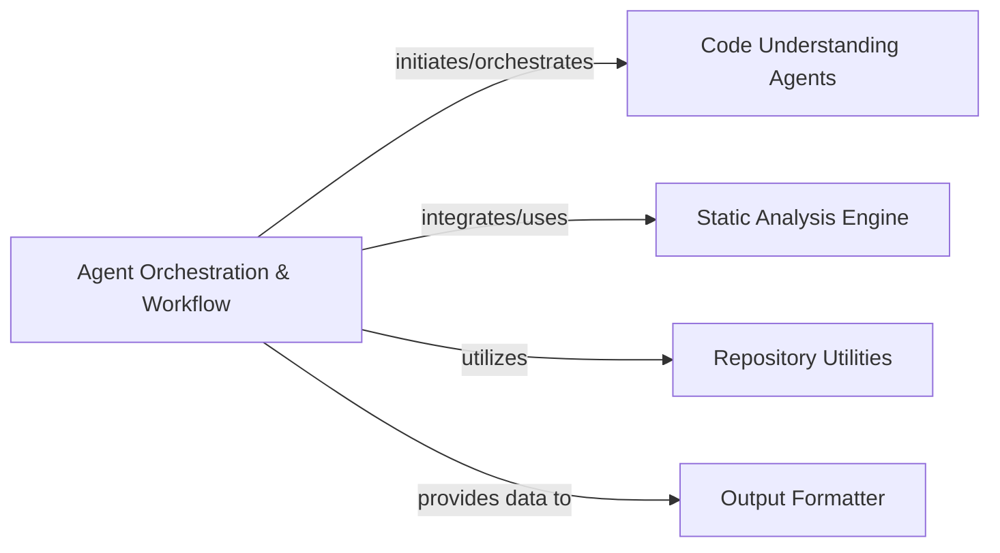

## Details

One paragraph explaining the functionality which is represented by this graph. What the main flow is and what is its purpose.

### Agent Orchestration & Workflow [[Expand]](./Agent_Orchestration_Workflow.md)
This component is the core orchestrator of the code understanding and onboarding platform. It manages the end-to-end workflow, from initiating code analysis to coordinating various AI agents and integrating their outputs to generate comprehensive documentation. It acts as the central nervous system, ensuring all sub-components work in harmony to achieve the project's goal.

**Related Classes/Methods**:

- <a href="https://github.com/CodeBoarding/CodeBoarding/blob/main/diagram_analysis/diagram_generator.py#L1-L100" target="_blank" rel="noopener noreferrer">`diagram_analysis.diagram_generator` (1:100)</a>

### Code Understanding Agents

**Related Classes/Methods**: _None_

### Static Analysis Engine

**Related Classes/Methods**: _None_

### Repository Utilities

**Related Classes/Methods**: _None_

### Output Formatter

**Related Classes/Methods**: _None_

### [FAQ](https://github.com/CodeBoarding/GeneratedOnBoardings/tree/main?tab=readme-ov-file#faq)
