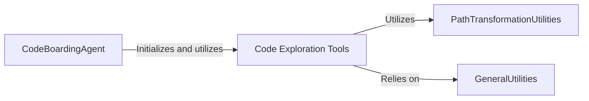

## Component Details

This graph illustrates the architecture of the CodeBoarding subsystem, focusing on how the central `CodeBoardingAgent` interacts with various `Code Exploration Tools` to analyze and understand source code. The `Code Exploration Tools` further leverage `PathTransformationUtilities` for path handling and `GeneralUtilities` for common functionalities, forming a cohesive system for code analysis.

### CodeBoardingAgent
The central agent responsible for orchestrating the code boarding process. It initializes and leverages various specialized tools to understand, analyze, and potentially modify source code references within a project.

**Related Classes/Methods**:

- <a href="https://github.com/CodeBoarding/CodeBoarding/blob/master/agents/agent.py#L20-L33" target="_blank" rel="noopener noreferrer">`agents.agent.CodeBoardingAgent:__init__` (20:33)</a>
- <a href="https://github.com/CodeBoarding/CodeBoarding/blob/master/agents/agent.py#L68-L89" target="_blank" rel="noopener noreferrer">`agents.agent.CodeBoardingAgent:fix_source_code_reference_lines` (68:89)</a>

### Code Exploration Tools
A suite of utility tools that allow agents to interact with the codebase by reading source files, understanding package hierarchies, and analyzing class structures. This component aggregates CodeExplorerTool, PackageRelationsTool, and CodeStructureTool.

**Related Classes/Methods**:

- <a href="https://github.com/CodeBoarding/CodeBoarding/blob/master/agents/tools/read_source.py#L19-L137" target="_blank" rel="noopener noreferrer">`agents.tools.read_source.CodeExplorerTool` (19:137)</a>
- <a href="https://github.com/CodeBoarding/CodeBoarding/blob/master/agents/tools/read_source.py#L29-L32" target="_blank" rel="noopener noreferrer">`agents.tools.read_source.CodeExplorerTool:__init__` (29:32)</a>
- <a href="https://github.com/CodeBoarding/CodeBoarding/blob/master/agents/tools/read_source.py#L41-L47" target="_blank" rel="noopener noreferrer">`agents.tools.read_source.CodeExplorerTool:_run` (41:47)</a>
- <a href="https://github.com/CodeBoarding/CodeBoarding/blob/master/agents/tools/read_source.py#L49-L114" target="_blank" rel="noopener noreferrer">`agents.tools.read_source.CodeExplorerTool:read_file` (49:114)</a>
- <a href="https://github.com/CodeBoarding/CodeBoarding/blob/master/agents/tools/read_source.py#L34-L39" target="_blank" rel="noopener noreferrer">`agents.tools.read_source.CodeExplorerTool.walk_dir` (34:39)</a>
- <a href="https://github.com/CodeBoarding/CodeBoarding/blob/master/agents/tools/read_source.py#L131-L137" target="_blank" rel="noopener noreferrer">`agents.tools.read_source.CodeExplorerTool.is_subsequence` (131:137)</a>
- <a href="https://github.com/CodeBoarding/CodeBoarding/blob/master/agents/tools/read_source.py#L117-L129" target="_blank" rel="noopener noreferrer">`agents.tools.read_source.CodeExplorerTool.read_content` (117:129)</a>
- <a href="https://github.com/CodeBoarding/CodeBoarding/blob/master/agents/tools/read_packages.py#L25-L74" target="_blank" rel="noopener noreferrer">`agents.tools.read_packages.PackageRelationsTool` (25:74)</a>
- <a href="https://github.com/CodeBoarding/CodeBoarding/blob/master/agents/tools/read_packages.py#L34-L37" target="_blank" rel="noopener noreferrer">`agents.tools.read_packages.PackageRelationsTool:__init__` (34:37)</a>
- <a href="https://github.com/CodeBoarding/CodeBoarding/blob/master/agents/tools/read_packages.py#L47-L58" target="_blank" rel="noopener noreferrer">`agents.tools.read_packages.PackageRelationsTool:_run` (47:58)</a>
- <a href="https://github.com/CodeBoarding/CodeBoarding/blob/master/agents/tools/read_packages.py#L60-L74" target="_blank" rel="noopener noreferrer">`agents.tools.read_packages.PackageRelationsTool:read_file` (60:74)</a>
- <a href="https://github.com/CodeBoarding/CodeBoarding/blob/master/agents/tools/read_packages.py#L39-L45" target="_blank" rel="noopener noreferrer">`agents.tools.read_packages.PackageRelationsTool.walk_dir` (39:45)</a>
- <a href="https://github.com/CodeBoarding/CodeBoarding/blob/master/agents/tools/read_packages.py#L17-L22" target="_blank" rel="noopener noreferrer">`agents.tools.read_packages.NoRootPackageFoundError` (17:22)</a>
- <a href="https://github.com/CodeBoarding/CodeBoarding/blob/master/agents/tools/read_structure.py#L12-L58" target="_blank" rel="noopener noreferrer">`agents.tools.read_structure.CodeStructureTool` (12:58)</a>
- <a href="https://github.com/CodeBoarding/CodeBoarding/blob/master/agents/tools/read_structure.py#L19-L22" target="_blank" rel="noopener noreferrer">`agents.tools.read_structure.CodeStructureTool:__init__` (19:22)</a>
- <a href="https://github.com/CodeBoarding/CodeBoarding/blob/master/agents/tools/read_structure.py#L32-L42" target="_blank" rel="noopener noreferrer">`agents.tools.read_structure.CodeStructureTool:_run` (32:42)</a>
- <a href="https://github.com/CodeBoarding/CodeBoarding/blob/master/agents/tools/read_structure.py#L24-L30" target="_blank" rel="noopener noreferrer">`agents.tools.read_structure.CodeStructureTool.walk_dir` (24:30)</a>
- <a href="https://github.com/CodeBoarding/CodeBoarding/blob/master/agents/tools/read_structure.py#L44-L58" target="_blank" rel="noopener noreferrer">`agents.tools.read_structure.CodeStructureTool.read_file` (44:58)</a>

### PathTransformationUtilities
A collection of utility functions specifically dedicated to transforming and standardizing file paths. This includes converting between different naming conventions, such as PascalCase to snake_case.

**Related Classes/Methods**:

- <a href="https://github.com/CodeBoarding/CodeBoarding/blob/master/agents/tools/read_source.py#L144-L147" target="_blank" rel="noopener noreferrer">`agents.tools.read_source:transform_path` (144:147)</a>
- <a href="https://github.com/CodeBoarding/CodeBoarding/blob/master/agents/tools/read_source.py#L140-L141" target="_blank" rel="noopener noreferrer">`agents.tools.read_source.pascal_to_snake_segment` (140:141)</a>

### GeneralUtilities
A module containing common utility functions that are not specific to any single tool but are utilized across various components of the CodeBoarding subsystem, such as reading specific file formats.

**Related Classes/Methods**:

- <a href="https://github.com/CodeBoarding/CodeBoarding/blob/master/agents/tools/utils.py#L6-L19" target="_blank" rel="noopener noreferrer">`agents.tools.utils.read_dot_file` (6:19)</a>

### [FAQ](https://github.com/CodeBoarding/GeneratedOnBoardings/tree/main?tab=readme-ov-file#faq)
