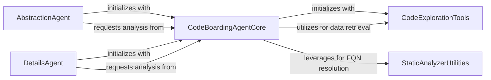

## Component Details

This graph illustrates the core components of the CodeBoarding system, focusing on the central orchestration by the CodeBoardingAgentCore and its interactions with specialized agents (AbstractionAgent, DetailsAgent) and underlying utility components (CodeExplorationTools, StaticAnalyzerUtilities). The main flow involves the CodeBoardingAgentCore setting up the environment and parsing invocations, which then delegates specific analysis tasks to the AbstractionAgent for high-level overviews and the DetailsAgent for in-depth insights. Both specialized agents rely on the CodeBoardingAgentCore for foundational operations like source code reference handling, while the core agent itself leverages CodeExplorationTools for data retrieval and StaticAnalyzerUtilities for resolving fully qualified names.

### CodeBoardingAgentCore
The central orchestrator responsible for setting up the environment, parsing invocations, and coordinating various code analysis tasks. It acts as an intermediary between specialized agents (Abstraction and Details) and underlying code exploration tools and static analysis utilities.

**Related Classes/Methods**:

- <a href="https://github.com/CodeBoarding/CodeBoarding/blob/master/agents/agent.py#L19-L38" target="_blank" rel="noopener noreferrer">`agents.agent.CodeBoardingAgent.__init__` (19:38)</a>
- <a href="https://github.com/CodeBoarding/CodeBoarding/blob/master/agents/agent.py#L64-L71" target="_blank" rel="noopener noreferrer">`agents.agent.CodeBoardingAgent._parse_invoke` (64:71)</a>
- <a href="https://github.com/CodeBoarding/CodeBoarding/blob/master/agents/agent.py#L73-L94" target="_blank" rel="noopener noreferrer">`agents.agent.CodeBoardingAgent.fix_source_code_reference_lines` (73:94)</a>
- <a href="https://github.com/CodeBoarding/CodeBoarding/blob/master/agents/agent.py#L40-L44" target="_blank" rel="noopener noreferrer">`agents.agent.CodeBoardingAgent._setup_env_vars` (40:44)</a>
- <a href="https://github.com/CodeBoarding/CodeBoarding/blob/master/agents/agent.py#L46-L62" target="_blank" rel="noopener noreferrer">`agents.agent.CodeBoardingAgent._invoke` (46:62)</a>

### AbstractionAgent
This agent is responsible for generating high-level analysis of the code. It interacts with the CodeBoardingAgentCore to parse invocations and fix source code reference lines, contributing to the overall understanding of the system's structure and flow.

**Related Classes/Methods**:

- <a href="https://github.com/CodeBoarding/CodeBoarding/blob/master/agents/abstraction_agent.py#L12-L38" target="_blank" rel="noopener noreferrer">`agents.abstraction_agent.AbstractionAgent.__init__` (12:38)</a>
- <a href="https://github.com/CodeBoarding/CodeBoarding/blob/master/agents/abstraction_agent.py#L40-L45" target="_blank" rel="noopener noreferrer">`agents.abstraction_agent.AbstractionAgent.step_cfg` (40:45)</a>
- <a href="https://github.com/CodeBoarding/CodeBoarding/blob/master/agents/abstraction_agent.py#L47-L62" target="_blank" rel="noopener noreferrer">`agents.abstraction_agent.AbstractionAgent.step_source` (47:62)</a>
- <a href="https://github.com/CodeBoarding/CodeBoarding/blob/master/agents/abstraction_agent.py#L64-L72" target="_blank" rel="noopener noreferrer">`agents.abstraction_agent.AbstractionAgent.generate_analysis` (64:72)</a>

### DetailsAgent
The Details Agent focuses on providing detailed insights into specific aspects of the code, such as sub-configurations, CFG steps, enhanced structure, and in-depth analysis. It leverages the CodeBoardingAgentCore for parsing and fixing source references to achieve its detailed examination.

**Related Classes/Methods**:

- <a href="https://github.com/CodeBoarding/CodeBoarding/blob/master/agents/details_agent.py#L13-L40" target="_blank" rel="noopener noreferrer">`agents.details_agent.DetailsAgent.__init__` (13:40)</a>
- <a href="https://github.com/CodeBoarding/CodeBoarding/blob/master/agents/details_agent.py#L42-L47" target="_blank" rel="noopener noreferrer">`agents.details_agent.DetailsAgent.step_subcfg` (42:47)</a>
- <a href="https://github.com/CodeBoarding/CodeBoarding/blob/master/agents/details_agent.py#L49-L56" target="_blank" rel="noopener noreferrer">`agents.details_agent.DetailsAgent.step_cfg` (49:56)</a>
- <a href="https://github.com/CodeBoarding/CodeBoarding/blob/master/agents/details_agent.py#L58-L67" target="_blank" rel="noopener noreferrer">`agents.details_agent.DetailsAgent.step_enhance_structure` (58:67)</a>
- <a href="https://github.com/CodeBoarding/CodeBoarding/blob/master/agents/details_agent.py#L69-L76" target="_blank" rel="noopener noreferrer">`agents.details_agent.DetailsAgent.step_analysis` (69:76)</a>

### CodeExplorationTools
This component provides a set of tools for exploring and reading various aspects of the codebase. It includes functionalities for reading source code, understanding package relationships, and analyzing class structures, which are crucial for the agents to gather information about the project.

**Related Classes/Methods**:

- `agents.tools.read_source.CodeExplorerTool` (full file reference)
- <a href="https://github.com/CodeBoarding/CodeBoarding/blob/master/agents/tools/read_packages.py#L29-L83" target="_blank" rel="noopener noreferrer">`agents.tools.read_packages.PackageRelationsTool` (29:83)</a>
- <a href="https://github.com/CodeBoarding/CodeBoarding/blob/master/agents/tools/read_structure.py#L12-L66" target="_blank" rel="noopener noreferrer">`agents.tools.read_structure.CodeStructureTool` (12:66)</a>
- `agents.tools.read_source.CodeExplorerTool.read_file` (full file reference)

### StaticAnalyzerUtilities
This component provides utilities for static analysis, specifically for finding fully qualified name (FQN) locations within the source code. This is essential for accurately referencing and linking code elements during analysis and reporting.

**Related Classes/Methods**:

- <a href="https://github.com/CodeBoarding/CodeBoarding/blob/master/static_analyzer/reference_lines.py#L4-L52" target="_blank" rel="noopener noreferrer">`static_analyzer.reference_lines.find_fqn_location` (4:52)</a>

### [FAQ](https://github.com/CodeBoarding/GeneratedOnBoardings/tree/main?tab=readme-ov-file#faq)
