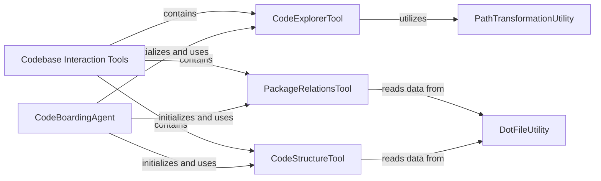

## Component Details

This graph represents the 'Codebase Interaction Tools' subsystem, which provides agents with capabilities to understand and navigate a codebase. The main flow involves agents utilizing specialized tools to read source code, analyze package dependencies, and explore code structure, enabling comprehensive code analysis and onboarding.

### Codebase Interaction Tools
A suite of utility tools enabling agents to interact with the codebase, including reading source files, analyzing package dependencies, and understanding overall class and module structures.

**Related Classes/Methods**:

- <a href="https://github.com/CodeBoarding/CodeBoarding/blob/master/agents/tools/read_source.py#L19-L137" target="_blank" rel="noopener noreferrer">`agents.tools.read_source.CodeExplorerTool` (19:137)</a>
- <a href="https://github.com/CodeBoarding/CodeBoarding/blob/master/agents/tools/read_packages.py#L25-L74" target="_blank" rel="noopener noreferrer">`agents.tools.read_packages.PackageRelationsTool` (25:74)</a>
- <a href="https://github.com/CodeBoarding/CodeBoarding/blob/master/agents/tools/read_structure.py#L12-L58" target="_blank" rel="noopener noreferrer">`agents.tools.read_structure.CodeStructureTool` (12:58)</a>

### CodeExplorerTool
The CodeExplorerTool is responsible for reading and providing access to the source code of Python modules and files. It manages a cache of discovered files within a given repository and offers functionality to retrieve specific parts of large files. This tool is crucial for enabling the agent to inspect and understand the actual code content.

**Related Classes/Methods**:

- <a href="https://github.com/CodeBoarding/CodeBoarding/blob/master/agents/tools/read_source.py#L19-L137" target="_blank" rel="noopener noreferrer">`agents.tools.read_source.CodeExplorerTool` (19:137)</a>
- <a href="https://github.com/CodeBoarding/CodeBoarding/blob/master/agents/tools/read_source.py#L29-L32" target="_blank" rel="noopener noreferrer">`agents.tools.read_source.CodeExplorerTool:__init__` (29:32)</a>
- <a href="https://github.com/CodeBoarding/CodeBoarding/blob/master/agents/tools/read_source.py#L41-L47" target="_blank" rel="noopener noreferrer">`agents.tools.read_source.CodeExplorerTool:_run` (41:47)</a>
- <a href="https://github.com/CodeBoarding/CodeBoarding/blob/master/agents/tools/read_source.py#L49-L114" target="_blank" rel="noopener noreferrer">`agents.tools.read_source.CodeExplorerTool:read_file` (49:114)</a>
- <a href="https://github.com/CodeBoarding/CodeBoarding/blob/master/agents/tools/read_source.py#L131-L137" target="_blank" rel="noopener noreferrer">`agents.tools.read_source.CodeExplorerTool.is_subsequence` (131:137)</a>
- <a href="https://github.com/CodeBoarding/CodeBoarding/blob/master/agents/tools/read_source.py#L117-L129" target="_blank" rel="noopener noreferrer">`agents.tools.read_source.CodeExplorerTool.read_content` (117:129)</a>

### PackageRelationsTool
The PackageRelationsTool is designed to provide insights into the hierarchical relationships and dependencies between different packages within a codebase. It achieves this by reading and parsing pre-generated .dot files that contain package relationship graphs. This tool helps in understanding the architectural layout of the project.

**Related Classes/Methods**:

- <a href="https://github.com/CodeBoarding/CodeBoarding/blob/master/agents/tools/read_packages.py#L25-L74" target="_blank" rel="noopener noreferrer">`agents.tools.read_packages.PackageRelationsTool` (25:74)</a>
- <a href="https://github.com/CodeBoarding/CodeBoarding/blob/master/agents/tools/read_packages.py#L34-L37" target="_blank" rel="noopener noreferrer">`agents.tools.read_packages.PackageRelationsTool:__init__` (34:37)</a>
- <a href="https://github.com/CodeBoarding/CodeBoarding/blob/master/agents/tools/read_packages.py#L47-L58" target="_blank" rel="noopener noreferrer">`agents.tools.read_packages.PackageRelationsTool:_run` (47:58)</a>
- <a href="https://github.com/CodeBoarding/CodeBoarding/blob/master/agents/tools/read_packages.py#L60-L74" target="_blank" rel="noopener noreferrer">`agents.tools.read_packages.PackageRelationsTool:read_file` (60:74)</a>

### CodeStructureTool
The CodeStructureTool focuses on extracting and presenting the structural relationships within the code, such as class hierarchies and method calls. Similar to the PackageRelationsTool, it processes .dot files that represent the code's internal structure, providing a detailed view of how different code elements interact.

**Related Classes/Methods**:

- <a href="https://github.com/CodeBoarding/CodeBoarding/blob/master/agents/tools/read_structure.py#L12-L58" target="_blank" rel="noopener noreferrer">`agents.tools.read_structure.CodeStructureTool` (12:58)</a>
- <a href="https://github.com/CodeBoarding/CodeBoarding/blob/master/agents/tools/read_structure.py#L19-L22" target="_blank" rel="noopener noreferrer">`agents.tools.read_structure.CodeStructureTool:__init__` (19:22)</a>
- <a href="https://github.com/CodeBoarding/CodeBoarding/blob/master/agents/tools/read_structure.py#L32-L42" target="_blank" rel="noopener noreferrer">`agents.tools.read_structure.CodeStructureTool:_run` (32:42)</a>
- <a href="https://github.com/CodeBoarding/CodeBoarding/blob/master/agents/tools/read_structure.py#L44-L58" target="_blank" rel="noopener noreferrer">`agents.tools.read_structure.CodeStructureTool:read_file` (44:58)</a>

### DotFileUtility
The DotFileUtility is a shared helper component responsible for parsing .dot graph description files. It converts the graphical representation within these files into a structured dictionary format, making the data accessible for other tools like PackageRelationsTool and CodeStructureTool.

**Related Classes/Methods**:

- <a href="https://github.com/CodeBoarding/CodeBoarding/blob/master/agents/tools/utils.py#L6-L19" target="_blank" rel="noopener noreferrer">`agents.tools.utils.read_dot_file` (6:19)</a>

### PathTransformationUtility
The PathTransformationUtility provides helper functions for transforming Python code references into file system paths. Specifically, it includes logic to convert PascalCase segments in a Python reference to snake_case, which is often necessary for locating corresponding physical files.

**Related Classes/Methods**:

- <a href="https://github.com/CodeBoarding/CodeBoarding/blob/master/agents/tools/read_source.py#L144-L147" target="_blank" rel="noopener noreferrer">`agents.tools.read_source.transform_path` (144:147)</a>
- <a href="https://github.com/CodeBoarding/CodeBoarding/blob/master/agents/tools/read_source.py#L140-L141" target="_blank" rel="noopener noreferrer">`agents.tools.read_source.pascal_to_snake_segment` (140:141)</a>

### CodeBoardingAgent
The CodeBoardingAgent serves as the central orchestrator of the code analysis subsystem. It initializes and integrates various specialized tools, such as CodeExplorerTool, PackageRelationsTool, and CodeStructureTool, to perform comprehensive code onboarding tasks. Its primary responsibility is to manage the overall flow of analysis and to refine source code references by interacting with the CodeExplorerTool.

**Related Classes/Methods**:

- <a href="https://github.com/CodeBoarding/CodeBoarding/blob/master/agents/agent.py#L20-L33" target="_blank" rel="noopener noreferrer">`agents.agent.CodeBoardingAgent:__init__` (20:33)</a>
- <a href="https://github.com/CodeBoarding/CodeBoarding/blob/master/agents/agent.py#L68-L89" target="_blank" rel="noopener noreferrer">`agents.agent.CodeBoardingAgent:fix_source_code_reference_lines` (68:89)</a>

### [FAQ](https://github.com/CodeBoarding/GeneratedOnBoardings/tree/main?tab=readme-ov-file#faq)
