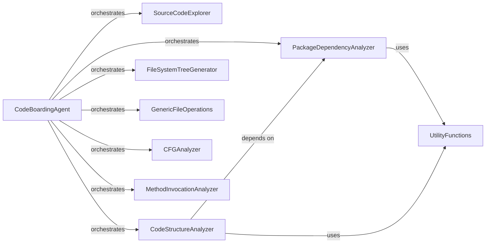

## Component Details

This graph provides an overview of the `Codebase Interaction Tools` subsystem, which is a collection of specialized tools orchestrated by the `CodeBoardingAgent`. These tools enable comprehensive analysis of Python source code, including reading file content, understanding package relationships, mapping code and file structures, analyzing control flow, and identifying method invocations, all supported by common utility functions.

### CodeBoardingAgent
The central agent responsible for orchestrating code analysis tasks within the CodeBoarding subsystem. It initializes and coordinates the use of various specialized tools for source code exploration, package relations, and overall code structure analysis, and also handles specific code reference fixes.

**Related Classes/Methods**:

- <a href="https://github.com/CodeBoarding/CodeBoarding/blob/master/agents/agent.py#L19-L38" target="_blank" rel="noopener noreferrer">`agents.agent.CodeBoardingAgent:__init__` (19:38)</a>
- <a href="https://github.com/CodeBoarding/CodeBoarding/blob/master/agents/agent.py#L73-L94" target="_blank" rel="noopener noreferrer">`agents.agent.CodeBoardingAgent:fix_source_code_reference_lines` (73:94)</a>

### SourceCodeExplorer
A specialized tool designed for in-depth exploration and reading of Python source code files by their fully qualified names. It provides functionalities for extracting specific code segments, transforming paths, and identifying code locations within files, including its own file reading and path matching logic.

**Related Classes/Methods**:

- <a href="https://github.com/CodeBoarding/CodeBoarding/blob/master/agents/tools/read_source.py#L22-L164" target="_blank" rel="noopener noreferrer">`agents.tools.read_source.CodeReferenceReader` (22:164)</a>
- <a href="https://github.com/CodeBoarding/CodeBoarding/blob/master/agents/tools/read_source.py#L36-L39" target="_blank" rel="noopener noreferrer">`agents.tools.read_source.CodeReferenceReader:__init__` (36:39)</a>
- <a href="https://github.com/CodeBoarding/CodeBoarding/blob/master/agents/tools/read_source.py#L48-L89" target="_blank" rel="noopener noreferrer">`agents.tools.read_source.CodeReferenceReader:_run` (48:89)</a>
- <a href="https://github.com/CodeBoarding/CodeBoarding/blob/master/agents/tools/read_source.py#L91-L156" target="_blank" rel="noopener noreferrer">`agents.tools.read_source.CodeReferenceReader.read_file` (91:156)</a>
- <a href="https://github.com/CodeBoarding/CodeBoarding/blob/master/agents/tools/read_source.py#L41-L46" target="_blank" rel="noopener noreferrer">`agents.tools.read_source.CodeReferenceReader.walk_dir` (41:46)</a>
- <a href="https://github.com/CodeBoarding/CodeBoarding/blob/master/agents/tools/read_source.py#L158-L164" target="_blank" rel="noopener noreferrer">`agents.tools.read_source.CodeReferenceReader.is_subsequence` (158:164)</a>
- <a href="https://github.com/CodeBoarding/CodeBoarding/blob/master/agents/tools/read_source.py#L171-L174" target="_blank" rel="noopener noreferrer">`agents.tools.read_source.transform_path` (171:174)</a>
- <a href="https://github.com/CodeBoarding/CodeBoarding/blob/master/agents/tools/read_source.py#L167-L168" target="_blank" rel="noopener noreferrer">`agents.tools.read_source.pascal_to_snake_segment` (167:168)</a>

### PackageDependencyAnalyzer
This tool is dedicated to analyzing and providing insights into the relationships and dependencies between different Python packages within the project. It reads package information and identifies root packages, often relying on external dot file formats.

**Related Classes/Methods**:

- <a href="https://github.com/CodeBoarding/CodeBoarding/blob/master/agents/tools/read_packages.py#L29-L83" target="_blank" rel="noopener noreferrer">`agents.tools.read_packages.PackageRelationsTool` (29:83)</a>
- <a href="https://github.com/CodeBoarding/CodeBoarding/blob/master/agents/tools/read_packages.py#L40-L43" target="_blank" rel="noopener noreferrer">`agents.tools.read_packages.PackageRelationsTool:__init__` (40:43)</a>
- <a href="https://github.com/CodeBoarding/CodeBoarding/blob/master/agents/tools/read_packages.py#L53-L64" target="_blank" rel="noopener noreferrer">`agents.tools.read_packages.PackageRelationsTool:_run` (53:64)</a>
- <a href="https://github.com/CodeBoarding/CodeBoarding/blob/master/agents/tools/read_packages.py#L45-L51" target="_blank" rel="noopener noreferrer">`agents.tools.read_packages.PackageRelationsTool.walk_dir` (45:51)</a>
- <a href="https://github.com/CodeBoarding/CodeBoarding/blob/master/agents/tools/read_packages.py#L66-L83" target="_blank" rel="noopener noreferrer">`agents.tools.read_packages.PackageRelationsTool.read_file` (66:83)</a>
- <a href="https://github.com/CodeBoarding/CodeBoarding/blob/master/agents/tools/read_packages.py#L21-L26" target="_blank" rel="noopener noreferrer">`agents.tools.read_packages.NoRootPackageFoundError` (21:26)</a>

### CodeStructureAnalyzer
A tool focused on understanding and representing the overall structural organization of the codebase. It helps in mapping out the hierarchy and relationships of various code elements by traversing directories and reading files.

**Related Classes/Methods**:

- <a href="https://github.com/CodeBoarding/CodeBoarding/blob/master/agents/tools/read_structure.py#L12-L66" target="_blank" rel="noopener noreferrer">`agents.tools.read_structure.CodeStructureTool` (12:66)</a>
- <a href="https://github.com/CodeBoarding/CodeBoarding/blob/master/agents/tools/read_structure.py#L26-L29" target="_blank" rel="noopener noreferrer">`agents.tools.read_structure.CodeStructureTool:__init__` (26:29)</a>
- <a href="https://github.com/CodeBoarding/CodeBoarding/blob/master/agents/tools/read_structure.py#L39-L49" target="_blank" rel="noopener noreferrer">`agents.tools.read_structure.CodeStructureTool:_run` (39:49)</a>
- <a href="https://github.com/CodeBoarding/CodeBoarding/blob/master/agents/tools/read_structure.py#L31-L37" target="_blank" rel="noopener noreferrer">`agents.tools.read_structure.CodeStructureTool.walk_dir` (31:37)</a>
- <a href="https://github.com/CodeBoarding/CodeBoarding/blob/master/agents/tools/read_structure.py#L51-L66" target="_blank" rel="noopener noreferrer">`agents.tools.read_structure.CodeStructureTool.read_file` (51:66)</a>

### FileSystemTreeGenerator
This component is responsible for generating a hierarchical string representation of the file system structure. It recursively traverses directories to build a visual tree of files and folders, useful for understanding project layout.

**Related Classes/Methods**:

- <a href="https://github.com/CodeBoarding/CodeBoarding/blob/master/agents/tools/read_file_structure.py#L20-L86" target="_blank" rel="noopener noreferrer">`agents.tools.read_file_structure.FileStructureTool` (20:86)</a>
- <a href="https://github.com/CodeBoarding/CodeBoarding/blob/master/agents/tools/read_file_structure.py#L31-L37" target="_blank" rel="noopener noreferrer">`agents.tools.read_file_structure.FileStructureTool:__init__` (31:37)</a>
- <a href="https://github.com/CodeBoarding/CodeBoarding/blob/master/agents/tools/read_file_structure.py#L39-L47" target="_blank" rel="noopener noreferrer">`agents.tools.read_file_structure.FileStructureTool:walk_dir` (39:47)</a>
- <a href="https://github.com/CodeBoarding/CodeBoarding/blob/master/agents/tools/read_file_structure.py#L49-L75" target="_blank" rel="noopener noreferrer">`agents.tools.read_file_structure.FileStructureTool:_run` (49:75)</a>
- <a href="https://github.com/CodeBoarding/CodeBoarding/blob/master/agents/tools/read_file_structure.py#L89-L103" target="_blank" rel="noopener noreferrer">`agents.tools.read_file_structure.get_tree_string` (89:103)</a>

### GenericFileOperations
Provides fundamental file reading and string matching capabilities for general file system interactions.

**Related Classes/Methods**:

- <a href="https://github.com/CodeBoarding/CodeBoarding/blob/master/agents/tools/read_file.py#L16-L105" target="_blank" rel="noopener noreferrer">`agents.tools.read_file.ReadFileTool` (16:105)</a>
- <a href="https://github.com/CodeBoarding/CodeBoarding/blob/master/agents/tools/read_file.py#L28-L32" target="_blank" rel="noopener noreferrer">`agents.tools.read_file.ReadFileTool:__init__` (28:32)</a>
- <a href="https://github.com/CodeBoarding/CodeBoarding/blob/master/agents/tools/read_file.py#L42-L94" target="_blank" rel="noopener noreferrer">`agents.tools.read_file.ReadFileTool:_run` (42:94)</a>
- <a href="https://github.com/CodeBoarding/CodeBoarding/blob/master/agents/tools/read_file.py#L34-L40" target="_blank" rel="noopener noreferrer">`agents.tools.read_file.ReadFileTool.walk_dir` (34:40)</a>
- <a href="https://github.com/CodeBoarding/CodeBoarding/blob/master/agents/tools/read_file.py#L96-L105" target="_blank" rel="noopener noreferrer">`agents.tools.read_file.ReadFileTool.is_subsequence` (96:105)</a>

### CFGAnalyzer
A tool for analyzing Control Flow Graphs (CFGs) of Python code, providing insights into the execution flow of programs.

**Related Classes/Methods**:

- `agents.tools.GetCFGTool` (full file reference)

### MethodInvocationAnalyzer
A tool designed to identify and analyze method invocations within the codebase, helping to understand call relationships and dependencies between methods.

**Related Classes/Methods**:

- `agents.tools.MethodInvocationsTool` (full file reference)

### UtilityFunctions
A collection of general-purpose utility functions used across various codebase interaction tools, such as reading dot files.

**Related Classes/Methods**:

- <a href="https://github.com/CodeBoarding/CodeBoarding/blob/master/agents/tools/utils.py#L6-L22" target="_blank" rel="noopener noreferrer">`agents.tools.utils.read_dot_file` (6:22)</a>

### [FAQ](https://github.com/CodeBoarding/GeneratedOnBoardings/tree/main?tab=readme-ov-file#faq)
