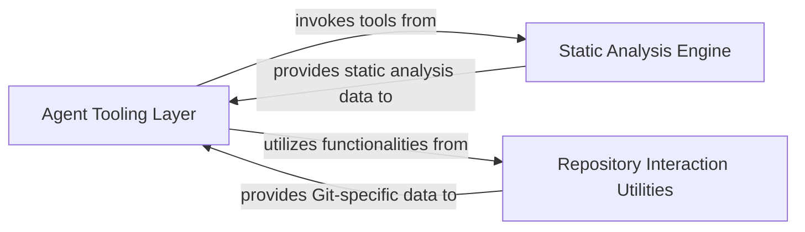

## Details

One paragraph explaining the functionality which is represented by this graph. What the main flow is and what is its purpose.

### Agent Tooling Layer
This component provides a comprehensive suite of tools that specialized AI agents can utilize to interact with the codebase, retrieve information, and perform specific operations. It acts as the agents' primary interface to the project's source code, file system, and documentation. The tools abstract away the complexities of data retrieval, offering a simplified and consistent API for agents to access various types of code-related information. This component is fundamental because it directly empowers the AI agents to "see" and "understand" the code, which is essential for any AI4SE application.

**Related Classes/Methods**:

- <a href="https://github.com/CodeBoarding/CodeBoarding/blob/main/agents/tools/read_file.py#L1-L1" target="_blank" rel="noopener noreferrer">`agents.tools.read_file` (1:1)</a>
- <a href="https://github.com/CodeBoarding/CodeBoarding/blob/main/agents/tools/read_source.py#L1-L1" target="_blank" rel="noopener noreferrer">`agents.tools.read_source` (1:1)</a>
- <a href="https://github.com/CodeBoarding/CodeBoarding/blob/main/agents/tools/read_packages.py#L1-L1" target="_blank" rel="noopener noreferrer">`agents.tools.read_packages` (1:1)</a>
- <a href="https://github.com/CodeBoarding/CodeBoarding/blob/main/agents/tools/read_git_diff.py#L1-L1" target="_blank" rel="noopener noreferrer">`agents.tools.read_git_diff` (1:1)</a>
- <a href="https://github.com/CodeBoarding/CodeBoarding/blob/main/agents/tools/read_docs.py#L1-L1" target="_blank" rel="noopener noreferrer">`agents.tools.read_docs` (1:1)</a>
- <a href="https://github.com/CodeBoarding/CodeBoarding/blob/main/agents/tools/get_method_invocations.py#L1-L1" target="_blank" rel="noopener noreferrer">`agents.tools.get_method_invocations` (1:1)</a>
- <a href="https://github.com/CodeBoarding/CodeBoarding/blob/main/agents/tools/read_cfg.py#L1-L1" target="_blank" rel="noopener noreferrer">`agents.tools.read_cfg` (1:1)</a>
- <a href="https://github.com/CodeBoarding/CodeBoarding/blob/main/agents/tools/read_file_structure.py#L1-L1" target="_blank" rel="noopener noreferrer">`agents.tools.read_file_structure` (1:1)</a>
- <a href="https://github.com/CodeBoarding/CodeBoarding/blob/main/agents/tools/read_structure.py#L1-L1" target="_blank" rel="noopener noreferrer">`agents.tools.read_structure` (1:1)</a>
- <a href="https://github.com/CodeBoarding/CodeBoarding/blob/main/agents/tools/external_deps.py#L1-L1" target="_blank" rel="noopener noreferrer">`agents.tools.external_deps` (1:1)</a>
- <a href="https://github.com/CodeBoarding/CodeBoarding/blob/main/agents/tools/utils.py#L1-L1" target="_blank" rel="noopener noreferrer">`agents.tools.utils` (1:1)</a>

### Static Analysis Engine
This component is dedicated to performing deep static analysis of the codebase. It is responsible for generating structured analytical data, such as call graphs and structure graphs, primarily using Pylint. It transforms raw source code into actionable, graph-based representations that can be consumed by other components, particularly the `Agent Tooling Layer`, to provide rich context to the AI agents. This component is fundamental because it provides the "intelligence" behind the code understanding. Raw code is just text; the static analysis engine transforms it into meaningful data structures that AI agents can reason about.

**Related Classes/Methods**:

- <a href="https://github.com/CodeBoarding/CodeBoarding/blob/main/static_analyzer/pylint_analyze/call_graph_builder.py#L1-L1" target="_blank" rel="noopener noreferrer">`static_analyzer.pylint_analyze.call_graph_builder` (1:1)</a>
- <a href="https://github.com/CodeBoarding/CodeBoarding/blob/main/static_analyzer/pylint_analyze/structure_graph_builder.py#L1-L1" target="_blank" rel="noopener noreferrer">`static_analyzer.pylint_analyze.structure_graph_builder` (1:1)</a>
- <a href="https://github.com/CodeBoarding/CodeBoarding/blob/main/static_analyzer/pylint_graph_transform.py#L1-L1" target="_blank" rel="noopener noreferrer">`static_analyzer.pylint_graph_transform` (1:1)</a>
- <a href="https://github.com/CodeBoarding/CodeBoarding/blob/main/static_analyzer/reference_lines.py#L1-L1" target="_blank" rel="noopener noreferrer">`static_analyzer.reference_lines` (1:1)</a>

### Repository Interaction Utilities
This component provides specialized functionalities for interacting with Git repositories. Its primary role is to abstract away the complexities of Git operations, offering utilities for tasks such as reading diffs between commits, which are essential for agents that need to understand changes in the codebase or access repository-specific metadata. This component is fundamental because modern software development heavily relies on version control systems like Git. For an AI agent to be truly effective in a software engineering context, it needs to be able to interact with and understand the history and changes within a repository.

**Related Classes/Methods**:

- <a href="https://github.com/CodeBoarding/CodeBoarding/blob/main/repo_utils/git_diff.py#L1-L1" target="_blank" rel="noopener noreferrer">`repo_utils.git_diff` (1:1)</a>
- <a href="https://github.com/CodeBoarding/CodeBoarding/blob/main/repo_utils/errors.py#L1-L1" target="_blank" rel="noopener noreferrer">`repo_utils.errors` (1:1)</a>

### [FAQ](https://github.com/CodeBoarding/GeneratedOnBoardings/tree/main?tab=readme-ov-file#faq)
