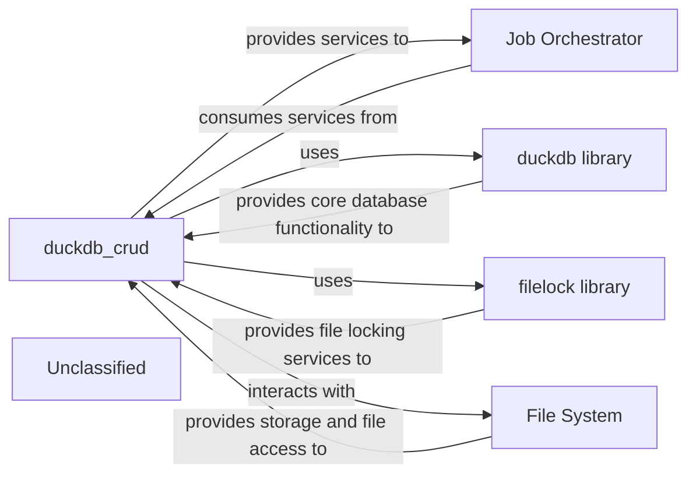

## Details

The `duckdb_crud` component serves as the central data management layer, offering CRUD operations for job records. It leverages the `duckdb library` for database functionalities and the `filelock library` to ensure data integrity during concurrent access. The `Job Orchestrator` acts as an external client, utilizing `duckdb_crud`'s services to manage the lifecycle of documentation generation jobs. All these interactions ultimately rely on the `File System` for persistent storage, with `duckdb_crud` directly interacting with the `os` module for file and directory management. This architecture ensures a clear separation of concerns, with `duckdb_crud` abstracting the complexities of database and file system interactions from the `Job Orchestrator`.

### duckdb_crud
The central component managing all interactions with the DuckDB database. It handles database initialization, and provides CRUD (Create, Read, Update, Delete) operations for job records, ensuring data integrity and managing file locking for concurrent access.

**Related Classes/Methods**:

- `duckdb`
- `filelock`
- `os`

### Job Orchestrator
An external component that consumes the job management services provided by duckdb_crud. It is responsible for initiating, tracking, and managing the lifecycle of documentation generation jobs by interacting with the database.

**Related Classes/Methods**:

- <a href="https://github.com/CodeBoarding/CodeBoarding/blob/main/duckdb_crud.py" target="_blank" rel="noopener noreferrer">`duckdb_crud`</a>

### duckdb library
The external Python library that provides the embedded, in-process analytical database engine (DuckDB). It is used by duckdb_crud for all low-level database operations and data storage.

**Related Classes/Methods**:

### filelock library
An external Python library utilized by duckdb_crud to implement robust file locking mechanisms. This ensures safe concurrent access to the DuckDB database file, preventing data corruption during parallel operations.

**Related Classes/Methods**:

- `filelock`:1-10

### File System
The underlying operating system service responsible for the physical storage and retrieval of the DuckDB database file and associated lock files. duckdb_crud interacts with it indirectly via the duckdb and filelock libraries, and directly through the `os` module for path and file management.

**Related Classes/Methods**:

- <a href="https://github.com/CodeBoarding/CodeBoarding/blob/main/static_analyzer/lsp_client/client.py" target="_blank" rel="noopener noreferrer">`os`</a>

### Unclassified
Component for all unclassified files and utility functions (Utility functions/External Libraries/Dependencies)

**Related Classes/Methods**: _None_

### [FAQ](https://github.com/CodeBoarding/GeneratedOnBoardings/tree/main?tab=readme-ov-file#faq)
