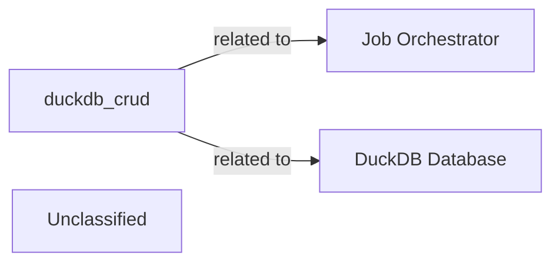

## Details

This analysis aims to identify and define the `duckdb_crud` component, which is currently well-defined in terms of its purpose but lacks specific source code references. The analysis also seeks to incorporate related components, `Job Orchestrator` and `DuckDB Database`, which are currently missing from the analysis. The main flow involves examining the file structure of relevant directories to locate potential source files for `duckdb_crud` to ensure all related components are properly defined and validated.

### duckdb_crud
A component responsible for CRUD operations on DuckDB, currently lacking specific source code references.

**Related Classes/Methods**: _None_

### Job Orchestrator
A component related to `duckdb_crud`, currently not present in the analysis.

**Related Classes/Methods**: _None_

### DuckDB Database
A database component related to `duckdb_crud`, currently not present in the analysis.

**Related Classes/Methods**: _None_

### Unclassified
Component for all unclassified files and utility functions (Utility functions/External Libraries/Dependencies)

**Related Classes/Methods**: _None_

### [FAQ](https://github.com/CodeBoarding/GeneratedOnBoardings/tree/main?tab=readme-ov-file#faq)
