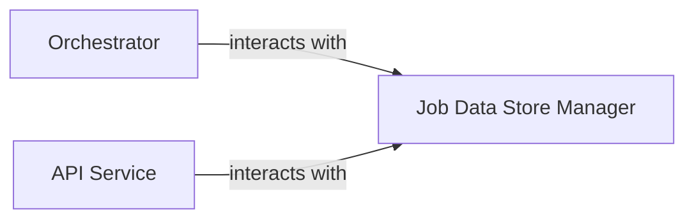

## Details

One paragraph explaining the functionality which is represented by this graph. What the main flow is and what is its purpose.

### Job Data Store Manager
This component is the core of the `Job Database` subsystem. It is responsible for the complete lifecycle management of documentation generation jobs, including their status, progress, and results. It provides a comprehensive set of CRUD (Create, Read, Update, Delete) operations for job metadata, ensuring data persistence and retrieval using a DuckDB database. It also handles the underlying database connection management and schema initialization. This component aligns with the "Data Store/Cache" expected component pattern, providing the necessary persistence for the pipeline's state.

**Related Classes/Methods**:

- <a href="https://github.com/CodeBoarding/CodeBoarding/blob/main/duckdb_crud.py#L15-L44" target="_blank" rel="noopener noreferrer">`duckdb_crud.init_db`:15-44</a>
- <a href="https://github.com/CodeBoarding/CodeBoarding/blob/main/duckdb_crud.py#L48-L58" target="_blank" rel="noopener noreferrer">`duckdb_crud.insert_job`:48-58</a>
- <a href="https://github.com/CodeBoarding/CodeBoarding/blob/main/duckdb_crud.py#L61-L70" target="_blank" rel="noopener noreferrer">`duckdb_crud.update_job`:61-70</a>
- <a href="https://github.com/CodeBoarding/CodeBoarding/blob/main/duckdb_crud.py#L73-L93" target="_blank" rel="noopener noreferrer">`duckdb_crud.fetch_job`:73-93</a>
- <a href="https://github.com/CodeBoarding/CodeBoarding/blob/main/duckdb_crud.py#L96-L117" target="_blank" rel="noopener noreferrer">`duckdb_crud.fetch_all_jobs`:96-117</a>
- <a href="https://github.com/CodeBoarding/CodeBoarding/blob/main/duckdb_crud.py#L11-L12" target="_blank" rel="noopener noreferrer">`duckdb_crud._connect`:11-12</a>

### Orchestrator
The central coordinator of the documentation generation pipeline.

**Related Classes/Methods**: _None_

### API Service [[Expand]](./API_Service.md)
The external interface of the tool.

**Related Classes/Methods**: _None_

### [FAQ](https://github.com/CodeBoarding/GeneratedOnBoardings/tree/main?tab=readme-ov-file#faq)
