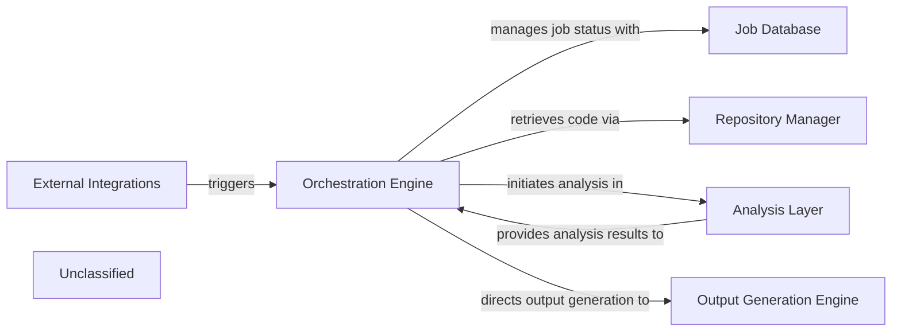

## Details

The system orchestrates the generation of documentation and diagrams through a well-defined workflow. The Orchestration Engine serves as the central control, initiating and managing all jobs. It interacts with the Job Database to track job statuses and with the Repository Manager to retrieve necessary code. The core analysis is performed by the Analysis Layer, which conducts static code analysis, AI-driven interpretation, and extracts data for diagram generation. A key enhancement within the Analysis Layer is its formalized prompt management system, utilizing an abstract factory pattern for structured and scalable AI prompt generation. Upon completion of the analysis, the Orchestration Engine directs the Output Generation Engine to format and produce the final documentation and diagrams. External systems can seamlessly trigger this entire process via External Integrations. The system's architecture is centered around an Orchestration Engine that governs the end-to-end process of documentation and diagram generation. This engine coordinates with a Job Database for job lifecycle management and a Repository Manager for source code acquisition. The Analysis Layer is the intellectual core, performing detailed code analysis, including AI-driven interpretation facilitated by a newly formalized and extensible prompt management system. The results from the Analysis Layer are then channeled back to the Orchestration Engine, which subsequently instructs the Output Generation Engine to produce the final documentation and diagrams. The entire workflow can be initiated by external systems through External Integrations, ensuring broad applicability and ease of use.

### Orchestration Engine [[Expand]](./Orchestration_Engine.md)
The central control subsystem responsible for initiating, managing, and coordinating all analysis and documentation generation jobs, acting as the primary orchestrator for the end-to-end workflow.

**Related Classes/Methods**:

- <a href="https://github.com/CodeBoarding/CodeBoarding/blob/mainlocal_app.py" target="_blank" rel="noopener noreferrer">`local_app.py:start_generation_job`</a>
- <a href="https://github.com/CodeBoarding/CodeBoarding/blob/mainlocal_app.py" target="_blank" rel="noopener noreferrer">`local_app.py:start_docs_generation_job`</a>
- <a href="https://github.com/CodeBoarding/CodeBoarding/blob/mainlocal_app.py" target="_blank" rel="noopener noreferrer">`local_app.py:process_docs_generation_job`</a>

### Job Database
Manages the storage and retrieval of job details, including status updates, for the documentation generation pipeline.

**Related Classes/Methods**:

- <a href="https://github.com/CodeBoarding/CodeBoarding/blob/mainduckdb_crud.py" target="_blank" rel="noopener noreferrer">`duckdb_crud.py`</a>

### Repository Manager [[Expand]](./Repository_Manager.md)
Handles repository operations suchs as cloning code repositories and retrieving code differences for analysis.

**Related Classes/Methods**:

- <a href="https://github.com/CodeBoarding/CodeBoarding/blob/mainrepo_utils/git_diff.py" target="_blank" rel="noopener noreferrer">`repo_utils.git_diff.py`</a>

### Analysis Layer
Performs comprehensive code analysis, encompassing static code analysis, AI-driven interpretation, and specialized data extraction for diagram generation. This layer now incorporates a formalized and extensible prompt management system, leveraging an abstract factory pattern to generate and manage AI prompts, thereby enhancing modularity and scalability.

**Related Classes/Methods**:

- <a href="https://github.com/CodeBoarding/CodeBoarding/blob/mainstatic_analyzer/scanner.py" target="_blank" rel="noopener noreferrer">`static_analyzer.scanner.py`</a>
- <a href="https://github.com/CodeBoarding/CodeBoarding/blob/mainagents/agent.py" target="_blank" rel="noopener noreferrer">`agents.agent.py`</a>
- <a href="https://github.com/CodeBoarding/CodeBoarding/blob/maindiagram_analysis/diagram_generator.py" target="_blank" rel="noopener noreferrer">`diagram_analysis/diagram_generator.py:generate_analysis`</a>
- <a href="https://github.com/CodeBoarding/CodeBoarding/blob/mainagents/prompts/abstract_prompt_factory.py" target="_blank" rel="noopener noreferrer">`agents.prompts.abstract_prompt_factory.py`</a>
- <a href="https://github.com/CodeBoarding/CodeBoarding/blob/mainagents/prompts/prompt_factory.py" target="_blank" rel="noopener noreferrer">`agents.prompts.prompt_factory.py`</a>
- <a href="https://github.com/CodeBoarding/CodeBoarding/blob/mainagents/prompts/gemini_flash_prompts_bidirectional.py" target="_blank" rel="noopener noreferrer">`agents.prompts.gemini_flash_prompts_bidirectional.py`</a>
- <a href="https://github.com/CodeBoarding/CodeBoarding/blob/mainagents/prompts/gemini_flash_prompts_unidirectional.py" target="_blank" rel="noopener noreferrer">`agents.prompts.gemini_flash_prompts_unidirectional.py`</a>

### Output Generation Engine [[Expand]](./Output_Generation_Engine.md)
Responsible for the final formatting and generation of documentation and diagrams in various formats.

**Related Classes/Methods**:

- <a href="https://github.com/CodeBoarding/CodeBoarding/blob/mainoutput_generators/markdown.py" target="_blank" rel="noopener noreferrer">`output_generators.markdown.py`</a>

### External Integrations
Provides interfaces for external systems, such as VSCode and GitHub Actions, to trigger analysis workflows.

**Related Classes/Methods**:

- <a href="https://github.com/CodeBoarding/CodeBoarding/blob/maingithub_action.py" target="_blank" rel="noopener noreferrer">`github_action.py`</a>
- <a href="https://github.com/CodeBoarding/CodeBoarding/blob/mainvscode_runnable.py" target="_blank" rel="noopener noreferrer">`vscode_runnable.py`</a>

### Unclassified
Component for all unclassified files and utility functions (Utility functions/External Libraries/Dependencies)

**Related Classes/Methods**: _None_

### [FAQ](https://github.com/CodeBoarding/GeneratedOnBoardings/tree/main?tab=readme-ov-file#faq)
