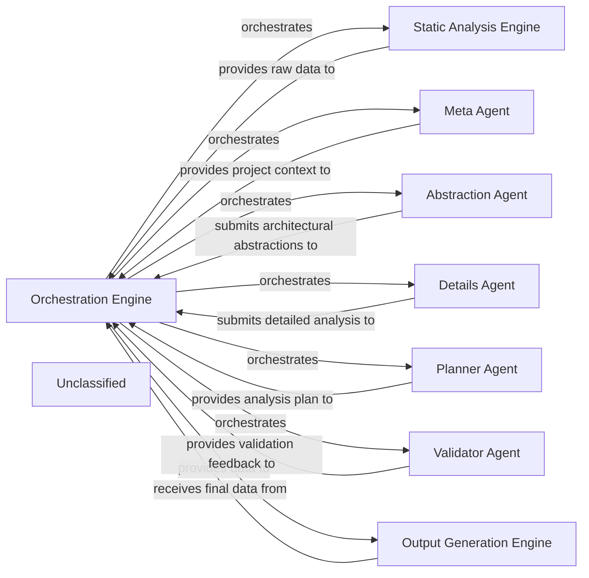

## Details

The system operates as a sophisticated analysis pipeline orchestrated by the Orchestration Engine. This engine initiates the process by leveraging the Static Analysis Engine to gather foundational code data. Subsequently, it coordinates a suite of specialized AI agents: the Meta Agent for initial project context, the Abstraction Agent for high-level architectural insights, the Details Agent for granular component analysis, the Planner Agent for dynamic task sequencing, and the Validator Agent for quality assurance. Each agent contributes to a progressively refined understanding of the codebase, with the Orchestration Engine managing the flow of information and feedback loops. Finally, the Output Generation Engine consolidates and formats the comprehensive architectural analysis into structured outputs, ready for documentation and visualization. This design emphasizes a modular, AI-driven approach to software architecture analysis, ensuring accuracy and adaptability.

### Orchestration Engine [[Expand]](./Orchestration_Engine.md)
The central control unit that manages the entire documentation generation pipeline. It initializes and coordinates various AI agents and analysis steps, manages parallel processing, saves analysis results, and handles error logging. This component embodies the "Orchestration" architectural pattern.

**Related Classes/Methods**:

- <a href="https://github.com/CodeBoarding/CodeBoarding/blob/maindiagram_analysis/diagram_generator.py" target="_blank" rel="noopener noreferrer">`DiagramGenerator`</a>

### Static Analysis Engine [[Expand]](./Static_Analysis_Engine.md)
Responsible for performing initial static analysis on the codebase to extract fundamental structural and relational data. This data serves as the raw input for subsequent AI interpretation, directly supporting the "Code Analysis" aspect.

**Related Classes/Methods**:

- <a href="https://github.com/CodeBoarding/CodeBoarding/blob/mainstatic_analyzer/__init__.py#L44-L67" target="_blank" rel="noopener noreferrer">`StaticAnalyzer`:44-67</a>
- <a href="https://github.com/CodeBoarding/CodeBoarding/blob/mainstatic_analyzer/__init__.py#L50-L67" target="_blank" rel="noopener noreferrer">`StaticAnalyzer:analyze`:50-67</a>

### Meta Agent
An AI agent dedicated to performing initial project metadata analysis. It establishes the foundational context and high-level understanding of the project, guiding subsequent detailed analysis. This is a key part of the "AI Interpretation Layer".

**Related Classes/Methods**:

- <a href="https://github.com/CodeBoarding/CodeBoarding/blob/mainagents/meta_agent.py#L15-L37" target="_blank" rel="noopener noreferrer">`MetaAgent`:15-37</a>
- <a href="https://github.com/CodeBoarding/CodeBoarding/blob/mainagents/meta_agent.py#L29-L37" target="_blank" rel="noopener noreferrer">`MetaAgent:analyze_project_metadata`:29-37</a>

### Abstraction Agent
An AI agent focused on generating high-level architectural abstractions from the analyzed code. It identifies and defines major components and their relationships, refining these abstractions based on feedback. This is a core function of the "AI Interpretation Layer".

**Related Classes/Methods**:

- <a href="https://github.com/CodeBoarding/CodeBoarding/blob/mainagents/abstraction_agent.py#L19-L160" target="_blank" rel="noopener noreferrer">`AbstractionAgent`:19-160</a>
- <a href="https://github.com/CodeBoarding/CodeBoarding/blob/mainagents/abstraction_agent.py#L155-L160" target="_blank" rel="noopener noreferrer">`AbstractionAgent:run`:155-160</a>
- <a href="https://github.com/CodeBoarding/CodeBoarding/blob/mainagents/abstraction_agent.py#L103-L111" target="_blank" rel="noopener noreferrer">`AbstractionAgent:apply_feedback`:103-111</a>

### Details Agent
An AI agent responsible for generating detailed analysis for identified components. It classifies files, extracts granular information, and refines its analysis based on feedback to provide in-depth insights. This component provides the detailed understanding within the "AI Interpretation Layer".

**Related Classes/Methods**:

- <a href="https://github.com/CodeBoarding/CodeBoarding/blob/mainagents/details_agent.py#L19-L154" target="_blank" rel="noopener noreferrer">`DetailsAgent`:19-154</a>
- <a href="https://github.com/CodeBoarding/CodeBoarding/blob/mainagents/details_agent.py#L104-L114" target="_blank" rel="noopener noreferrer">`DetailsAgent:run`:104-114</a>
- <a href="https://github.com/CodeBoarding/CodeBoarding/blob/mainagents/details_agent.py#L94-L102" target="_blank" rel="noopener noreferrer">`DetailsAgent:apply_feedback`:94-102</a>
- <a href="https://github.com/CodeBoarding/CodeBoarding/blob/mainagents/details_agent.py#L116-L154" target="_blank" rel="noopener noreferrer">`DetailsAgent:classify_files`:116-154</a>

### Planner Agent
An AI agent that dynamically determines the optimal sequence and scope of analysis steps. It plans which components to analyze next based on the current state of understanding and analysis goals, crucial for the "Pipeline/Event-Driven Architecture" flow.

**Related Classes/Methods**:

- <a href="https://github.com/CodeBoarding/CodeBoarding/blob/mainagents/planner_agent.py#L13-L31" target="_blank" rel="noopener noreferrer">`PlannerAgent`:13-31</a>
- <a href="https://github.com/CodeBoarding/CodeBoarding/blob/mainagents/planner_agent.py#L21-L31" target="_blank" rel="noopener noreferrer">`PlannerAgent:plan_analysis`:21-31</a>

### Validator Agent
An AI agent tasked with validating the analysis results produced by other agents. It provides critical feedback to ensure the accuracy, consistency, and completeness of the generated architectural insights, ensuring quality in the "AI Interpretation Layer".

**Related Classes/Methods**:

- <a href="https://github.com/CodeBoarding/CodeBoarding/blob/mainagents/validator_agent.py#L15-L143" target="_blank" rel="noopener noreferrer">`ValidatorAgent`:15-143</a>
- <a href="https://github.com/CodeBoarding/CodeBoarding/blob/mainagents/validator_agent.py#L116-L143" target="_blank" rel="noopener noreferrer">`ValidatorAgent:run`:116-143</a>

### Output Generation Engine [[Expand]](./Output_Generation_Engine.md)
Responsible for formatting and saving the final architectural analysis and diagram data into persistent storage, typically as structured JSON files, for consumption by visualization tools or other systems. This is the final stage of the "Visualization Tool" output.

**Related Classes/Methods**:

- <a href="https://github.com/CodeBoarding/CodeBoarding/blob/maindiagram_analysis/analysis_json.py" target="_blank" rel="noopener noreferrer">`from_analysis_to_json`</a>

### Unclassified
Component for all unclassified files and utility functions (Utility functions/External Libraries/Dependencies)

**Related Classes/Methods**: _None_

### [FAQ](https://github.com/CodeBoarding/GeneratedOnBoardings/tree/main?tab=readme-ov-file#faq)
