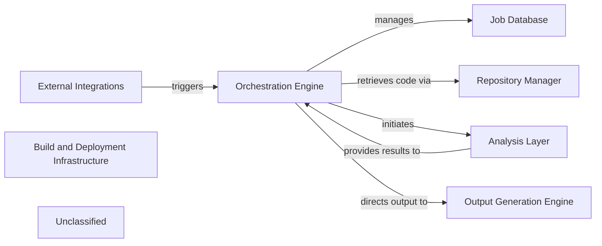

## Details

The system operates with an Orchestration Engine at its core, initiating and managing all documentation generation jobs. This engine interacts with a Job Database to maintain job status and details. Code repositories are handled by the Repository Manager, which provides the necessary code for analysis. The Analysis Layer performs comprehensive code analysis, including static analysis and AI-driven interpretation, now significantly enhanced by a dedicated prompt management system for AI agents. The results from the Analysis Layer are then passed back to the Orchestration Engine, which directs them to the Output Generation Engine for final documentation and diagram creation. External systems can trigger these workflows through the External Integrations component. The entire system is supported by the Build and Deployment Infrastructure, ensuring its operational readiness.

### Orchestration Engine [[Expand]](./Orchestration_Engine.md)
The central control subsystem responsible for initiating, managing, and coordinating all analysis and documentation generation jobs, acting as the primary orchestrator for the end-to-end workflow.

**Related Classes/Methods**:

- <a href="https://github.com/CodeBoarding/CodeBoarding/blob/mainlocal_app.py" target="_blank" rel="noopener noreferrer">`local_app.py:start_generation_job`</a>
- <a href="https://github.com/CodeBoarding/CodeBoarding/blob/mainlocal_app.py" target="_blank" rel="noopener noreferrer">`local_app.py:start_docs_generation_job`</a>
- <a href="https://github.com/CodeBoarding/CodeBoarding/blob/mainlocal_app.py" target="_blank" rel="noopener noreferrer">`local_app.py:process_docs_generation_job`</a>

### Job Database
Manages the storage and retrieval of job details, including status updates, for the documentation generation pipeline.

**Related Classes/Methods**:

- <a href="https://github.com/CodeBoarding/CodeBoarding/blob/mainduckdb_crud.py" target="_blank" rel="noopener noreferrer">`duckdb_crud.py`</a>

### Repository Manager [[Expand]](./Repository_Manager.md)
Handles repository operations suchs as cloning code repositories and retrieving code differences for analysis.

**Related Classes/Methods**:

- <a href="https://github.com/CodeBoarding/CodeBoarding/blob/mainrepo_utils/git_diff.py" target="_blank" rel="noopener noreferrer">`repo_utils.git_diff.py`</a>

### Analysis Layer
Performs comprehensive code analysis, encompassing static code analysis, AI-driven interpretation, and specialized data extraction for diagram generation. This layer now includes a dedicated and structured prompt management system for generating and managing prompts for AI agents, enhancing modularity and scalability.

**Related Classes/Methods**:

- <a href="https://github.com/CodeBoarding/CodeBoarding/blob/mainstatic_analyzer/scanner.py" target="_blank" rel="noopener noreferrer">`static_analyzer.scanner.py`</a>
- <a href="https://github.com/CodeBoarding/CodeBoarding/blob/mainagents/agent.py" target="_blank" rel="noopener noreferrer">`agents.agent.py`</a>
- <a href="https://github.com/CodeBoarding/CodeBoarding/blob/maindiagram_analysis/diagram_generator.py" target="_blank" rel="noopener noreferrer">`diagram_analysis/diagram_generator.py:generate_analysis`</a>
- <a href="https://github.com/CodeBoarding/CodeBoarding/blob/mainagents/prompts/gemini_flash_prompts_bidirectional.py" target="_blank" rel="noopener noreferrer">`agents.prompts.gemini_flash_prompts_bidirectional.py`</a>
- <a href="https://github.com/CodeBoarding/CodeBoarding/blob/mainagents/prompts/gemini_flash_prompts_unidirectional.py" target="_blank" rel="noopener noreferrer">`agents.prompts.gemini_flash_prompts_unidirectional.py`</a>
- <a href="https://github.com/CodeBoarding/CodeBoarding/blob/mainagents/prompts/prompt_factory.py" target="_blank" rel="noopener noreferrer">`agents.prompts.prompt_factory.py`</a>

### Output Generation Engine
Responsible for the final formatting and generation of documentation and diagrams in various formats.

**Related Classes/Methods**:

- <a href="https://github.com/CodeBoarding/CodeBoarding/blob/mainoutput_generators/markdown.py" target="_blank" rel="noopener noreferrer">`output_generators.markdown.py`</a>

### External Integrations
Provides interfaces for external systems, such as VSCode and GitHub Actions, to trigger analysis workflows.

**Related Classes/Methods**:

- <a href="https://github.com/CodeBoarding/CodeBoarding/blob/maingithub_action.py" target="_blank" rel="noopener noreferrer">`github_action.py`</a>
- <a href="https://github.com/CodeBoarding/CodeBoarding/blob/mainvscode_runnable.py" target="_blank" rel="noopener noreferrer">`vscode_runnable.py`</a>

### Build and Deployment Infrastructure
Encompasses the project's packaging, dependency management, and build processes, defining how the system is assembled, distributed, and integrated. This component underpins the operational readiness of all other components.

**Related Classes/Methods**:

- <a href="https://github.com/CodeBoarding/CodeBoarding/blob/mainsetup.py" target="_blank" rel="noopener noreferrer">`setup.py`</a>

### Unclassified
Component for all unclassified files and utility functions (Utility functions/External Libraries/Dependencies)

**Related Classes/Methods**: _None_

### [FAQ](https://github.com/CodeBoarding/GeneratedOnBoardings/tree/main?tab=readme-ov-file#faq)
