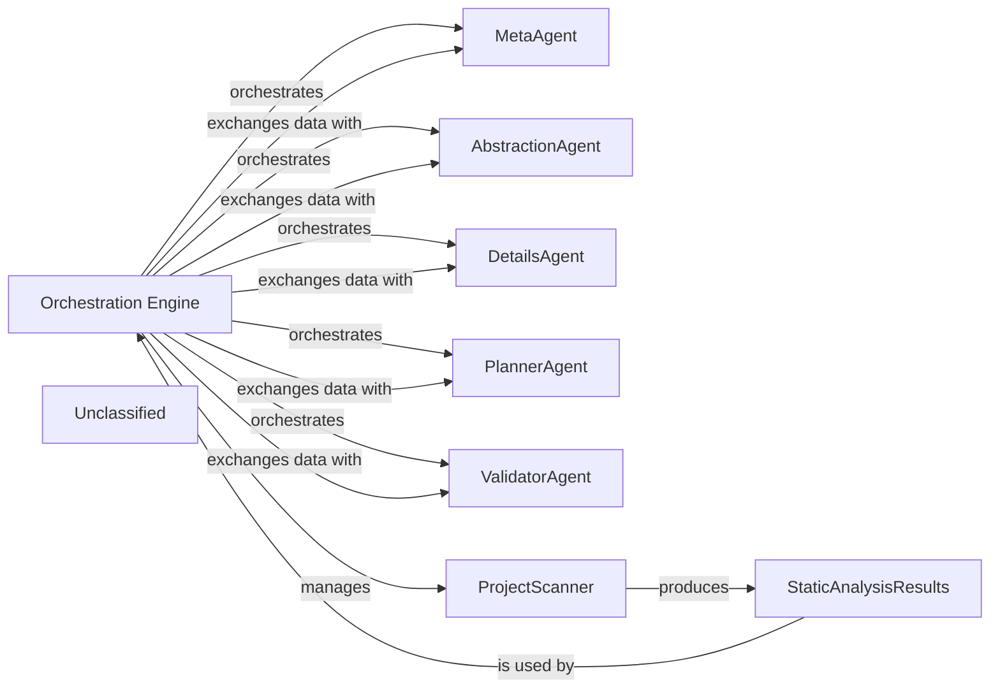

## Details

The core of the system is the `Orchestration Engine`, which centrally manages the documentation generation pipeline. It begins by managing the `ProjectScanner` to collect raw static analysis data, which is then stored in `StaticAnalysisResults`. The `Orchestration Engine` then iteratively orchestrates a suite of specialized AI agents—`MetaAgent`, `AbstractionAgent`, `DetailsAgent`, `PlannerAgent`, and `ValidatorAgent`—exchanging data with them to progressively refine the architectural understanding. This iterative process, driven by the `Orchestration Engine`, ensures comprehensive analysis, from initial metadata gathering and high-level abstraction to detailed component examination, workflow planning, and final validation, culminating in accurate and consistent architectural documentation.

### Orchestration Engine [[Expand]](./Orchestration_Engine.md)
The central control unit that manages the entire documentation generation pipeline, coordinating all analysis and generation stages. It initializes and coordinates AI agents, handles pre-analysis, processes components, determines update needs, applies feedback, and saves results.

**Related Classes/Methods**:

- <a href="https://github.com/CodeBoarding/CodeBoarding/blob/maindiagram_analysis/diagram_generator.py" target="_blank" rel="noopener noreferrer">`diagram_generator`</a>

### MetaAgent
An AI agent responsible for performing initial project metadata analysis, providing foundational context for subsequent analysis stages.

**Related Classes/Methods**:

- <a href="https://github.com/CodeBoarding/CodeBoarding/blob/mainagents/meta_agent.py" target="_blank" rel="noopener noreferrer">`meta_agent`</a>

### AbstractionAgent
An AI agent that generates high-level architectural abstractions from the analyzed code, identifying major components and their relationships.

**Related Classes/Methods**:

- <a href="https://github.com/CodeBoarding/CodeBoarding/blob/mainagents/abstraction_agent.py" target="_blank" rel="noopener noreferrer">`abstraction_agent`</a>

### DetailsAgent
An AI agent that provides detailed analysis of individual components, delving into their responsibilities, internal structure, and specific interactions.

**Related Classes/Methods**:

- <a href="https://github.com/CodeBoarding/CodeBoarding/blob/mainagents/details_agent.py" target="_blank" rel="noopener noreferrer">`details_agent`</a>

### PlannerAgent
An AI agent that plans the next set of components to analyze, optimizing the analysis workflow based on dependencies and previous results.

**Related Classes/Methods**:

- <a href="https://github.com/CodeBoarding/CodeBoarding/blob/mainagents/planner_agent.py" target="_blank" rel="noopener noreferrer">`planner_agent`</a>

### ValidatorAgent
An AI agent that validates the generated analysis and provides feedback, ensuring accuracy and consistency of the documentation.

**Related Classes/Methods**:

- <a href="https://github.com/CodeBoarding/CodeBoarding/blob/mainagents/validator_agent.py" target="_blank" rel="noopener noreferrer">`validator_agent`</a>

### ProjectScanner
A component responsible for initiating and collecting static analysis data from the codebase, serving as the primary input for the analysis pipeline.

**Related Classes/Methods**:

- <a href="https://github.com/CodeBoarding/CodeBoarding/blob/mainstatic_analyzer/scanner.py" target="_blank" rel="noopener noreferrer">`scanner`</a>

### StaticAnalysisResults
A data structure that holds the comprehensive results of static analysis, making this information accessible to the Orchestration Engine and AI agents.

**Related Classes/Methods**:

- <a href="https://github.com/CodeBoarding/CodeBoarding/blob/mainstatic_analyzer/analysis_result.py" target="_blank" rel="noopener noreferrer">`analysis_result`</a>

### Unclassified
Component for all unclassified files and utility functions (Utility functions/External Libraries/Dependencies)

**Related Classes/Methods**: _None_

### [FAQ](https://github.com/CodeBoarding/GeneratedOnBoardings/tree/main?tab=readme-ov-file#faq)
