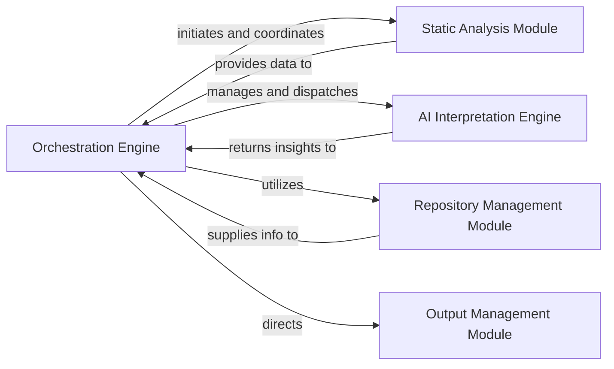

## Details

The CodeBoarding system operates as a sophisticated documentation generation pipeline, orchestrated by a central `Orchestration Engine`. This engine initiates and coordinates the entire process, starting with the `Static Analysis Module` which performs foundational code data extraction. The gathered static analysis data is then fed into the `AI Interpretation Engine`, a collection of specialized AI agents that delve into deep code understanding, generate architectural insights, and validate results. Throughout this process, the `Repository Management Module` provides crucial version control context. Finally, the `Output Management Module` takes the processed insights and generates structured documentation outputs. This modular design ensures a clear separation of concerns, enabling efficient and scalable code analysis and documentation.

### Orchestration Engine [[Expand]](./Orchestration_Engine.md)
The central control unit that manages the entire documentation generation pipeline. It coordinates all analysis and generation stages, handles project configuration, manages concurrency for component processing, and ensures the integrity and validity of the generated analysis.

**Related Classes/Methods**:

- <a href="https://github.com/CodeBoarding/CodeBoarding/blob/main/diagram_analysis/diagram_generator.py" target="_blank" rel="noopener noreferrer">`CodeBoarding.diagram_analysis.diagram_generator.DiagramGenerator`</a>

### Static Analysis Module
Responsible for performing the initial static analysis of the codebase, gathering foundational code data such as project structure, file contents, and basic code metrics. It also handles the creation and management of Language Server Protocol (LSP) clients for detailed code introspection.

**Related Classes/Methods**:

- <a href="https://github.com/CodeBoarding/CodeBoarding/blob/main/static_analyzer/scanner.py#L13-L66" target="_blank" rel="noopener noreferrer">`static_analyzer.scanner.ProjectScanner`:13-66</a>
- <a href="https://github.com/CodeBoarding/CodeBoarding/blob/main/static_analyzer/lsp_client" target="_blank" rel="noopener noreferrer">`CodeBoarding.static_analyzer.lsp_client`</a>

### AI Interpretation Engine
A collective component comprising various specialized AI agents (e.g., DetailsAgent, AbstractionAgent, PlannerAgent, ValidatorAgent, DiffAnalyzingAgent, MetaAgent). This engine performs in-depth code understanding, generates architectural insights, plans analysis steps, validates results, and conducts meta-level analysis based on the static analysis output.

**Related Classes/Methods**:

- <a href="https://github.com/CodeBoarding/CodeBoarding/blob/main/agents/details_agent.py#L16-L113" target="_blank" rel="noopener noreferrer">`agents.details_agent.DetailsAgent`:16-113</a>
- <a href="https://github.com/CodeBoarding/CodeBoarding/blob/main/agents/abstraction_agent.py#L14-L100" target="_blank" rel="noopener noreferrer">`agents.abstraction_agent.AbstractionAgent`:14-100</a>
- <a href="https://github.com/CodeBoarding/CodeBoarding/blob/main/agents/planner_agent.py#L13-L31" target="_blank" rel="noopener noreferrer">`agents.planner_agent.PlannerAgent`:13-31</a>
- <a href="https://github.com/CodeBoarding/CodeBoarding/blob/main/agents/validator_agent.py#L15-L143" target="_blank" rel="noopener noreferrer">`agents.validator_agent.ValidatorAgent`:15-143</a>
- <a href="https://github.com/CodeBoarding/CodeBoarding/blob/main/agents/diff_analyzer.py#L20-L136" target="_blank" rel="noopener noreferrer">`agents.diff_analyzer.DiffAnalyzingAgent`:20-136</a>
- <a href="https://github.com/CodeBoarding/CodeBoarding/blob/main/agents/meta_agent.py#L15-L37" target="_blank" rel="noopener noreferrer">`agents.meta_agent.MetaAgent`:15-37</a>

### Repository Management Module
Provides utilities for integrating with version control systems (e.g., Git) to retrieve repository context, commit hashes, and other versioning information crucial for analysis and documentation.

**Related Classes/Methods**:

- <a href="https://github.com/CodeBoarding/CodeBoarding/blob/main/repo_utils" target="_blank" rel="noopener noreferrer">`CodeBoarding.repo_utils`</a>

### Output Management Module
Manages the final stages of the pipeline, including the serialization of analysis results into structured formats (e.g., JSON) and the sanitization and generation of final documentation outputs (e.g., Markdown).

**Related Classes/Methods**:

- <a href="https://github.com/CodeBoarding/CodeBoarding/blob/main/diagram_analysis/analysis_json.py#L25-L32" target="_blank" rel="noopener noreferrer">`diagram_analysis.analysis_json.from_analysis_to_json`:25-32</a>
- <a href="https://github.com/CodeBoarding/CodeBoarding/blob/main/output_generators/markdown.py" target="_blank" rel="noopener noreferrer">`output_generators.markdown.sanitize`</a>

### [FAQ](https://github.com/CodeBoarding/GeneratedOnBoardings/tree/main?tab=readme-ov-file#faq)
