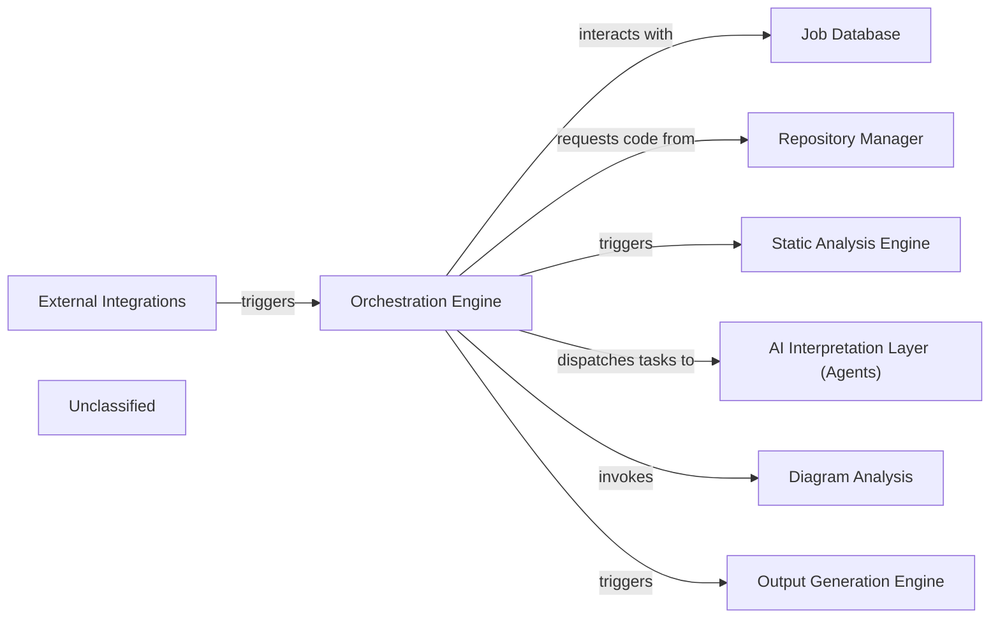

## Details

The CodeBoarding system is orchestrated by the Orchestration Engine, which serves as the central control unit for initiating and managing documentation generation jobs. External systems, such as VSCode and GitHub Actions, interact with the system through the External Integrations component, triggering the Orchestration Engine to begin a new analysis workflow. The Orchestration Engine relies on the Job Database to store and retrieve job-related information and status updates throughout the process. To access the codebase, the Orchestration Engine communicates with the Repository Manager, which handles tasks like cloning repositories and retrieving code differences. Once the code is available, the Orchestration Engine triggers the Static Analysis Engine to perform initial code analysis. Subsequently, it dispatches tasks to the AI Interpretation Layer (Agents) for deeper, AI-driven code understanding. For visual representations, the Orchestration Engine invokes the Diagram Analysis component to generate structured data for diagrams. Finally, the Output Generation Engine is responsible for formatting and producing the final documentation and diagrams in various desired formats.

### Orchestration Engine [[Expand]](./Orchestration_Engine.md)
The central control subsystem responsible for initiating, managing, and coordinating all analysis and documentation generation jobs, acting as the primary orchestrator for the end-to-end workflow.

**Related Classes/Methods**:

- `local_app.py:process_docs_generation_job`:302-349
- `diagram_analysis/diagram_generator.py:generate_analysis`:100-169

### Job Database [[Expand]](./Job_Database.md)
Manages the storage and retrieval of job details, including status updates, for the documentation generation pipeline.

**Related Classes/Methods**:

- <a href="https://github.com/CodeBoarding/CodeBoarding/blob/main/duckdb_crud.py" target="_blank" rel="noopener noreferrer">`duckdb_crud.py`</a>

### Repository Manager
Handles repository operations such as cloning code repositories and retrieving code differences for analysis.

**Related Classes/Methods**:

- <a href="https://github.com/CodeBoarding/CodeBoarding/blob/main/repo_utils/git_diff.py" target="_blank" rel="noopener noreferrer">`repo_utils.git_diff.py`</a>

### Static Analysis Engine [[Expand]](./Static_Analysis_Engine.md)
Performs static code analysis on the codebase.

**Related Classes/Methods**:

- <a href="https://github.com/CodeBoarding/CodeBoarding/blob/main/static_analyzer/scanner.py" target="_blank" rel="noopener noreferrer">`static_analyzer.scanner.py`</a>

### AI Interpretation Layer (Agents)
Dispatches tasks to AI agents for advanced analysis and interpretation of code.

**Related Classes/Methods**:

- <a href="https://github.com/CodeBoarding/CodeBoarding/blob/main/agents/agent.py" target="_blank" rel="noopener noreferrer">`agents.agent.py`</a>

### Diagram Analysis
Generates structured analysis data specifically for creating diagrams.

**Related Classes/Methods**:

- <a href="https://github.com/CodeBoarding/CodeBoarding/blob/main/diagram_analysis/diagram_generator.py" target="_blank" rel="noopener noreferrer">`diagram_analysis.diagram_generator.py`</a>

### Output Generation Engine [[Expand]](./Output_Generation_Engine.md)
Responsible for the final formatting and generation of documentation and diagrams in various formats.

**Related Classes/Methods**:

- <a href="https://github.com/CodeBoarding/CodeBoarding/blob/main/output_generators/markdown.py" target="_blank" rel="noopener noreferrer">`output_generators.markdown.py`</a>

### External Integrations
Provides interfaces for external systems, such as VSCode and GitHub Actions, to trigger analysis workflows.

**Related Classes/Methods**:

- <a href="https://github.com/CodeBoarding/CodeBoarding/blob/main/github_action.py" target="_blank" rel="noopener noreferrer">`github_action.py`</a>
- <a href="https://github.com/CodeBoarding/CodeBoarding/blob/main/vscode_runnable.py" target="_blank" rel="noopener noreferrer">`vscode_runnable.py`</a>

### Unclassified
Component for all unclassified files and utility functions (Utility functions/External Libraries/Dependencies)

**Related Classes/Methods**: _None_

### [FAQ](https://github.com/CodeBoarding/GeneratedOnBoardings/tree/main?tab=readme-ov-file#faq)
