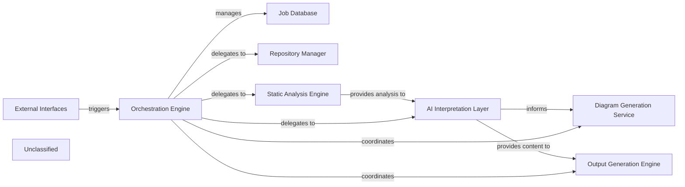

## Details

The system is orchestrated by the `Orchestration Engine`, which manages the end-to-end process of generating documentation. This engine interacts with `External Interfaces` to initiate jobs and persists job status in the `Job Database`. For code analysis, it delegates to the `Repository Manager` to access source code, which is then fed into the `Static Analysis Engine`. The `Static Analysis Engine` performs in-depth structural and semantic analysis, with recent updates significantly enhancing its internal logic and capabilities for extracting richer code insights. The results from static analysis are then passed to the `AI Interpretation Layer` for generating high-level insights and content. Subsequently, the `Diagram Generation Service` creates visual representations, and the `Output Generation Engine` compiles the final documentation. The CodeBoarding system is structured around an `Orchestration Engine` that manages the entire documentation generation workflow. This engine is initiated via `External Interfaces` and maintains job states in a `Job Database`. It delegates core tasks to specialized components: the `Repository Manager` for code retrieval, and the `Static Analysis Engine` for in-depth code analysis. The `Static Analysis Engine`, recently enhanced for more sophisticated analysis, feeds its findings to the `AI Interpretation Layer`. This layer processes the analysis to generate documentation content and insights, which are then used by the `Diagram Generation Service` for visual representations and the `Output Generation Engine` for final documentation production.

### Orchestration Engine [[Expand]](./Orchestration_Engine.md)
The central component responsible for managing the documentation generation pipeline, including job status and delegating the core generation process to other pipeline stages.

**Related Classes/Methods**: _None_

### Job Database
Manages the persistence and status of documentation generation jobs.

**Related Classes/Methods**: _None_

### External Interfaces
Provides API endpoints for interacting with the documentation generation system.

**Related Classes/Methods**: _None_

### Repository Manager [[Expand]](./Repository_Manager.md)
Manages access and retrieval of code repositories for analysis within the documentation generation pipeline.

**Related Classes/Methods**: _None_

### Static Analysis Engine [[Expand]](./Static_Analysis_Engine.md)
Performs advanced static code analysis to extract detailed structural and semantic information from source code. Recent enhancements have refined its internal logic, potentially leading to improved accuracy, performance, or the ability to analyze new language constructs and complex patterns.

**Related Classes/Methods**: _None_

### AI Interpretation Layer [[Expand]](./AI_Interpretation_Layer.md)
Interprets analysis results and generates insights using AI models for documentation content.

**Related Classes/Methods**: _None_

### Diagram Generation Service
Generates visual diagrams based on the interpreted code structure and relationships.

**Related Classes/Methods**: _None_

### Output Generation Engine [[Expand]](./Output_Generation_Engine.md)
Formats and produces the final documentation output in various formats.

**Related Classes/Methods**: _None_

### Unclassified
Component for all unclassified files and utility functions (Utility functions/External Libraries/Dependencies)

**Related Classes/Methods**: _None_

### [FAQ](https://github.com/CodeBoarding/GeneratedOnBoardings/tree/main?tab=readme-ov-file#faq)
