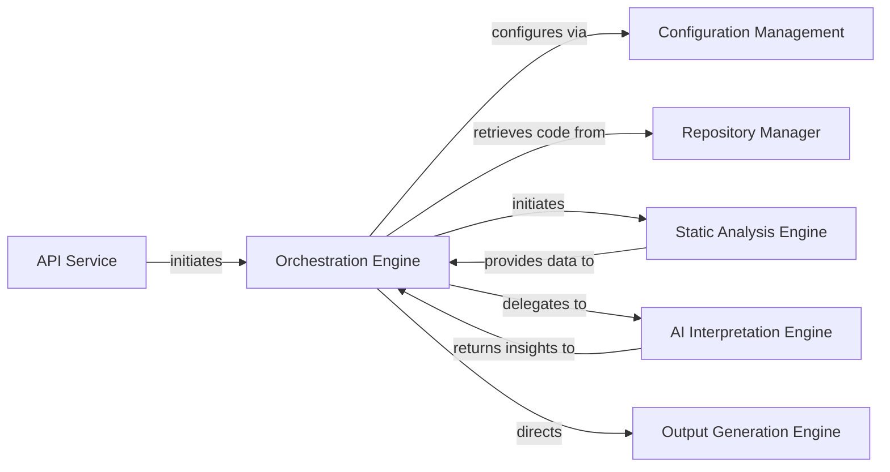

## Details

The system is designed around a central Orchestration Engine that manages the entire documentation generation workflow. This engine initiates tasks, coordinates data flow, and delegates specialized operations to other core components. The API Service acts as the external interface, allowing users to trigger documentation generation. Once a request is received, the Orchestration Engine interacts with the Repository Manager to access the source code. The code is then passed to the Static Analysis Engine for initial parsing and data extraction. The extracted data is subsequently processed by the AI Interpretation Engine, which leverages AI models to generate high-level insights and summaries. Finally, the Output Generation Engine transforms the processed information into various documentation formats, including diagrams and reports. The Configuration Management component provides system-wide settings and parameters, ensuring the Orchestration Engine operates with the correct configurations.

### Orchestration Engine [[Expand]](./Orchestration_Engine.md)
The core component responsible for managing the entire documentation generation pipeline. It handles configuration, initiates static analysis, coordinates AI interpretation, and directs the final output generation. It acts as the central hub, directing the flow of operations.

**Related Classes/Methods**: _None_

### Static Analysis Engine [[Expand]](./Static_Analysis_Engine.md)
Performs initial code scanning, parsing, and data extraction from the source repository. It provides the raw structural and semantic information of the codebase to the Orchestration Engine.

**Related Classes/Methods**: _None_

### AI Interpretation Engine
Processes the data extracted by the Static Analysis Engine, leveraging various AI agents (LLMs) for detailed analysis, abstraction, and interpretation of code components, generating insights and high-level summaries.

**Related Classes/Methods**: _None_

### Output Generation Engine [[Expand]](./Output_Generation_Engine.md)
Responsible for transforming the processed and interpreted data into various documentation formats, including diagrams, textual summaries, and reports.

**Related Classes/Methods**: _None_

### Repository Manager [[Expand]](./Repository_Manager.md)
Manages access to the source code repositories, handling cloning, updating, and providing the necessary file paths for the Static Analysis Engine to operate on.

**Related Classes/Methods**: _None_

### Configuration Management
Provides a centralized mechanism for managing system-wide settings, pipeline parameters, and tool configurations, which the Orchestration Engine utilizes to tailor its operations.

**Related Classes/Methods**: _None_

### API Service [[Expand]](./API_Service.md)
Exposes the system's functionality to external clients or user interfaces, allowing for initiation of documentation generation tasks and retrieval of results. It serves as the entry point for triggering the Orchestration Engine.

**Related Classes/Methods**: _None_

### [FAQ](https://github.com/CodeBoarding/GeneratedOnBoardings/tree/main?tab=readme-ov-file#faq)
