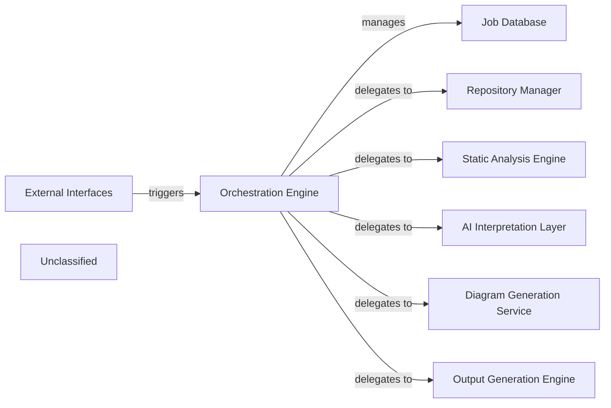

## Details

The component analysis is being refined to address the feedback regarding the `Orchestration Engine` and missing destination components. The `Orchestration Engine`'s role is central to the documentation generation pipeline, and its implementation details are crucial for accurate representation.

### Orchestration Engine [[Expand]](./Orchestration_Engine.md)
The central component responsible for managing the documentation generation pipeline, including job status and delegating the core generation process to other pipeline stages.

**Related Classes/Methods**:

- <a href="https://github.com/CodeBoarding/CodeBoarding/blob/main/local_app.py#L92-L129" target="_blank" rel="noopener noreferrer">`local_app.generate_onboarding`:92-129</a>
- <a href="https://github.com/CodeBoarding/CodeBoarding/blob/main/demo.py#L78-L97" target="_blank" rel="noopener noreferrer">`demo.generate_docs_remote`:78-97</a>

### Job Database [[Expand]](./Job_Database.md)
Manages the persistence and status of documentation generation jobs.

**Related Classes/Methods**: _None_

### External Interfaces
Provides API endpoints for interacting with the documentation generation system.

**Related Classes/Methods**: _None_

### Repository Manager [[Expand]](./Repository_Manager.md)
Manages access and retrieval of code repositories for analysis within the documentation generation pipeline.

**Related Classes/Methods**: _None_

### Static Analysis Engine [[Expand]](./Static_Analysis_Engine.md)
Performs static code analysis to extract structural and semantic information from source code.

**Related Classes/Methods**: _None_

### AI Interpretation Layer [[Expand]](./AI_Interpretation_Layer.md)
Interprets analysis results and generates insights using AI models for documentation content.

**Related Classes/Methods**: _None_

### Diagram Generation Service
Generates visual diagrams based on the interpreted code structure and relationships.

**Related Classes/Methods**: _None_

### Output Generation Engine [[Expand]](./Output_Generation_Engine.md)
Formats and produces the final documentation output in various formats.

**Related Classes/Methods**: _None_

### Unclassified
Component for all unclassified files and utility functions (Utility functions/External Libraries/Dependencies)

**Related Classes/Methods**: _None_

### [FAQ](https://github.com/CodeBoarding/GeneratedOnBoardings/tree/main?tab=readme-ov-file#faq)
