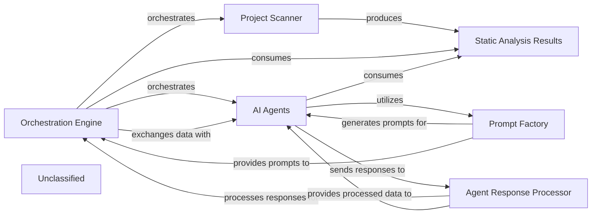

## Details

The system operates around an Orchestration Engine that manages the entire documentation generation pipeline. It initiates the process by leveraging the Project Scanner to gather static analysis data, which is then stored in Static Analysis Results. The Orchestration Engine then coordinates a suite of AI Agents, each with specialized roles, to analyze this data. These agents utilize a sophisticated Prompt Factory to construct dynamic prompts for the LLM, enabling both "bidirectional" and "unidirectional" communication patterns. Agent responses are processed by the Agent Response Processor before being fed back to the Orchestration Engine for further coordination, feedback application, and final result saving. This architecture emphasizes a modular, agent-based approach with a highly adaptable prompting mechanism for intelligent code analysis and documentation generation.

### Orchestration Engine [[Expand]](./Orchestration_Engine.md)
The central control unit that manages the entire documentation generation pipeline, coordinating all analysis and generation stages. It initializes and coordinates AI agents, handles pre-analysis, processes components, determines update needs, applies feedback, and saves results.

**Related Classes/Methods**:

- <a href="https://github.com/CodeBoarding/CodeBoarding/blob/maindiagram_analysis/diagram_generator.py" target="_blank" rel="noopener noreferrer">`diagram_generator`</a>

### Project Scanner
A component responsible for initiating and collecting static analysis data from the codebase, including specialized scanning for TypeScript configurations, serving as the primary input for the analysis pipeline.

**Related Classes/Methods**:

- <a href="https://github.com/CodeBoarding/CodeBoarding/blob/mainstatic_analyzer/scanner.py" target="_blank" rel="noopener noreferrer">`scanner`</a>
- <a href="https://github.com/CodeBoarding/CodeBoarding/blob/mainstatic_analyzer/typescript_config_scanner.py" target="_blank" rel="noopener noreferrer">`typescript_config_scanner`</a>

### Static Analysis Results
A data structure that holds the comprehensive results of static analysis, making this information accessible to the Orchestration Engine and AI agents.

**Related Classes/Methods**:

- <a href="https://github.com/CodeBoarding/CodeBoarding/blob/mainstatic_analyzer/analysis_result.py" target="_blank" rel="noopener noreferrer">`analysis_result`</a>

### AI Agents
A collective component representing all specialized AI agents (MetaAgent, AbstractionAgent, DetailsAgent, PlannerAgent, ValidatorAgent) responsible for various stages of code analysis and documentation generation. These agents now incorporate advanced prompting strategies for more complex reasoning.

**Related Classes/Methods**:

- <a href="https://github.com/CodeBoarding/CodeBoarding/blob/mainagents/meta_agent.py" target="_blank" rel="noopener noreferrer">`meta_agent`</a>
- <a href="https://github.com/CodeBoarding/CodeBoarding/blob/mainagents/abstraction_agent.py" target="_blank" rel="noopener noreferrer">`abstraction_agent`</a>
- <a href="https://github.com/CodeBoarding/CodeBoarding/blob/mainagents/details_agent.py" target="_blank" rel="noopener noreferrer">`details_agent`</a>
- <a href="https://github.com/CodeBoarding/CodeBoarding/blob/mainagents/planner_agent.py" target="_blank" rel="noopener noreferrer">`planner_agent`</a>
- <a href="https://github.com/CodeBoarding/CodeBoarding/blob/mainagents/validator_agent.py" target="_blank" rel="noopener noreferrer">`validator_agent`</a>

### Prompt Factory
Responsible for dynamically constructing and managing prompts for the LLM, supporting both "bidirectional" and "unidirectional" communication patterns, enabling sophisticated reasoning and interaction strategies for the AI Agents.

**Related Classes/Methods**:

- <a href="https://github.com/CodeBoarding/CodeBoarding/blob/mainagents/prompts/prompt_factory.py#L37-L53" target="_blank" rel="noopener noreferrer">`prompt_factory`:37-53</a>
- <a href="https://github.com/CodeBoarding/CodeBoarding/blob/mainagents/prompts/claude_prompts_bidirectional.py" target="_blank" rel="noopener noreferrer">`claude_prompts_bidirectional`</a>
- <a href="https://github.com/CodeBoarding/CodeBoarding/blob/mainagents/prompts/claude_prompts_unidirectional.py" target="_blank" rel="noopener noreferrer">`claude_prompts_unidirectional`</a>

### Agent Response Processor
Handles the parsing, validation, and structuring of responses received from the LLM, ensuring that the output is correctly interpreted and formatted for subsequent processing by the Orchestration Engine and other AI Agents.

**Related Classes/Methods**:

- <a href="https://github.com/CodeBoarding/CodeBoarding/blob/mainagents/agent_responses.py" target="_blank" rel="noopener noreferrer">`agent_responses`</a>

### Unclassified
Component for all unclassified files and utility functions (Utility functions/External Libraries/Dependencies)

**Related Classes/Methods**: _None_

### [FAQ](https://github.com/CodeBoarding/GeneratedOnBoardings/tree/main?tab=readme-ov-file#faq)
