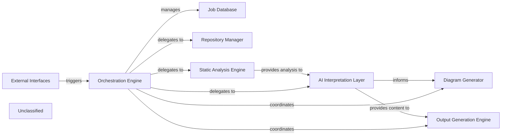

## Details

The CodeBoarding system is structured around an Orchestration Engine that manages the entire documentation generation workflow. This engine is initiated via External Interfaces and maintains job states in a Job Database. It delegates core tasks to specialized components: the Repository Manager for code retrieval, and the Static Analysis Engine for in-depth code analysis. The Static Analysis Engine feeds its findings to the AI Interpretation Layer. This layer processes the analysis to generate documentation content and insights, which are then used by the Diagram Generator for visual representations and the Output Generation Engine for final documentation production.

### Orchestration Engine [[Expand]](./Orchestration_Engine.md)
The central control unit that manages the entire documentation generation pipeline, coordinating all analysis and generation stages. It initiates and oversees analysis jobs, and acts as the central coordinator, directing the flow of data and control between other components.

**Related Classes/Methods**:

- <a href="https://github.com/CodeBoarding/CodeBoarding/blob/main/./.codeboarding/Orchestration_Engine.json" target="_blank" rel="noopener noreferrer">`Orchestration Engine`</a>

### Job Database
Manages and persists the state and metadata of ongoing analysis jobs.

**Related Classes/Methods**:

- <a href="https://github.com/CodeBoarding/CodeBoarding/blob/main/./.codeboarding/Job_Database.json" target="_blank" rel="noopener noreferrer">`Job Database`</a>

### External Interfaces
Provides API endpoints for interacting with the documentation generation system, triggering the Orchestration Engine.

**Related Classes/Methods**:

- <a href="https://github.com/CodeBoarding/CodeBoarding/blob/main/./.codeboarding/Orchestration_Engine.json" target="_blank" rel="noopener noreferrer">`External Interfaces`</a>

### Repository Manager
Manages access and retrieval of code repositories for analysis within the documentation generation pipeline.

**Related Classes/Methods**:

- <a href="https://github.com/CodeBoarding/CodeBoarding/blob/main/./.codeboarding/Orchestration_Engine.json" target="_blank" rel="noopener noreferrer">`Repository Manager`</a>

### Static Analysis Engine [[Expand]](./Static_Analysis_Engine.md)
Performs advanced static code analysis to extract detailed structural and semantic information from source code.

**Related Classes/Methods**:

- <a href="https://github.com/CodeBoarding/CodeBoarding/blob/main/./.codeboarding/Static_Analysis_Engine.json" target="_blank" rel="noopener noreferrer">`Static Analysis Engine`</a>

### AI Interpretation Layer [[Expand]](./AI_Interpretation_Layer.md)
Interprets analysis results and generates insights using AI models for documentation content.

**Related Classes/Methods**:

- <a href="https://github.com/CodeBoarding/CodeBoarding/blob/main/./.codeboarding/AI_Interpretation_Layer.json" target="_blank" rel="noopener noreferrer">`AI Interpretation Layer`</a>

### Diagram Generator
Generates visual diagrams based on the interpreted code structure and relationships.

**Related Classes/Methods**:

- <a href="https://github.com/CodeBoarding/CodeBoarding/blob/main/./.codeboarding/Orchestration_Engine.json" target="_blank" rel="noopener noreferrer">`Diagram Generator`</a>

### Output Generation Engine [[Expand]](./Output_Generation_Engine.md)
Formats and produces the final documentation output in various formats.

**Related Classes/Methods**:

- <a href="https://github.com/CodeBoarding/CodeBoarding/blob/main/./.codeboarding/Output_Generation_Engine.json" target="_blank" rel="noopener noreferrer">`Output Generation Engine`</a>

### Unclassified
Component for all unclassified files and utility functions (Utility functions/External Libraries/Dependencies)

**Related Classes/Methods**: _None_

### [FAQ](https://github.com/CodeBoarding/GeneratedOnBoardings/tree/main?tab=readme-ov-file#faq)
