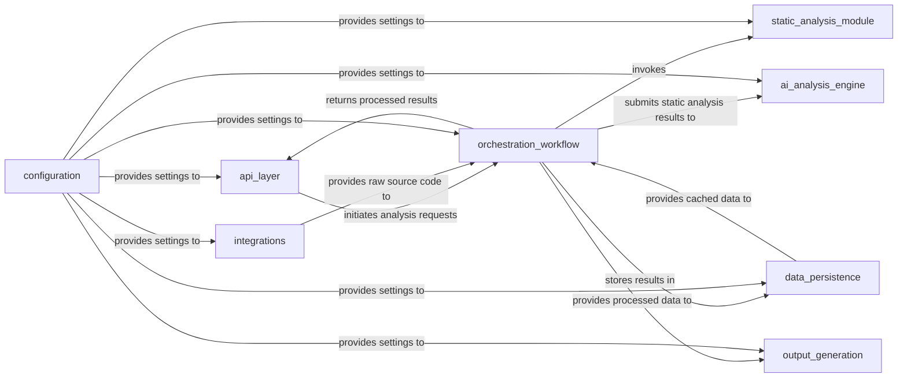

## Details

The `Orchestration & Workflow` component is central to the system, coordinating the entire analysis pipeline. Its interactions with other components are crucial for the system's functionality.

### api_layer
The primary interface for external communication, responsible for receiving analysis requests via HTTP and returning the final processed results. It acts as the system's public-facing entry point.

**Related Classes/Methods**:

- `local_app` (1:1)
- `github_action` (1:1)

### orchestration_workflow
The central coordinator that manages the end-to-end analysis pipeline. It initiates static analysis, triggers the AI engine, coordinates with the persistence layer for caching and differential checks, and sends the final, validated results to the output generator.

**Related Classes/Methods**:

- `local_app` (1:1)
- `github_action` (1:1)

### static_analysis_module
Responsible for parsing source code, building abstract syntax trees (ASTs), control flow graphs (CFGs), and extracting raw code metadata. It provides the foundational data for subsequent analysis steps.

**Related Classes/Methods**:

- `astroid` (1:1)
- `python-call-graph` (1:1)
- `networkx` (1:1)

### ai_analysis_engine
Encapsulates all interactions with Large Language Models (LLMs), including prompt engineering, multi-provider support (OpenAI, Anthropic, Google Gemini, AWS Bedrock), and processing LLM responses to derive high-level insights and recommendations.

**Related Classes/Methods**:

- `LangChain` (1:1)
- `LangGraph` (1:1)
- `OpenAI` (1:1)
- `Anthropic` (1:1)
- `Google Gemini` (1:1)
- `AWS Bedrock` (1:1)

### data_persistence
Manages data storage and retrieval for analysis results, intermediate data, and caching mechanisms. It abstracts the underlying database (e.g., DuckDB via SQLAlchemy) to provide a consistent data access layer.

**Related Classes/Methods**:

- `SQLAlchemy` (1:1)
- `DuckDB` (1:1)

### output_generation
Transforms processed analysis data into various user-consumable output formats, particularly interactive diagrams (e.g., Mermaid.js, pygraphviz, pydot) and other visualizations.

**Related Classes/Methods**:

- `pygraphviz` (1:1)
- `pydot` (1:1)
- `Mermaid.js` (1:1)

### integrations
Handles specific logic related to external services, such as cloning repositories from GitHub (using GitPython, Dulwich) and potential integrations with other platforms (VS Code, MCP Server).

**Related Classes/Methods**:

- `GitPython` (1:1)
- `Dulwich` (1:1)

### configuration
Centralizes application settings, environment variable loading, and credential management, ensuring consistent and secure configuration across all components of the system.

**Related Classes/Methods**:

- `config_module` (1:1)

### [FAQ](https://github.com/CodeBoarding/GeneratedOnBoardings/tree/main?tab=readme-ov-file#faq)
