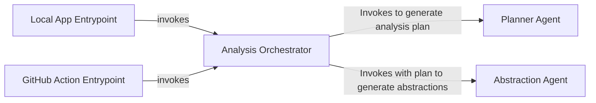

## Details

One paragraph explaining the functionality which is represented by this graph. What the main flow is and what is its purpose.

### Local App Entrypoint
Serves as the command-line interface for the application. It parses user arguments, prepares the local environment, and initiates the analysis process.

**Related Classes/Methods**:

- `local_app.py`

### GitHub Action Entrypoint
Acts as the entry point when the system is run within a GitHub Actions CI/CD pipeline. It interprets GitHub event data and triggers the analysis, often for pull request checks.

**Related Classes/Methods**:

- `github_action.py`

### Analysis Orchestrator
The central coordinator that defines and executes the analysis workflow. It invokes the `Planner Agent` to create an analysis plan, then passes this plan to the `Abstraction Agent` to perform the detailed analysis, managing the state between steps.

**Related Classes/Methods**:

- <a href="https://github.com/CodeBoarding/CodeBoarding/blob/main/diagram_analysis/diagram_generator.py#L23-L211" target="_blank" rel="noopener noreferrer">`CodeBoarding.diagram_analysis.diagram_generator.DiagramGenerator` (23:211)</a>

### Planner Agent
A specialized AI agent responsible for creating a high-level analysis plan. It determines the steps required to analyze the target codebase based on the initial request from the orchestrator.

**Related Classes/Methods**:

- <a href="https://github.com/CodeBoarding/CodeBoarding/blob/main/agents/planner_agent.py#L9-L27" target="_blank" rel="noopener noreferrer">`agents.planner_agent.PlannerAgent` (9:27)</a>

### Abstraction Agent
A specialized AI agent that performs the main code analysis. It executes the step-by-step plan provided to it by the `Analysis Orchestrator` to generate architectural abstractions.

**Related Classes/Methods**:

- <a href="https://github.com/CodeBoarding/CodeBoarding/blob/main/agents/abstraction_agent.py#L9-L95" target="_blank" rel="noopener noreferrer">`agents.abstraction_agent.AbstractionAgent` (9:95)</a>

### [FAQ](https://github.com/CodeBoarding/GeneratedOnBoardings/tree/main?tab=readme-ov-file#faq)