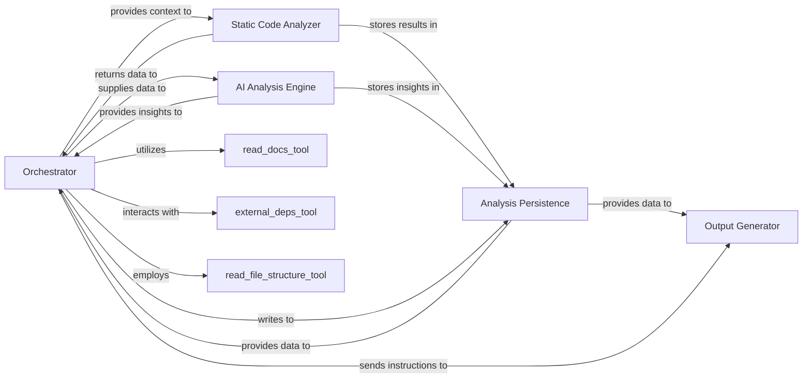

## Details

The `CodeBoarding` project operates as an automated software architecture analysis system. The `Orchestrator` serves as the central control unit, initiating the analysis process by leveraging its `MetaAgent` to gather initial project metadata and establish architectural context. This context, along with raw code, is then fed to the `Static Code Analyzer`, which performs in-depth code analysis, extracting structural information and building essential data structures like call graphs. The results from the static analysis are then passed to the `AI Analysis Engine`, which, powered by sophisticated prompt engineering, interprets these findings and generates high-level architectural insights. All intermediate and final analysis data are diligently stored and managed by the `Analysis Persistence` component, ensuring data integrity and historical traceability. Finally, the `Output Generator` takes the processed analysis data and renders it into various user-friendly formats, including visual diagrams and comprehensive reports, making the complex architectural insights accessible to users. The `Orchestrator` also integrates with various tools like `read_docs`, `external_deps_tool`, and `read_file_structure` to enrich the analysis with external information.

### Orchestrator [[Expand]](./Orchestrator.md)
Acts as the central coordinator of the analysis pipeline. It manages the sequence of operations, directing the flow of data between the various components to ensure the end-to-end process runs smoothly. The `MetaAgent` within this component has a streamlined role in initial project metadata analysis, establishing architectural context, and guiding subsequent analysis steps.

**Related Classes/Methods**:

### Static Code Analyzer
Responsible for performing in-depth static analysis on the codebase. This involves efficiently parsing source code, building abstract syntax trees (ASTs), identifying code patterns, and extracting structural information without executing the code, leveraging its refactored LSP client for enhanced capabilities.

**Related Classes/Methods**:

### AI Analysis Engine
Integrates AI/LLM capabilities to interpret the results from the Static Code Analyzer and the architectural context provided by the Orchestrator. It generates high-level insights, identifies complex relationships, and provides explanations or suggestions based on the analyzed code, with its refined prompt system enabling more nuanced interpretations.

**Related Classes/Methods**:

### Analysis Persistence
Manages the storage, retrieval, and versioning of all analysis-related data, including raw static analysis outputs, AI-generated insights, project metadata, and configuration settings. This ensures data integrity and enables historical analysis.

**Related Classes/Methods**:

### Output Generator [[Expand]](./Output_Generator.md)
Transforms the processed analysis data into various user-friendly formats, including visual representations (e.g., Mermaid.js diagrams for architectural views) and structured reports. It is responsible for rendering the final output for user consumption.

**Related Classes/Methods**: _None_

### [FAQ](https://github.com/CodeBoarding/GeneratedOnBoardings/tree/main?tab=readme-ov-file#faq)
